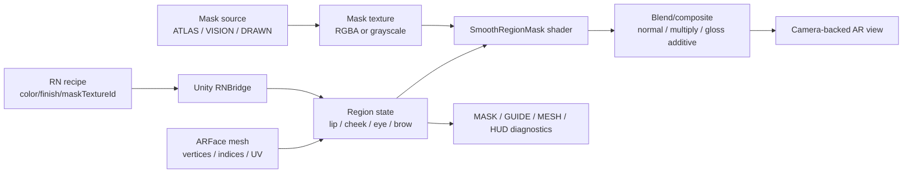

# AR Makeup Rendering Concepts Glossary

Status: Architecture reference
Date: 2026-06-27 KST
Scope: AR 메이크업 렌더링에서 코드, UI, 로그, 셰이더, 마스크 asset에 쓰이는 핵심 개념을 정리한다. 이 문서는 AI/model inference, backend upload, 상용 SDK 통합, Android 구현을 시작하지 않는다.

## 제일 중요한 구분

AR 메이크업 엔진에서 가장 자주 헷갈리는 축은 `무엇을 칠할지`와 `어디까지 칠할지`다.

| 축 | 예시 | 뜻 | 코드에서 가까운 필드 |
| --- | --- | --- | --- |
| 색감/룩 | rose, coral, matte, glossy, gradient, overlip, shimmer | 칠해진 뒤 어떤 색, 질감, 농도, 광택처럼 보일지 | `color`, `secondaryColor`, `texture`, `sample`, `finish`, `intensity`, `glossBoost`, `gradientAmount` |
| 경계/영역 | ATLAS, VISION, DRAWN, smooth mask | 얼굴에서 어느 픽셀/삼각형/UV 영역까지 칠할지 | `maskTextureId`, `maskSource`, `boundaryRenderer`, `meshCullingMode`, `maskSoftSampleMode` |
| 렌더 방식 | normal, multiply, additive gloss pass | 칠한 결과를 카메라/피부 위에 어떻게 합성할지 | `blendMode`, `_SrcBlend`, `_DstBlend`, `_PigmentMultiply`, shader pass |
| 진단 표시 | MASK, GUIDE, MESH, HUD | 렌더러를 이해하거나 QA하기 위해 보여주는 보조 화면 | `maskOverlayVisible`, `guideOverlayVisible`, `meshOverlayVisible`, `diagnosticsHudVisible` |

### ATLAS / VISION / DRAWN

`ATLAS`, `VISION`, `DRAWN`은 색감 타입이 아니다. 메이크업을 "어디까지 칠할지" 정하는 마스크 소스 또는 경계 계산 방식이다.

| 라벨 | 정확한 의미 | 장점 | 단점/리스크 | 현재 레포 예시 |
| --- | --- | --- | --- | --- |
| ATLAS | 얼굴 UV 맵에 미리 만들어둔 립/부위 마스크 텍스처를 쓰는 방식 | 안정적이고 빠른 편. 프레임마다 랜드마크를 새로 추정하지 않아 흔들림이 적음 | UV/topology가 틀리면 계속 같은 방식으로 어긋남. 얼굴 개인차/표정 변화 대응은 제한적 | `lip-drawn-style-atlas-v1`, `lip-drawn-gradient-density-atlas-v1`, `lip-style-atlas-v1` |
| VISION | Apple Vision/랜드마크 기반으로 입술 경계를 실시간 추정해서 쓰는 방식 | 실제 얼굴 인식 상태 확인에 유용. 런타임 입술 경계 보강 후보 | frame capture, landmark jitter, 지연, 좌표 변환, face motion risk가 있음 | `lip-vision-boundary-v1`, `apple_vision_runtime_lip_landmarks` |
| DRAWN | 우리가 직접 그려둔 단순 마스크/수동 제작 마스크를 쓰는 방식 | 비교 기준, fallback, 빠른 디버그에 좋음 | 실제 얼굴/표정에 정교하게 맞지 않을 수 있음 | `lip-drawn-mask-v1`, `cheek-drawn-mask-v1`, `eye-drawn-mask-v1` |

현재 이름에는 `lip-drawn-style-atlas-v1`처럼 `drawn`과 `atlas`가 같이 들어간다. 이 경우 "수동 제작한 atlas asset"이라는 뜻에 가깝다. UI 라벨에서는 사용자 혼란을 줄이기 위해 `Atlas`, `Vision`, `Flat/Drawn`을 경계 방식으로 설명하고, 룩 선택은 `Normal`, `Matte`, `Glossy`, `Full`, `Gradient`, `Overlip` 같은 별도 컨트롤로 유지한다.

### Atlas를 아주 풀어 쓰면

`Atlas`는 제품명, 모델명, AI 모델명이 아니다. 그래픽스에서 쓰는 개념명에 가깝다. 원래 atlas는 여러 이미지를 한 장의 큰 이미지나 지도에 배치해 둔 것을 뜻한다. AR 얼굴에서 말하는 `UV atlas`는 얼굴 3D 표면을 2D 종이처럼 펼쳐 놓은 지도다.

비유하면:

| 비유 | AR 메이크업에서의 대응 |
| --- | --- |
| 얼굴 | 지구본 |
| UV atlas | 지구본을 펼친 세계지도 |
| 립 마스크 | 세계지도 위에 색칠해 둔 특정 나라/영역 |
| UV 좌표 | 지구본의 한 점이 세계지도 어디에 해당하는지 알려주는 좌표 |

그래서 `UV atlas 기반 마스크 방식`은 "얼굴을 펼친 2D 지도 위에 미리 입술/볼/눈 영역을 그려 두고, 런타임에는 얼굴 메시의 UV 좌표를 따라 그 지도 이미지를 다시 얼굴에 붙이는 방식"이다.

### 어디에 마스크를 올릴지는 어떻게 정하나

마스크를 어디에 올릴지는 사람이 매 프레임 손으로 정하는 것이 아니라 얼굴 메시의 `UV`가 정한다. ARKit/AR Foundation이 주는 얼굴은 점과 삼각형으로 된 3D 그물망, 즉 `mesh`다. 각 점에는 3D 위치뿐 아니라 `UV`라는 2D 좌표도 붙어 있다.

예를 들어 어떤 얼굴 점이 실제 3D 얼굴에서는 입술 왼쪽에 있고, 그 점의 UV가 `(0.43, 0.62)`라면 렌더러는 마스크 이미지의 `(0.43, 0.62)` 위치를 본다. 그 위치가 흰색이면 칠하고, 검정이면 안 칠하고, 회색이면 반쯤 칠한다. 이 과정을 "UV로 마스크 텍스처를 읽는다" 또는 "UV로 마스크를 샘플링한다"라고 부른다.

```text
face vertex/pixel -> has UV (0.43, 0.62)
mask texture at (0.43, 0.62) -> 0.85
makeup alpha = mask value * opacity
```

마스크 텍스처는 보통 이렇게 해석한다.

| 마스크 값 | 의미 |
| --- | --- |
| 검정 / `0.0` | 안 칠함 |
| 회색 / `0.1..0.9` | 일부만 칠함, 부드러운 경계 |
| 흰색 / `1.0` | 강하게 칠함 |

### UV atlas 방식 구현 순서

| 단계 | 하는 일 | 현재 레포와 연결 |
| --- | --- | --- |
| 1 | ARKit/AR Foundation이 `ARFace` 메시를 준다 | `ARFaceManager`, `ARFace` |
| 2 | 얼굴 메시의 vertices, indices, UV를 읽는다 | `meshVertexCount`, `meshIndexCount`, `meshUvCount` |
| 3 | 2D atlas 위에 만든 mask PNG를 준비한다 | `Assets/Resources/SmoothRegionMasks/*.png` |
| 4 | 런타임에서 각 픽셀/삼각형의 UV로 mask PNG 값을 읽는다 | shader `tex2D(_MaskTex, uv)` 또는 C# sampling |
| 5 | mask 값이 threshold보다 높으면 메이크업 alpha를 만든다 | `_Threshold`, `smoothstep`, `maskThreshold` |
| 6 | feather/soft sample로 경계를 부드럽게 한다 | `_Feather`, `feather_scaled_13tap_near_far` |
| 7 | color/finish/blend mode로 최종 카메라 위에 합성한다 | `blendMode`, `finish`, `glossBoost` |

### Shader 방식과 mesh culling 방식

같은 UV atlas mask를 쓰더라도 구현 방식은 크게 두 가지로 나뉜다.

| 방식 | 뜻 | 간단한 흐름 | 장점 | 단점 |
| --- | --- | --- | --- | --- |
| Shader 방식 | 얼굴 메시 위에 material을 올리고 GPU shader가 픽셀마다 mask를 읽어 칠할지 결정 | `mask = sample(maskTexture, uv); alpha = mask * opacity;` | 빠르고 경계/질감 표현이 자연스러움 | shader/material/색공간 세팅을 이해해야 함 |
| Mesh culling 방식 | 얼굴 메시의 삼각형마다 UV를 보고 mask 밖 삼각형을 버리고 안쪽 삼각형만 남김 | `triangle center UV -> mask > threshold -> keep` | 어디가 칠해졌는지 디버깅하기 좋음 | 경계가 투박할 수 있고, 매번 메시를 재구성하면 비용이 큼 |

`Shader`는 GPU에서 도는 작은 렌더링 프로그램이다. "이 얼굴 픽셀을 최종적으로 무슨 색과 투명도로 그릴지"를 결정한다. 예를 들어 마스크 값이 `0`이면 투명, `1`이면 립 컬러, `0.5`면 반투명 립 컬러가 된다. Glossy라면 별도 하이라이트를 더하고, Matte라면 반사/광택을 줄이는 식의 계산도 shader에서 한다.

`Mesh culling`에서 culling은 "버린다/제외한다"는 뜻이다. 입술 영역 밖 삼각형은 렌더링 대상에서 빼고, 입술 영역 안 삼각형만 남기는 방식이다. 자연스러운 최종 메이크업에는 보통 shader 방식이 더 중요하고, "정말 어디가 칠해지고 있는지" 확인하는 디버그에는 mesh culling 결과가 눈에 잘 들어온다.

## 현재 렌더링 흐름



## UI와 디버그 단어

| 단어 | 뜻 | 사용자에게 보여줄 때 | 개발자 관점 |
| --- | --- | --- | --- |
| MASK | 실제로 메이크업을 칠할 영역 또는 그 영역을 시각화한 overlay | "칠해지는 범위" | mask texture/channel에서 나온 alpha. threshold/feather 후 최종 coverage를 만든다 |
| GUIDE | 사용자가/QA가 위치를 이해하도록 보여주는 기준선, 안내선, 디버그 보조 | "가이드" | 최종 렌더 입력이 아니라 진단 overlay인 경우가 많다 |
| MESH | ARKit/AR Foundation이 추적한 얼굴 3D 메시의 삼각형 wireframe 구조 | 보통 일반 사용자는 숨김 | vertices, indices, UV, triangle count, topology audit의 기준. QA용 MESH는 삼각형 선만 보여야 하며, ARFace prefab의 채워진 face surface renderer는 계속 억제한다 |
| HUD | debug head-up display | QA/개발 모드에서만 노출 | 이벤트, latency, tracking state, mask stats를 텍스트로 표시 |
| Clean | 진단 표시를 숨긴 보기 | 실제 사용자 품질 확인 | 메이크업 결과만 볼 때 사용 |
| Debug | 상세 진단 보기 | 내부 QA | MASK/GUIDE/MESH/HUD를 조합해 문제를 찾는다 |

## Recipe / Layer / Region 용어

| 용어 | 뜻 | 현재 코드 예시 | 주의 |
| --- | --- | --- | --- |
| `region` | 얼굴 부위. 현재 `lip`, `cheek`, `eye` | `RecipeRegion` | 제품 기획에서도 부위별 QA를 분리해야 함 |
| `layer` | 렌더 계층. 현재는 region과 거의 같은 값 | `layer: region` | 나중에 lip liner + lip fill처럼 한 region에 여러 layer가 생길 수 있음 |
| `activeRegions` | 현재 켜진 부위 목록 | `lip,cheek,eye` | focus region과 다름. focus는 UI 편집 대상, active는 렌더 대상 |
| `textureSample` / `sample` | 룩 preset 이름 | `matte_lip`, `gloss_lip`, `soft_blush` | 색상 자체가 아니라 질감/파라미터 묶음 |
| `textureMode` | sample/custom/procedural 같은 texture 적용 방식 | 현재 `sample` | texture asset을 뜻할 수도, parameter preset을 뜻할 수도 있어 명확히 해야 함 |
| `rendererMode` | 렌더러 종류 | `smooth-region-mask` | 렌더 파이프라인 버전처럼 다루는 것이 좋음 |
| `lookId` / `recipeId` / `recipeBatchId` | recipe 추적용 식별자 | `lip_makeup_validation_v1` | QA log와 스크린샷/영상 evidence를 묶는 키 |

## 마스크 관련 용어

| 용어 | 뜻 | 현재 코드 예시 | 읽는 법 |
| --- | --- | --- | --- |
| `maskTextureId` | 어떤 마스크 asset/소스를 쓸지 고르는 ID | `lip-vision-boundary-v1` | 색감이 아니라 영역 선택 |
| `maskSource` | 마스크가 어디서 왔는지 | `smooth_region_mask`, `lip_style_atlas_v1_uv_back_projection`, `apple_vision_runtime_lip_landmarks` | provenance/logging용 |
| `boundaryRenderer` | 경계를 어떤 렌더러/알고리즘으로 처리했는지 | `rgba_style_atlas_logical_multilayer_sdf_feather` | 마스크를 어떻게 부드럽게/계층화했는지 설명 |
| `maskThreshold` / `_Threshold` | 마스크 값이 얼마 이상이면 active로 볼지 | lip atlas/vision `0.025`, 일반 `0.04` | 낮으면 더 넓게 칠해지고, 높으면 좁아짐 |
| `feather` / `_Feather` | 경계 부드러움 | RN tuning, shader property | 너무 낮으면 스티커 같고, 너무 높으면 번짐 |
| `maskSoftSampleMode` | 부드러운 mask alpha를 샘플링하는 방식 | `feather_scaled_13tap_near_far`, `legacy_soft_alpha` | 현재 shader는 주변 texel을 여러 번 샘플링 |
| `maskFeatherNearRadiusPx` / `FarRadiusPx` | feather가 shader에서 픽셀 반경으로 환산된 값 | `3.45/6.38` | UI 값과 실제 sampling 비용을 연결 |
| `maskTextureActivePixelCountGt8` | 8/255보다 큰 active 픽셀 수 | diagnostics | 마스크가 비었거나 너무 넓은지 보는 지표 |
| `maskTextureActiveCoverageGt8` | 전체 텍스처 중 active 비율 | diagnostics | 부위 크기 sanity check |
| `maskTextureActiveBbox` | active 영역 bounding box | diagnostics | 마스크가 한쪽으로 밀렸는지 확인 |
| `maskTriangles` | 마스크를 통과한 face mesh triangle 수 | diagnostics | "칠해지는 메시 면"의 대략적 규모 |
| `culledTriangles` | 마스크 밖이라 제외한 triangle 수 | diagnostics | culling이 너무 과한지 확인 |

## 마스크 채널

마스크 텍스처는 이미지처럼 보이지만 색상 이미지가 아니라 데이터 맵이다. 그래서 mask PNG는 `sRGBTexture = false`로 import해야 한다. 감마 보정이 들어가면 threshold/feather 계산이 달라진다.

| 채널 | 현재 shader에서의 역할 | 예시 |
| --- | --- | --- |
| R | 기본 full mask. `fullSoft`, `fullCore`, base stain의 기준 | 립 전체, cheek/eye 단순 mask |
| G | overlip 확장 영역 mask. 라인만이 아니라 안쪽 립 베이스를 포함 | `overline_lip` 내부 legacy sample의 Overlip 영역 |
| B | gradient density 계열 mask | `gradient_lip` 안쪽 농도 |
| A | glossy/specular highlight mask | `glossy-highlight` wet sheen |
| L / grayscale | 단순 mask source. 로드 후 RGB/R channel처럼 사용될 수 있음 | `lip-drawn-mask-v1`, `cheek-drawn-mask-v1` |

권장 규칙: color texture와 data texture를 절대 섞어 부르지 않는다. 립스틱 색상 이미지는 sRGB color일 수 있지만, `mask`, `roughness`, `gloss`, `coverage`, `density` 같은 데이터 맵은 linear/data로 다룬다.

## 좌표 공간

| 공간 | 뜻 | 현재 관련 용어 | 실수하기 쉬운 점 |
| --- | --- | --- | --- |
| Object/local space | mesh 자체 좌표 | ARFace local vertices | 얼굴 기준인지 Unity object 기준인지 구분 |
| World space | Unity scene 전체 좌표 | face transform, camera transform | XR Origin/Camera Offset 영향 |
| View/camera space | 카메라 기준 좌표 | AR Camera | 카메라 pose가 틀리면 overlay가 밀림 |
| Clip space | GPU projection 후 좌표 | `UnityObjectToClipPos`, `clipPos` | shader 중간 공간 |
| NDC | clip을 w로 나눈 normalized device coordinates | `clipPos.xy / clipPos.w` | screen-space mask 계산 전 단계 |
| Screen space | 화면 픽셀/정규화 좌표 | `_UseScreenSpaceMask`, Vision screen mask | 기기 회전, safe area, top-left/bottom-left가 문제 |
| UV space | texture 좌표 0..1 | `input.uv`, ARFace UV | atlas mask의 핵심. ARFace topology와 맞아야 함 |
| MediaPipe/ARCore canonical texture space | MediaPipe/ARCore 기준 얼굴을 2D로 펼친 asset 도화지 | `psd-arcore-*`, `face_landmarker.task` | asset 도화지와 런타임 얼굴 인식은 다름. 이 공간에 그렸다고 실제 눈썹 위치를 자동 인식하는 것은 아님 |
| Raw Vision image space | Apple Vision 결과가 나온 이미지 좌표 | `raw-y` | Y축 방향/원점이 Unity screen과 다를 수 있음 |
| Face-local warped space | Vision 경계를 얼굴 bounds 기준으로 보정한 공간 | `face-local-warp` | motion이 크면 보정이 흔들릴 수 있음 |
| ARFace UV baked space | Vision boundary를 ARFace UV mask로 구운 결과 | `arface-uv-bake` | Vision과 UV를 연결하는 복잡한 변환 |

현재 Vision 경로의 대표 좌표 로그는 `raw-y->flip-y->face-local-warp->arface-uv-bake`다. 이 문자열은 색감이 아니라 "좌표가 어떤 변환을 거쳐 마스크가 되었는지"를 기록한다.

### MediaPipe Canonical Face 도화지

MediaPipe Canonical Face는 우리 앱에서 새 메이크업 asset을 그릴 때의
기준 도화지로 쓴다. PSD 원본이 4096px 얼굴 텍스처라면, 생성기는 그
전체 도화지를 `512x512` runtime mask로 줄이되 lip/cheek/brow를 ARKit
전용 bbox에 억지로 맞추지 않는다. 즉 asset의 기준은
MediaPipe/ARCore canonical face이고, ARKit UV mask는 기존 호환/비교용
좌표계로 남긴다.

다만 이 도화지는 "어디에 그려야 하는지"의 기준이지, 카메라 속 실제
눈썹을 찾아주는 인식 결과가 아니다. 실제 얼굴에서 눈썹 위치를 맞추려면
MediaPipe Face Landmarker가 런타임 full-face landmark packet을 만들고,
그 packet을 Unity 배치값으로 넘기는 단계가 따로 필요하다. Apple Vision
경로는 과거/중간 실험과 iOS 진단 맥락으로만 남기며, 새 제품 placement
contract의 기준은 MediaPipe다.

Apple Vision, MediaPipe, Face Parsing의 자세한 비교와 `smooth-region-mask` 보강 전략은 learning 문서의 `Apple Vision, MediaPipe, custom parsing 조합` 섹션에 둔다. 이 glossary는 용어 뜻을 빠르게 찾는 목적이므로 중복 설명을 두지 않는다.

학습 문서: `learning/runbooks/E7_SMOOTH_REGION_MASK_UV_POSITION_LEARNING_GUIDE_KO.md`

### 2026-06-30 Product Coordinate Decision

2026-06-30 기준 product makeup placement의 장기 좌표계는 MediaPipe
canonical face space다. ARKit/AR Foundation은 iOS camera/session/depth와
fallback, compatibility/debug route를 계속 도울 수 있지만, ARKit `ARFace`
UV는 lip, cheek, brow, eye 메이크업의 장기 semantic coordinate source가
아니다. 새 asset과 placement contract는 MediaPipe canonical asset과
MediaPipe full-face landmark packet을 기준으로 해석한다.

## Mesh / topology 용어

| 용어 | 뜻 | 왜 중요한가 |
| --- | --- | --- |
| `ARFace` | AR Foundation이 얼굴 하나를 나타내는 trackable | 메이크업을 붙일 실제 얼굴 기준 |
| `ARFaceManager` | 얼굴 trackable 생성/갱신/삭제 관리 | face lifecycle과 max face count 관리 |
| Vertex | 3D 점 | 입술/볼/눈 주변 위치의 기본 단위 |
| Index | triangle을 만들 vertex 번호 목록 | mesh 면 구성 |
| Triangle | 3개 vertex로 만든 면 | 마스크가 어느 face surface에 칠해지는지의 단위 |
| UV | vertex가 texture atlas 어디를 참조하는지 | atlas mask를 얼굴 위에 올리는 핵심 |
| Topology | vertices/indices/UV의 구조 | atlas가 맞으려면 topology가 안정적이어야 함 |
| `meshCullingMode` | 마스크 밖 triangle을 어떻게 제외했는지 | `lip_atlas_threshold_sample`, `apple_vision_lip_landmark_arface_uv_baked` |
| `topologyAuditStatus` | mesh/UV 구조 검증 상태 | atlas/region mask가 신뢰 가능한지 판단 |

여기서 `Cull Off` 같은 GPU culling과 `meshCullingMode`는 다르다. `Cull Off`는 앞/뒤 면을 GPU에서 버리지 않겠다는 shader render state이고, `meshCullingMode`는 어떤 triangle을 region mask에 포함할지 고르는 앱 레벨 로직이다.

## Blend / compositing 용어

Blend 또는 compositing은 "이미 그려진 카메라/피부 픽셀 위에 지금 shader가 만든 메이크업 픽셀을 어떻게 합칠지"를 정하는 단계다. Unity ShaderLab의 일반식은 대략 아래처럼 이해하면 된다.

```text
result = source * sourceFactor + destination * destinationFactor
```

여기서 `source`는 지금 shader가 그리는 메이크업 색이고, `destination`은 이미 화면에 있는 카메라/피부 색이다. `GPU multiply`라고 부르는 이유는 이 곱셈/덧셈이 PNG를 미리 저장할 때 일어나는 것이 아니라, 앱 실행 중 GPU가 매 프레임 화면 픽셀을 그리면서 실시간으로 처리하기 때문이다.

### 자주 쓰는 blend mode와 연산 방식

아래 식은 이해를 위한 단순화다. 실제 shader에서는 alpha, mask, feather, coverage, color space, render queue, multi-pass가 함께 들어간다.

| 모드 | 단순 연산식 | 느낌 | AR 메이크업에서 좋은 점 | 약점 |
| --- | --- | --- | --- | --- |
| `normal` / straight alpha | `src * alpha + dst * (1 - alpha)` | 가장 기본적인 반투명 덮기 | 색을 예측하기 쉽고 UI opacity와 잘 맞음 | alpha가 높으면 스티커처럼 떠 보이고, 피부 질감이 죽을 수 있음 |
| `multiply` | `dst * src` 또는 `dst * pigmentFilter` | 아래 피부를 어둡게 착색 | 피부/털결/명암이 비교적 살아 보임. 눈썹, 섀도우, 립 stain에 유용 | 전체가 탁해지고 어두워질 수 있음. 밝은 눈썹이나 밝은 립 표현에 불리함 |
| `screen` | `1 - (1 - src) * (1 - dst)` | 밝게 띄우기 | 하이라이트, 쉬머, 글리터, 밝은 눈두덩 표현에 유리 | 피부가 뿌옇게 뜨거나 흰 막처럼 보일 수 있음 |
| additive | `dst + src * strength` | 빛을 더함 | 젖은 립 광택, 작은 specular highlight, 글리터 sparkle에 좋음 | 과하면 번쩍이고 AR 스티커처럼 보임. 어두운 피부/강한 조명에서 튈 수 있음 |
| overlay | 어두운 dst에는 multiply, 밝은 dst에는 screen 계열 | 대비를 올림 | 피부 명암을 유지하면서 색감과 contrast를 동시에 줄 수 있음 | 중간톤에서 색이 예측하기 어렵고 얼굴 조명에 따라 결과가 크게 달라짐 |
| soft light | overlay보다 약한 contrast blend | 부드러운 명암 보정 | 블러셔, 컨투어, 자연스러운 톤 보정에 후보 | 효과가 약해서 사용자는 차이를 못 느낄 수 있음 |
| darken | `min(src, dst)` | 더 어두운 값만 선택 | 눈썹/아이라인처럼 "밝아지면 안 되는" 디테일 보호에 후보 | 색이 더러워지고 경계가 딱딱해질 수 있음 |
| lighten | `max(src, dst)` | 더 밝은 값만 선택 | 하이라이트나 밝은 털 일부 보존에 후보 | 메이크업 색이 잘 안 보일 수 있음 |
| premultiplied alpha | `srcPremul + dst * (1 - alpha)` | alpha가 이미 RGB에 곱해진 투명 합성 | PNG edge halo를 줄이고 부드러운 반투명 asset에 강함 | asset export/import 규칙이 틀리면 오히려 흰/검은 테두리가 생김 |

현재 레포의 `normal`은 `_SrcBlend = SrcAlpha`, `_DstBlend = OneMinusSrcAlpha`에 가깝다. `multiply`는 material blend state로는 `_SrcBlend = DstColor`, `_DstBlend = Zero`를 쓰고, shader 내부에서는 `_PigmentMultiply`로 pigment filter를 만드는 경로가 있다. Gloss 계열은 별도 pass에서 `Blend One One` additive 방식으로 하이라이트만 더한다.

### Blend mode별 보정기법

상용 품질에 가까워지려면 blend mode 하나만 고르는 것으로 끝나지 않는다. 각 모드의 약점을 보완하는 보정 레이어가 필요하다.

| 모드 | 흔한 실패 | 보정기법 | 구현 힌트 |
| --- | --- | --- | --- |
| `normal` | 스티커처럼 붙음 | mask feather 확대, edge alpha 감쇠, skin detail 보존 계수, alpha 상한 | edge band에서 alpha를 낮추고 core에서만 opacity를 유지한다 |
| `normal` | 피부 질감이 사라짐 | detail-preserve multiply를 약하게 추가, luminance texture를 alpha 안쪽에만 적용 | `finalColor = lerp(flatColor, flatColor * detail, detailAmount)` |
| `multiply` | 너무 어두움 | multiply strength 상한, 밝기 보상, shadow-only detail 분리 | `pigmentStrength`를 `maxPigmentStrength`로 cap하고 밝은 색은 normal layer 비중을 늘린다 |
| `multiply` | 밝은 눈썹/밝은 립이 표현 안 됨 | color layer는 normal alpha로 입히고, hair/detail 명암만 controlled multiply | 눈썹 PNG 전체를 곱하지 말고 털결 luminance만 추출해서 `detailAmount`로 섞는다 |
| `multiply` | 회색 배경/글로우가 같이 묻음 | 배경 제거, alpha matte 정리, glow channel 폐기 또는 별도 halo로 분리 | PNG 원본을 바로 multiply하지 않고 alpha/detail/color layer로 분해한다 |
| `screen` | 하얗게 뜸 | screen 영역 축소, luminance threshold, highlight mask 사용 | 밝은 픽셀만 screen하고 중간톤은 normal로 fallback한다 |
| additive | 번쩍임/과노출 | specular mask, roughness 기반 감쇠, temporal clamp, 작은 highlight footprint | gloss pass alpha를 넓히지 말고 A channel highlight seed로 제한한다 |
| overlay / soft light | 색 예측 어려움 | 피부 밝기 구간별 strength curve, color calibration swatch, alpha cap | 어두운 피부와 밝은 피부에서 별도 QA preset을 둔다 |
| premultiplied alpha | 가장자리 halo | premultiply 규칙 통일, transparent pixel RGB 정리, import sRGB/data 구분 | 색 PNG는 premul/straight 중 하나로 고정하고 mask PNG는 non-sRGB data로 유지한다 |

### 눈썹 PNG 텍스처에 대한 권장 구조

눈썹 PNG를 그대로 한 장으로 `multiply`하면 회색 배경, 글로우, 원래 색까지 얼굴 위에 함께 곱해질 수 있다. 제품용 SDK에 가까운 구조는 PNG를 아래처럼 분해해서 쓰는 것이다.

| 레이어 | 역할 | blend 권장 |
| --- | --- | --- |
| Shape / alpha layer | 눈썹이 그려질 영역 제한 | mask alpha + feather |
| Color layer | 사용자가 고른 눈썹 색, 밝기, 온도, 농도 적용 | normal alpha 중심 |
| Hair detail layer | 털결 방향, 밀도, 미세 명암 보존 | controlled multiply 또는 luminance modulation |
| Optional highlight layer | 밝은 털/윤기 일부 | 약한 screen/lighten, 기본은 꺼두거나 낮게 |

이 구조에서는 "multiply를 쓰지 않는다"가 아니라 "전체 PNG를 무작정 multiply하지 않는다"가 핵심이다. 눈썹 털결 디테일에는 multiply 계열이 유용하지만, 색상 변경과 밝은 눈썹 표현은 color layer가 맡아야 한다. 그래서 밝은 눈썹은 `Color layer`를 밝게 만들고, `Hair detail layer`는 너무 세게 어둡히지 않도록 `detailAmount`와 `multiplyStrength`를 낮게 두는 편이 좋다.

### 실기기 QA에서 볼 것

| 확인 항목 | 봐야 하는 현상 |
| --- | --- |
| 색 재현 | 75% opacity에서 충분히 보이고, 100%에서는 의도적으로 살짝 과할 정도인지 |
| 피부 적응 | 밝은 피부/어두운 피부/노란 조명/실내 조명에서 너무 탁해지지 않는지 |
| 경계 | 눈썹 끝과 앞머리가 네모나게 잘리지 않는지 |
| 디테일 | 털결이 살아있지만 멀리서 노이즈처럼 깨지지 않는지 |
| 밝은 눈썹 | Depth를 낮췄을 때 회색 안개가 아니라 실제 밝은 브라운/베이지 눈썹처럼 보이는지 |
| 움직임 | 표정/고개 회전에서 multiply/detail이 깜빡이거나 얼룩처럼 움직이지 않는지 |

현재 shader render state:

| 설정 | 뜻 | 이유/주의 |
| --- | --- | --- |
| `Queue = Transparent` | 투명 물체 렌더 순서 | 카메라 위에 overlay하기 위해 필요 |
| `ZWrite Off` | depth buffer에 쓰지 않음 | 투명 overlay가 depth를 막지 않게 함 |
| `ZTest Always` | depth와 상관없이 그림 | 얼굴/카메라 정렬 검증에는 편하지만 occlusion 품질은 별도 검토 필요 |
| `Cull Off` | 앞/뒤면 모두 그림 | 얼굴 mesh 방향 문제를 줄임. 불필요한 뒷면도 그릴 수 있음 |
| `renderQueue = 5000` | 매우 뒤쪽에 렌더 | overlay 우선 표시. 다른 UI/AR object와 충돌 가능 |

## 감마 공간 / 선형 공간

| 용어 | 뜻 | AR 메이크업에서 의미 |
| --- | --- | --- |
| Gamma space | 사람이 보는 밝기에 맞게 비선형으로 인코딩된 값 | 일반 UI color/사진 color와 친숙함 |
| Linear space | 빛 연산에 가까운 선형 값 | blend, lighting, shader math에 더 물리적으로 자연스러움 |
| sRGB texture | gamma/sRGB로 저장된 color texture | 립스틱 색상 이미지, UI preview 등 |
| non-sRGB data texture | 숫자 데이터 그대로 읽는 texture | mask, roughness, density, gloss, alpha map |
| `sRGBTexture = false` | Unity import에서 sRGB 보정을 끔 | mask 값이 threshold/feather 계산에 그대로 들어가도록 함 |

마스크는 색이 아니라 숫자다. 예를 들어 mask 값 0.04와 0.08 사이를 `smoothstep`으로 부드럽게 만드는 로직이 있는데, sRGB 보정이 끼면 이 숫자 자체가 변한다. 그래서 현재 `SmoothRegionMaskTextureImporter`는 `sRGBTexture = false`, readable, mipmap off, clamp, bilinear, uncompressed를 강제한다.

## 샘플링 / 필터링 / texture import

| 용어 | 뜻 | 현재 판단 |
| --- | --- | --- |
| Bilinear filtering | 주변 4개 texel을 보간해 부드럽게 샘플링 | mask edge를 부드럽게 하는 데 도움 |
| Nearest filtering | 가장 가까운 texel 하나만 사용 | 픽셀 정확도는 좋지만 edge가 계단처럼 보일 수 있음 |
| Clamp wrap | UV가 0..1 밖으로 나가면 가장자리 값을 유지 | 얼굴 UV 가장자리에서 반복 무늬가 생기는 것을 방지 |
| Repeat wrap | UV가 반복됨 | makeup mask에는 보통 부적절 |
| Mipmap | 멀리서 작은 texture level 사용 | UI/3D texture에는 유용하지만 mask threshold에는 예상 밖 blur가 생길 수 있음 |
| Compression | texture 압축 | color asset에는 유용할 수 있지만 mask/data map에는 값 손상 위험 |
| Readable texture | CPU에서 픽셀 읽기 가능 | mask diagnostics, active pixel count 계산에 필요 |

## Shader 연산 방식

| 연산 | 뜻 | 현재 shader에서 하는 일 |
| --- | --- | --- |
| `saturate(x)` | 0..1로 clamp | alpha/color/mask strength가 범위를 넘지 않게 함 |
| `lerp(a,b,t)` | 선형 보간 | roughness/gloss/gradient/색 혼합 |
| `smoothstep(edge0, edge1, x)` | 부드러운 threshold | hard mask를 soft alpha로 변환 |
| `pow(x,p)` | 곡선 조정 | gradient density/하이라이트 강도 curve |
| 13-tap sample | 중심/가까운 축/대각/먼 축 주변값 샘플 | feather를 넓고 부드럽게 만듦 |
| edge band | full soft와 core mask의 차이 | 입술 가장자리/overlip 보조 느낌 |
| center density | 입술 중앙부 농도 | gradient lip, inner stain 느낌 |
| additive gloss | 별도 pass로 highlight를 더함 | gloss lip wet sheen |

## 주요 파라미터

| 파라미터 | 범주 | 뜻 | 커지면 |
| --- | --- | --- | --- |
| `color` / `_RegionColor` | 색 | 주 pigment 색상 | 더 진한 색 자체가 됨 |
| `secondaryColor` / `_SecondaryColor` | 색 | overlip/보조 tint | 입술 경계나 보조 레이어 색에 영향 |
| `opacity` / `_Opacity` | 강도 | 최종 alpha/강도 | 전체가 더 진해짐 |
| `intensity` / `textureAmount` | 룩 강도 | texture/sample 적용량 | 질감/효과가 강해짐 |
| `coverage` / `_Coverage` | 면적/피그먼트 밀도 | mask 내부에서 얼마나 채울지 | 더 꽉 칠해짐 |
| `feather` / `_Feather` | 경계 | edge softness | 경계가 넓고 부드러워짐 |
| `roughness` | 재질 | 표면 거칠기 | 광택이 둔해지는 방향 |
| `specular` | 재질 | 반사/하이라이트 양 | gloss가 강해짐 |
| `specularPower` | 재질 | 하이라이트 집중도 | 높으면 좁고 날카로운 highlight |
| `glossBoost` | 재질 | gloss pass 강도 | wet sheen이 강해짐 |
| `glossSharpness` | 재질 | gloss core 선명도 | highlight가 더 또렷함 |
| `glossHaloIntensity` | 재질 | gloss 주변 halo | 부드러운 광택 번짐 |
| `gradientAmount` | 스타일 | 안쪽/중앙 density 변화 | gradient lip 효과 증가 |
| `preserveDetail` | 보존 | 피부/입술 디테일 보존 스케일 | 현재는 강도를 살짝 낮추는 방향 |
| `lipStyleMode` | shader branch | matte/gloss/full/gradient/overlip 선택 | 직접 UI 값이 아니라 내부 모드 |
| `visibilityAlpha` | tracking state | tracking/lost 상태에 따른 가시성 | Limited/lost에서 fade 가능 |

## 립 스타일 모드

| `textureSample` | `_LipStyleMode` | 의미 |
| --- | --- | --- |
| `matte_lip` | `0` | matte reference mask |
| `gloss_lip` | `1` | matte base + gloss additive highlight |
| `full_lip` | `2` | 전체 립 coverage |
| `gradient_lip` | `3` | 중심/안쪽 density 기반 gradient |
| `overline_lip` | `4` | 채워진 Overlip 영역. 이름은 legacy internal ID |
| 기타 | `-1` | lip style shader branch 비활성 |

## 세부 룩 옵션 구현 방식

`Gradient`, `Glossy`, `Matte`, `Full`, `Overlip` 같은 옵션은 색상 이름이 아니라 렌더링 recipe다. 현재 UI에서는 `Normal / Matte / Glossy`가 finish 타입이고, `Full / Gradient / Overlip`은 립 area style이다. 두 축은 서로 독립적으로 조합된다.

| 구현 축 | 하는 일 | 예시 |
| --- | --- | --- |
| UI preset | 사용자가 고른 finish와 area를 recipe 값으로 합침 | `finish=gloss`, `textureSample=gradient_lip` |
| Source mask | 사람이 검수하는 개별 PNG를 style별로 관리 | `full.png`, `overlip.png`, `gradient-density-pronounced.png`, `glossy-highlight.png` |
| Runtime atlas | source mask를 RGBA 채널로 패킹해 Unity Resources에서 사용 | `build_lip_source_mask_atlas.py` |
| Mask channel | RGBA mask atlas의 특정 채널을 읽음 | `R=full`, `G=overlip filled area`, `B=gradient density`, `A=glossy highlight` |
| Shader branch | `_LipStyleMode` 값으로 계산식을 나눔 | matte `0`, gloss `1`, full `2`, gradient `3`, overlip internal `4` |
| Material parameter | 강도/광택/경계/디버그 값을 shader property로 전달 | `_Coverage`, `_Feather`, `_Specular`, `_GlossBoost`, `_GradientAmount`, `_DebugMaskMode` |
| Blend mode | 피부/카메라 영상 위에 합성하는 방식 선택 | multiply pigment, normal alpha, additive gloss |
| Extra pass | 기본 색 pass 뒤에 별도 효과를 한 번 더 그림 | `GlossAdditiveHighlight` pass |
| Procedural math | UV 위치나 거리값으로 농도/광택을 계산 | lip center density, distance-field gradient |
| Mesh culling | style별 channel 기준으로 얼굴 mesh triangle을 남김 | Full `R`, Gradient `R+B`, Overlip `R+G` |
| QA debug view | mask 단계별 상태를 화면에서 직접 비교 | `Final`, `Raw`, `Processed` |

핵심은 `Atlas / Vision / Flat(Drawn legacy)`은 경계/마스크 소스이고, `Normal / Matte / Glossy / Full / Gradient / Overlip`은 그 경계 안에서 "어떻게 보이게 칠할지"를 정하는 룩 계산이라는 점이다.

## 우리 프로젝트의 립 옵션 흐름

현재 립 옵션은 RN에서 `finish type`과 `area style`을 조합해 `textureSample`을 만들고, Unity가 그 sample을 shader mode와 material property로 변환한다.

```text
RN UI
  finish: Normal / Matte / Glossy
  area: Full / Gradient / Overlip
    -> composeLipTextureSample(...)
    -> textureSample + tuning + maskTextureId
    -> Unity RNBridge payload
    -> E3RegionMaskOverlay.ApplyRecipeAppearance(...)
    -> SmoothRegionMask shader
```

| 단계 | 현재 구현 |
| --- | --- |
| RN finish 옵션 | `normal`, `matte`, `glossy`가 `finish`, `roughness`, `specular`, `specularPower`, `glossBoost` 값을 덮어쓴다 |
| RN area 옵션 | `full`, `gradient`, `overline`이 각각 `full_lip`, `gradient_lip`, `overline_lip` sample을 고른다. 사용자 표시명은 `Overlip`이고 내부 ID만 호환 때문에 `overline`/`overline_lip`를 유지한다 |
| 조합 함수 | `composeLipTextureSample(finishType, areaStyle)`가 area sample에 finish material 값을 합친다 |
| mask 선택 | `gradient_lip`이면 `lip-drawn-gradient-density-atlas-v1`, 그 외 기본 lip atlas는 `lip-drawn-style-atlas-v1` 계열. 두 atlas 모두 source mask packer가 같은 RGBA 채널 계약으로 생성한다 |
| Unity property set | `_MaskTex`, `_GlossMaskTex`, `_RegionColor`, `_SecondaryColor`, `_Opacity`, `_Threshold`, `_Feather`, `_Coverage`, `_Specular`, `_GlossBoost`, `_GradientAmount`, `_LipStyleMode`, `_DebugMaskMode` 등을 material에 세팅 |
| shader mode | `ResolveLipStyleMode()`가 `matte=0`, `gloss=1`, `full=2`, `gradient=3`, internal overline/overlip `4`로 매핑 |
| mesh culling | atlas mask는 sample별 channel mask를 사용한다. `full/matte/gloss`는 R, `gradient_lip`은 R+B, `overline_lip`은 R+G |
| 로그/QA | `region_mask_apply`가 `finish`, `coverage`, `roughness`, `specular`, `glossBoost`, `gradientAmount`, `lipRenderLayerMode`, `glossHighlightMode`, `meshCullingMode`를 남긴다. UI의 `Final / Raw / Processed`로 mask 단계를 확인한다 |

현재 `roughness`는 recipe/material/log에는 들어가지만, 실제 하이라이트 강도 계산의 핵심은 주로 `specular`, `glossBoost`, `glossSharpness`, `glossHaloIntensity`, mask channel, additive pass다. 나중에 더 물리적인 재질 모델로 가면 roughness가 highlight 폭/분산에 직접 더 강하게 쓰일 수 있다.

## 옵션별 현재 구현

| 옵션 | 일반 구현 아이디어 | 우리 프로젝트 현재 구현 |
| --- | --- | --- |
| Normal | 기본 alpha/multiply tint. 너무 광택도, 너무 무광도 아닌 값 | RN `finish=normal`, `roughness=0.55`, `specular=0.18`, `glossBoost=0.08`. area style이 정한 `textureSample` 위에 중간 광택 값을 덮어쓴다 |
| Matte | 반사/하이라이트를 낮추고 pigment가 입술에 스며든 것처럼 보이게 함 | `matte_lip`, `_LipStyleMode=0`, `blendMode=multiply`, `roughness=1`, `specular=0`, `glossBoost=0`. shader는 `matteReferenceMaskStrength`와 살짝 어두운 `matteReferencePigmentColor`를 쓴다 |
| Glossy | base color 위에 좁은 흰/밝은 wet highlight를 더함 | finish `gloss`, matte 계열 base는 유지하고 `GlossAdditiveHighlight` pass를 추가한다. `_Specular`, `_GlossBoost`, `_GlossSharpness`, `_GlossHaloIntensity`와 A 채널 `glossy-highlight` mask가 하이라이트를 만든다. `Glow`라는 UI 용어는 쓰지 않는다 |
| Full | 입술 영역 전체를 비교적 고르게 채움 | `full_lip`, `_LipStyleMode=2`. R 채널 full mask와 soft/core alpha를 바탕으로 `baseStain`, `innerLayer`, `edgeLayer`, 약한 `overlineSoft`를 합쳐 전체 coverage를 만든다 |
| Gradient | 중심/안쪽은 진하고 외곽은 부드럽게 옅어짐 | `gradient_lip`, `_LipStyleMode=3`, B 채널 `gradient-density-pronounced`를 사용한다. PNG 자체가 더 강한 gradient 밀도 차이를 갖고, shader에서 `GradientDensityBlur`, `_GradientAmount`, `gradientDensityRamp`, `gradientStrengthScale`로 matte 기반 pigment 강도를 위치별로 바꾼다 |
| Overlip | 원래 입술보다 살짝 넓은 오버립 영역을 채움 | 내부 sample은 `overline_lip`, `_LipStyleMode=4`, G 채널 `overlip` mask를 사용한다. 라인만 빼는 방식이 아니라 `max(fullSoft, overlineSoft)` 기반으로 안쪽 립 베이스와 바깥 확장을 같이 칠한다 |
| Soft blush | 볼 영역에 넓고 부드러운 색을 얹음 | `soft_blush`, `blendMode=normal`, 높은 feather와 낮은 specular. 현재 lip style branch는 비활성이고 region mask + alpha blend 성격이 강하다 |
| Shimmer eye | 눈 주변에 밝은 shimmer 성향을 줌 | `shimmer_eye`, `blendMode=screen` 라벨을 쓰지만 현재 Unity blend state는 alpha fallback에 가깝다. 실제 screen 수식/입자성 shimmer는 추가 검증이 필요하다 |

## Gradient 구현 자세히

Gradient lip은 단순히 alpha를 반으로 줄이는 옵션이 아니다. "입술 안쪽/중심부는 진하고 외곽으로 갈수록 자연스럽게 약해지는 density map"을 만든 뒤, 그 값을 shader에서 pigment 강도에 곱하는 방식이다.

| 구성 | 현재 구현 |
| --- | --- |
| 전용 atlas | `lip-drawn-gradient-density-atlas-v1.png` |
| 생성 스크립트 | `scripts/e7_reference_atlas/build_lip_source_mask_atlas.py` |
| source mask | `unity/MakeupARUnityValidation/Assets/SourceMasks/Lip/gradient-density-pronounced.png` |
| 채널 계약 | R=full, G=overlip, B=gradient density, A=glossy highlight를 source mask에서 패킹한다 |
| density 생성 | 현재 기본 source는 더 극명한 중심부 밀도를 가진 PNG다. shader 수식만으로 gradient를 만드는 것이 아니라 PNG 자체의 density가 품질 기준이 된다 |
| RN 값 | `gradient_lip`은 `feather=0.38`, `coverage=0.94`, `gradientAmount=1`, `roughness=1`, `specular=0.02`, `glossBoost=0` |
| Unity feather | gradient lip은 effective feather를 대략 `0.28..0.38` 범위로 clamp한다 |
| shader 계산 | `mask.b`, `softMask.b`, `GradientDensityBlur()`, `_GradientAmount`를 섞어 `singleGradientDensity`를 만들고 `matteReferenceMaskStrength`를 위치별로 스케일한다 |
| mesh culling | R+B channel 기준으로 triangle을 남겨 B 채널 gradient 영역이 R full 기준에만 갇히지 않게 한다 |
| 의도 | 색상은 matte 계열과 맞추되, 농도 분포만 안쪽 중심부에 더 강하게 만든다 |

Gradient 품질에서 볼 것은 `색이 바뀌었나`보다 `농도 전이가 부드러운가`, `inner/outer strength ratio가 자연스러운가`, `edge가 갑자기 끊기지 않는가`다.

## Glossy 구현 자세히

Glossy는 base lip을 하얗게 덮는 옵션이 아니라, 기존 pigment 위에 별도 하이라이트 에너지를 더하는 옵션이다.

| 구성 | 현재 구현 |
| --- | --- |
| base pass | 첫 번째 pass `PigmentMultiplyOrAlphaFallback`에서 matte와 거의 같은 base pigment를 만든다 |
| highlight pass | 두 번째 pass `GlossAdditiveHighlight`가 `Blend One One`으로 빛을 더한다 |
| gloss source mask | `unity/MakeupARUnityValidation/Assets/SourceMasks/Lip/glossy-highlight.png` |
| gloss seed | atlas A 채널만 highlight shape의 주 seed로 쓴다. 립 전체나 Gradient/Overlip 채널을 보조 seed로 섞어 전체가 빛나는 방식은 쓰지 않는다 |
| gloss energy | `coverage * coverage * specular * glossBoost * opacity * visibilityAlpha` |
| sharp highlight | `glossSharpMask * glossEnergy * 0.96` |
| halo highlight | `glossHalo * glossEnergy * glossHaloIntensity * 0.22` |
| gloss color | `_GlossColor=(1.0, 0.78, 0.84, 1.0)`와 현재 lip color를 섞는다 |
| RN glossy 값 | `finish=gloss`, `roughness=0.26`, `specular=0.78`, `specularPower=36`, `glossBoost=0.68` |
| 디버그 모드 | `Raw`/`Processed`에서는 glossy additive pass를 꺼서 mask 확인을 방해하지 않는다 |
| gloss atlas 생성 | `build_lip_source_mask_atlas.py`가 `glossy-highlight.png`를 A 채널로 패킹한다 |

Glossy 품질에서 중요한 것은 "전체 입술이 번쩍이는가"가 아니라 "작고 위치가 맞는 wet highlight가 입술 결 위에 얹히는가"다. A 채널이 너무 넓으면 하얀 스티커가 되고, additive energy가 너무 크면 카메라 노출이 바뀔 때 과하게 튄다.

## Full / Overlip 구현 자세히

| 옵션 | 현재 계산의 핵심 | 주의할 점 |
| --- | --- | --- |
| Full | R 채널 full mask에서 `fullSoft`, `fullCore`, `edgeBand`를 만들고 base/inner/edge layer를 합산 | coverage가 높으면 제품 테스트에는 잘 보이지만 실제 화장보다 두껍게 보일 수 있음 |
| Overlip | G 채널 overlip mask에서 `overlineSoft`를 만들고 `max(fullSoft, overlineSoft)`로 안쪽 베이스와 바깥 확장을 함께 채운다 | 라인만 남기면 따로 노는 테두리처럼 보인다. `secondaryColor`가 너무 강하면 립 라이너 오류처럼 보임 |

현재 `Full / Gradient / Overlip`은 "어디까지 칠할지"와 "립 안에서 어떤 밀도/확장 스타일로 칠할지"를 함께 결정하는 area style이다. source mask는 따로 관리하고, 런타임 atlas는 packer가 같은 채널 계약으로 생성한다.

## 새 룩 옵션을 추가할 때의 구현 checklist

1. RN에 `RecipeTextureSampleName`과 preset 값을 추가한다.
2. 필요한 경우 `LipFinishType` 또는 `LipAreaStyle`에 UI 옵션을 추가한다.
3. 새 옵션이 별도 mask 채널/atlas를 요구하면 `MaskTextureId`와 `resolveMaskTextureIdForRecipe()`를 갱신한다.
4. Unity `NormalizeTextureSample()`, `ResolveLipStyleMode()`에 sample을 추가한다.
5. `SmoothRegionMask.shader`에 `_LipStyleMode` branch 또는 별도 pass를 추가한다.
6. `region_mask_apply` 로그에 새 파라미터가 남는지 확인한다.
7. buildless preview/verification script를 추가해 channel contract, bbox, coverage, edge/inner strength를 검증한다.
8. mask/data texture라면 `sRGBTexture=false`, clamp, bilinear, mipmap off, uncompressed 규칙을 유지한다.
9. 실제 iPhone에서는 정지 사진뿐 아니라 움직임에서 jitter/latency/gloss flicker를 확인한다.

## Vision 관련 용어

| 용어 | 뜻 | 현재 사용 |
| --- | --- | --- |
| `VNDetectFaceLandmarksRequest` | Apple Vision 얼굴 landmark 요청 | native plugin에서 outer/inner lips 추정 |
| `outerLips` / `innerLips` | 입술 외곽/안쪽 landmark | 입술 mask polygon 생성 |
| `visionBoundaryAgeMs` | Vision 결과가 얼마나 오래됐는지 | 오래되면 지연/틀어짐 위험 |
| `visionBoundaryFaceMotionScore` | Vision capture 사이 얼굴 이동 추정 | motion risk 판단 |
| `visionBoundaryFaceMotionRisk` | 움직임 위험 분류 | `medium_face_motion`, `large_face_motion` 등 |
| `face-local-warp` | 얼굴 bounds 기준으로 Vision 경계를 보정 | screen motion 보정 |
| `arface-uv-bake` | Vision 경계를 ARFace UV mask로 변환 | screen landmark와 UV atlas를 연결 |

Vision은 "실제 얼굴 경계를 본다"는 장점이 있지만, frame capture와 detection이 들어간다. 따라서 제품 렌더의 기본값이라기보다 live boundary validation, 립 보강, fallback 비교용으로 신중히 써야 한다.

## 추적 / lifecycle / pose 용어

AR 메이크업은 색을 칠하는 문제가 아니라 "얼굴이 지금 어디 있고, 믿을 수 있는 상태인가"를 계속 판단하는 문제다.

| 용어 | 뜻 | 현재 레포와 연결 | 왜 중요한가 |
| --- | --- | --- | --- |
| `ARSession` | ARKit/AR Foundation 세션 전체 상태 | `FaceTrackingStatusReporter` | AR이 준비됐는지, tracking이 가능한지의 상위 상태 |
| `ARFaceManager` | 얼굴 trackable을 생성/업데이트/삭제하는 manager | `faceManager.trackablesChanged` | 얼굴 lifecycle의 시작점 |
| Trackable | AR Foundation이 추적하는 대상 | `ARFace` | 얼굴이 생겼다/갱신됐다/사라졌다를 이벤트로 다룸 |
| `added` / `updated` / `removed` | trackable lifecycle 이벤트 | lifecycle log | 얼굴 신규 인식, 프레임 갱신, 추적 해제 구분 |
| `Tracking` | 정상 추적 중 | `tracking_render` | 메이크업을 렌더해도 되는 상태 |
| `Limited` | 제한적 추적 | `limited_hide` | 얼굴 pose/mesh가 불안정하므로 fade/hide 후보 |
| Lost / `None` | 얼굴을 잃었거나 추적 불가 | `lost_hide` | 이전 메이크업이 화면에 남으면 안 됨 |
| `activeFaceId` | 현재 렌더 기준 얼굴 식별자 | lifecycle snapshot | 얼굴이 바뀌면 이전 mesh/material 상태가 섞일 수 있음 |
| `faceCount` | 현재 추적 얼굴 수 | HUD/lifecycle | iPhone 전면 face tracking은 보통 단일 얼굴 기준으로 설계하는 편이 안전 |
| Pose | 위치와 회전 | `PosePositionJson`, `PoseRotationEulerJson` | 얼굴 이동/기울기/거리 변화가 mask 안정성에 직접 영향 |
| Transform | local/world 변환 정보 | `face.transform.TransformPoint` | mesh local vertex를 screen/world로 옮길 때 필요 |
| `visibilityAlpha` | 추적 상태에 따른 alpha multiplier | `_VisibilityAlpha` | Limited/lost 상태에서 갑자기 붙었다 사라지는 느낌을 줄임 |
| Recovery | 제한/소실 후 다시 추적됨 | `recovered_restore` | 복귀 시 튐을 줄이기 위해 transition이 필요할 수 있음 |

실무 규칙: `Tracking`이 아니면 "렌더가 맞다/틀리다"를 평가하지 않는다. 먼저 tracking state, pose, mesh/UV availability를 확인해야 한다.

## 시간 안정화 / latency 용어

`VISION`이나 screen-space mask가 흔들리는 이유는 대부분 공간 문제와 시간 문제가 섞여 있기 때문이다. "어디에 있나"만큼 "언제 계산된 값인가"가 중요하다.

| 용어 | 뜻 | 현재 레포와 연결 | 판단 기준 |
| --- | --- | --- | --- |
| Latency | 입력/계산/렌더 사이 지연 | `latencyMs`, recipe ack | 값이 커지면 얼굴보다 메이크업이 늦게 따라옴 |
| `frameTimeMs` | 한 프레임을 그리는 데 걸린 시간 | E7 metric sample | 16.7ms면 60fps, 33.3ms면 30fps 수준 |
| FPS | 초당 프레임 수 | HUD `fps` | 평균만 보지 말고 worst frame도 봐야 함 |
| Jitter | 경계/랜드마크가 작은 폭으로 떨림 | Vision landmark risk | 눈에는 "부들부들"하거나 "끓는" 경계처럼 보임 |
| Drift | 시간이 지나며 위치가 서서히 밀림 | coordinate transform risk | 잘못된 보정/누적 보간에서 생길 수 있음 |
| Stale result | 오래된 검출 결과 | `visionBoundaryAgeMs` | 현재 얼굴 위치와 맞지 않을 확률이 큼 |
| Capture cadence | Vision capture 주기 | `CaptureIntervalSeconds = 0.20f` | 자주 하면 최신이지만 비용이 큼 |
| Freshness timeout | 결과를 유효하다고 보는 최대 나이 | `FreshBoundaryMaxAgeMs = 300` | 오래된 Vision 경계를 버리는 안전장치 |
| Low-pass / EMA | 새 값과 이전 값을 섞는 smoothing | `BoundarySmoothBlend` | jitter를 줄이지만 latency를 늘릴 수 있음 |
| Hysteresis | 켜짐/꺼짐 임계값을 다르게 두는 방식 | threshold 안정화 후보 | 경계가 임계값 근처에서 깜빡이는 문제 완화 |
| Debounce | 짧은 튐을 무시하는 방식 | UI/상태 전환 후보 | 얼굴 lost/recovered가 빠르게 반복될 때 유용 |
| Interpolation | 두 상태 사이를 보간 | transition snapshot | 갑작스러운 경계 점프를 줄임 |
| Prediction | 현재 속도로 다음 위치를 예측 | 아직 기본 구현 아님 | 지연 보정 후보지만 overshoot 위험 |
| Motion score | capture 시점과 현재 얼굴 위치 차이 | `visionBoundaryFaceMotionScore` | Vision 결과를 믿을지 판단하는 지표 |
| Motion risk | motion score를 등급화 | `low/medium/large_face_motion` | 큰 움직임에서는 Vision boundary를 제품 렌더에 쓰기 어렵다 |

권장 해석: jitter를 줄이려고 smoothing을 키우면 경계가 늦어지고, latency를 줄이려고 smoothing을 줄이면 떨림이 커진다. AR 메이크업 품질은 이 둘의 균형이다.

## 카메라 / 이미지 파이프라인 용어

카메라 영상은 "그냥 RGB 화면"이 아니다. 디바이스 회전, 미러링, 노출, 화이트밸런스, 색공간, 원점 방향이 섞여 들어온다.

| 용어 | 뜻 | AR 메이크업에서 문제 되는 지점 |
| --- | --- | --- |
| Camera background | AR 카메라가 화면 뒤에 그리는 실제 영상 | 배경 shader가 빠지면 검은 화면이 날 수 있음 |
| Camera intrinsics | 초점거리/주점 등 카메라 내부 파라미터 | 3D 얼굴점을 screen으로 정확히 투영할 때 중요 |
| Projection | 3D 점을 2D 화면 위치로 바꾸는 계산 | `WorldToScreenPoint`, Vision boundary bake |
| Mirroring | 전면 카메라 좌우 반전 | screen mask와 face mesh가 반대로 붙는 원인 |
| Orientation | portrait/landscape/회전 정보 | Vision image 좌표와 Unity screen 좌표 불일치 원인 |
| Top-left origin | 이미지 좌상단을 `(0,0)`으로 보는 좌표계 | Vision/PNG 처리에서 흔함 |
| Bottom-left origin | 화면 좌하단을 `(0,0)`으로 보는 좌표계 | Unity screen/texture 계열에서 자주 만남 |
| Aspect fit/fill | 화면 비율에 맞춰 맞춤/채움 | crop/letterbox가 생기면 landmark가 밀림 |
| Safe area | notch/home indicator를 피한 UI 영역 | RN overlay UI 위치와 AR 화면 좌표를 섞으면 안 됨 |
| Exposure | 카메라 밝기 자동 조정 | 같은 립 컬러도 조명에 따라 진하거나 옅게 보임 |
| White balance | 조명 색온도 보정 | 핑크/코랄/레드 색이 장면마다 달라짐 |
| Tone mapping | 밝은/어두운 값을 화면 표시용으로 압축 | gloss highlight가 날아가거나 탁해질 수 있음 |
| YUV / RGB | 카메라 원본 색 포맷과 렌더 포맷 | native camera 처리 시 변환 비용/색 오차가 생김 |
| `ReadPixels` | 현재 화면을 CPU texture로 읽음 | Vision capture에는 편하지만 GPU stall 위험이 큼 |
| PNG encode | texture를 PNG bytes로 변환 | 디버그/검출에는 편하지만 매 프레임 사용하면 비용 큼 |

제품 렌더 기준: 카메라 노출과 화이트밸런스가 바뀌면 같은 shader 값도 다르게 보인다. 색 품질 QA는 한 장의 사진보다 조명/거리/각도 matrix로 봐야 한다.

## Mask authoring / SDF / morphology 용어

마스크 품질은 "흰색 영역을 잘 그렸다"로 끝나지 않는다. 경계가 어떤 방식으로 부드러워지는지, 중심부와 가장자리가 어떻게 나뉘는지, 작은 구멍이나 계단 현상을 어떻게 처리하는지가 중요하다.

| 용어 | 뜻 | 어디에 쓰이는가 |
| --- | --- | --- |
| Alpha matte | 투명도 지도 | `mask alpha`, coverage, soft boundary |
| Coverage map | 칠해지는 면적/밀도 지도 | full lip/cheek/eye coverage |
| Density map | 중심부 농도 지도 | gradient lip, inner stain |
| Edge map | 경계/라인 지도 | overlip, lip liner |
| Highlight map | 광택/하이라이트 지도 | gloss A channel |
| SDF | Signed Distance Field. 경계까지의 거리를 값으로 저장한 맵 | 부드러운 outline/feather/edge band |
| Soft SDF | SDF를 이용해 경계를 더 부드럽게 만든 표현 | `soft_sdf_multilayer_mask` |
| Dilation | mask를 바깥으로 확장 | lip undercoverage 보정 |
| Erosion | mask를 안쪽으로 축소 | 얼굴/피부 침범 줄이기 |
| Blur | mask 값을 주변과 섞음 | feather와 비슷하지만 전체가 퍼질 수 있음 |
| Gaussian blur | 가중치가 중심에 가까운 blur | 자연스러운 feather 후보 |
| Threshold | mask 값을 on/off 또는 soft alpha로 바꾸는 기준 | `_Threshold`, `maskThreshold` |
| Feather | threshold 주변을 부드럽게 만드는 폭 | `_Feather` |
| Hard edge | 경계가 갑자기 끊김 | 스티커처럼 보이는 원인 |
| Halo | 경계 밖으로 밝거나 흐린 테가 생김 | premultiplied/blur/import 오류에서도 생김 |
| Bleeding | 색이 원래 부위 밖으로 번짐 | feather/dilation 과다 또는 좌표 오류 |
| Undercoverage | 칠해야 할 영역보다 좁게 칠해짐 | threshold 과다, atlas 축소, culling 과다 |
| Overcoverage | 칠하지 말아야 할 영역까지 칠해짐 | threshold 낮음, dilation 과다, broad mask |
| Hole filling | mask 내부의 빈 구멍 메우기 | 입술 내부 discontinuity 완화 |
| Polygon rasterization | landmark polygon을 pixel mask로 채움 | Vision outer/inner lips mask |
| Outer minus inner | outer lip에서 inner mouth를 뺌 | 입술 바깥 살만 칠하고 입 안쪽은 제외 |
| Splat | 한 샘플을 주변 픽셀에도 찍음 | Vision UV bake의 soft falloff |
| Barycentric coordinate | 삼각형 내부 점을 세 vertex 비율로 표현 | screen 점을 ARFace UV로 되돌릴 때 사용 |
| Degenerate triangle | 면적이 거의 0인 삼각형 | projection/bake에서 skip 대상 |

마스크 보정의 직관: `dilation`은 더 넓게, `erosion`은 더 좁게, `feather/blur`는 더 부드럽게 만든다. 하지만 세 값은 서로 대체재가 아니다. 넓이를 고치는 값과 경계 질감을 고치는 값을 분리해서 봐야 한다.

## 재질 / 빛 / 화장 표현 용어

메이크업은 단순 색 overlay가 아니라 피부 디테일, 입술 주름, 광택, 질감과 섞여 보이는 재질 표현이다.

| 용어 | 뜻 | AR 메이크업에서의 의미 |
| --- | --- | --- |
| Pigment | 색소/착색 성분처럼 보이는 색 | `pigment multiply`, stain 느낌 |
| Stain | 피부/입술에 스며든 듯한 색 | alpha overlay보다 multiply 계열이 자연스러울 수 있음 |
| Finish | matte/gloss/satin/shimmer 같은 마감 | UI의 질감 타입 |
| Matte | 무광/낮은 반사 | roughness 높고 specular 낮은 방향 |
| Gloss | 유광/젖은 광택 | specular, glossBoost, additive highlight |
| Satin | matte와 gloss 중간 | 제품 후보 finish |
| Shimmer | 작은 반짝임 입자 | eye/cheek/highlight 후보. 과하면 artifact처럼 보임 |
| Roughness | 표면 거칠기 | 높으면 highlight가 넓고 둔해짐 |
| Specular | 반사 성분 | 높으면 광택이 강해짐 |
| Specular power | highlight 집중도 | 높으면 좁고 날카로운 highlight |
| Fresnel | 보는 각도에 따라 가장자리가 밝아지는 효과 | gloss/skin sheen 후보. 과하면 부자연스러움 |
| Normal | 표면 방향 벡터 | 조명/반사 계산의 기본 |
| Normal map | 표면 굴곡을 흉내 내는 texture | 입술 주름/피부 결 후보 |
| Roughness map | 부위별 거칠기 지도 | 부분 광택 조절 |
| Occlusion map | 홈/접힘 부분을 어둡게 하는 지도 | 입술 주름 보존 후보 |
| Detail preservation | 원본 피부/입술 디테일 유지 | `preserveDetail`, pigment multiply 품질 |
| Color transfer | reference 색을 대상 영상에 맞게 보정 | 제품화 색 보정 후보 |
| LUT | color lookup table | 전체 색감/카메라 보정 후보 |
| Delta E | 사람이 느끼는 색 차이 지표 | 제품 색 정확도 QA 후보 |

주의: `normal`, `matte`, `gloss`는 제품 룩 용어이고, `normal blend`는 합성 방식이다. 같은 `normal`이라도 문맥이 다르다.

## 렌더링 순서 / depth / material 용어

마스크가 정확해도 렌더 순서와 depth 설정이 틀리면 화면에서는 틀려 보인다.

| 용어 | 뜻 | 현재 레포와 연결 |
| --- | --- | --- |
| Material | shader와 파라미터 묶음 | region별 shared material |
| Shader pass | shader 안의 렌더 단계 | pigment pass, gloss additive pass |
| Draw call | GPU에 한 번 그리라고 보내는 호출 | region/layer/pass가 늘면 증가 |
| Render queue | 어떤 순서로 그릴지 | `Transparent`, `renderQueue = 5000` |
| Depth buffer | 픽셀별 깊이 저장소 | overlay/occlusion 판단 |
| `ZWrite` | depth buffer에 쓸지 여부 | 투명 overlay는 보통 `Off` |
| `ZTest` | 기존 depth와 비교해 그릴지 결정 | 현재 `Always`는 항상 그림 |
| `Cull` | 앞면/뒷면 중 일부를 버릴지 | 현재 `Cull Off` |
| Backface | 메시의 뒤쪽 면 | 얼굴 mesh winding 문제에서 보일 수 있음 |
| Overdraw | 같은 픽셀을 여러 번 그림 | 투명 pass/feather/gloss가 늘면 성능 비용 증가 |
| Alpha clip | alpha가 낮은 픽셀을 아예 버림 | 경계는 또렷하지만 부드러움이 줄 수 있음 |
| Straight alpha | RGB와 alpha가 따로 저장됨 | 일반 PNG/Unity alpha blend에서 흔함 |
| Premultiplied alpha | RGB에 alpha가 미리 곱해짐 | edge halo를 줄일 수 있지만 import/export 규칙 일치 필요 |

현재 설정의 의미: `ZTest Always`와 `renderQueue = 5000`은 "일단 화면에 보이게 하자"는 validation 성격이 강하다. 제품화 단계에서는 얼굴/손/머리카락 occlusion과 UI overlay 순서를 별도로 봐야 한다.

## 성능 / 메모리 / 디바이스 예산 용어

실시간 AR 메이크업은 "한 장 예쁘게 만들기"가 아니라 매 프레임 안정적으로 그리는 일이다.

| 용어 | 뜻 | 위험 신호 |
| --- | --- | --- |
| CPU time | 메인 스레드/스크립트 계산 시간 | mesh 재구성, Vision, PNG encode가 많을 때 증가 |
| GPU time | shader/rendering 시간 | overdraw, 다중 pass, 큰 texture sampling에서 증가 |
| Main thread | Unity 대부분의 game logic이 도는 스레드 | hitch/stutter의 흔한 원인 |
| Render thread | 렌더 명령 처리 스레드 | draw call/material 변경이 많으면 부담 |
| GPU stall | CPU가 GPU 작업을 기다림 | `ReadPixels` 같은 동기 readback에서 발생 가능 |
| Allocation | 런타임 메모리 할당 | 매 프레임 배열/list/texture 생성은 GC 위험 |
| GC spike | garbage collection으로 프레임이 튐 | 순간 멈춤/끊김 |
| Texture upload | CPU texture를 GPU로 올림 | Vision UV mask texture 업데이트 비용 |
| Batching | 여러 렌더를 묶어 draw call 감소 | material/layer가 많으면 깨질 수 있음 |
| Material instance | material 복제본 | region별 파라미터 분리에 필요하지만 관리 비용 있음 |
| Thermal state | 기기 발열 상태 | 오래 켜면 FPS와 카메라 품질이 내려갈 수 있음 |
| Memory pressure | 메모리 부족 압박 | 큰 texture, capture buffer, raw frame 보관에서 위험 |
| Fill rate | 화면 픽셀을 채우는 GPU 능력 | 투명 full-screen overlay가 많으면 병목 |

현재 Vision runtime처럼 `ReadPixels -> PNG encode -> Vision -> UV bake -> texture upload`가 들어가는 경로는 비교/진단에는 유용하지만 제품 기본 렌더로 쓰려면 비용을 아주 엄격하게 봐야 한다.

## Privacy / safety / 데이터 용어

AR 메이크업에서 얼굴 영상은 민감한 입력이다. 기술 용어와 별개로 데이터 흐름을 정확히 기록해야 한다.

| 용어 | 뜻 | 현재 원칙 |
| --- | --- | --- |
| Raw frame | 카메라 원본 또는 그에 가까운 이미지 | 기본 저장 금지 |
| Transient capture | 메모리에 잠깐만 두고 처리 | Vision runtime 설명에 맞는 방식 |
| On-device processing | 기기 안에서만 처리 | 얼굴/카메라 기능의 기본 선호 |
| Off-device upload | 서버로 이미지/특징 전송 | 사용자 승인과 privacy review 없이는 금지 |
| Retention | 데이터를 얼마나 보관하는지 | raw frame은 기본 보관하지 않음 |
| Redaction | 민감 정보 제거 | evidence 저장 시 필요할 수 있음 |
| Consent | 사용자 동의 | 카메라/얼굴/업로드 기능의 전제 |
| Purpose limitation | 수집 목적 제한 | QA evidence와 제품 기능 데이터를 섞지 않음 |
| Derived data | 원본에서 계산된 mask/landmark/metric | 원본보다 낮은 위험일 수 있지만 여전히 맥락 기록 필요 |

문서 원칙: `rawCameraFrameStored=false`, `offDeviceUpload=false` 같은 플래그는 단순 로그가 아니라 제품 신뢰의 일부다.

## QA / 측정 / evidence 용어

눈으로 보기 좋은 것과 지표가 좋은 것은 다르다. 둘 다 봐야 한다.

| 용어 | 뜻 | 어디에 쓰이는가 |
| --- | --- | --- |
| IoU | 두 영역의 교집합 / 합집합 | atlas vs Vision, predicted vs reference mask 비교 |
| Precision | 칠한 영역 중 맞는 비율 | overcoverage 평가 |
| Recall | 칠해야 할 영역 중 칠한 비율 | undercoverage 평가 |
| Outside-source ratio | 기준 밖으로 나간 비율 | 입술 밖 번짐 측정 |
| Missing-source ratio | 기준 안에서 빠진 비율 | 입술 안쪽 누락 측정 |
| Round-trip projection | UV mask를 다시 screen에 투영해 비교 | atlas가 실제 프레임에 맞는지 확인 |
| Active pixel count | mask에서 살아 있는 픽셀 수 | 빈 mask/너무 넓은 mask 감지 |
| Active bbox | active 픽셀 bounding box | mask가 엉뚱한 위치에 있는지 감지 |
| Candidate set | 비교할 여러 mask/render 후보 묶음 | atlas variant sweep |
| Baseline | 비교 기준 | DRAWN/fallback/simple mask |
| A/B compare | 두 후보를 같은 조건에서 비교 | shader/blend/mask 변경 검증 |
| Contact sheet | 여러 결과를 한 장에 모은 이미지 | 시각 QA 공유 |
| Representative frame | 대표 정지 프레임 | 문서화에 좋지만 motion 품질은 별도 필요 |
| Screen recording | 시간 흐름이 필요한 증거 | jitter/latency/transition 검증에 필요 |
| Acceptance screenshot | 사용자가 현재 품질을 받아들인 스크린샷 | 제품 판단 근거 |
| Build evidence | 빌드/링크/설치 로그 | 시각 품질과 별개의 검증 |

지표 해석: IoU가 높아도 경계가 딱딱하면 화장처럼 보이지 않을 수 있고, 사진 한 장이 좋아도 움직일 때 latency가 크면 제품 품질은 낮다.

## 마스크 방식 확장 비교

`ATLAS / VISION / DRAWN` 외에도 AR 메이크업 사람이 알아야 할 경계 추정 방식은 더 있다. 현재 레포가 모두 구현한다는 뜻은 아니고, 설계/리서치 때 비교해야 하는 개념들이다.

| 방식 | 입력 | 강점 | 약점 | AR 메이크업에서의 위치 |
| --- | --- | --- | --- | --- |
| UV atlas mask | ARFace UV + prebuilt mask texture | 빠르고 안정적 | 개인차/표정 대응 제한 | 현재 기본에 가장 가까운 방식 |
| Landmark polygon | 입술/눈/얼굴 landmark 점 | 실제 얼굴 특징을 직접 봄 | jitter/latency/좌표 변환 위험 | Vision boundary 후보 |
| Segmentation mask | 픽셀 단위 semantic mask | 머리카락/피부/입술 등 복잡한 영역 가능 | AI inference/privacy/perf 검토 필요 | 명시 승인 전 구현 금지 |
| Depth/occlusion mask | depth buffer/scene depth | 손/물체/얼굴 앞뒤 가림 처리 | face-only 전면 카메라에서는 제약 | 제품화 occlusion 후보 |
| Optical flow / tracking | 이전 프레임 움직임 추적 | 프레임 간 부드러운 경계 | drift/누적 오류 | Vision 사이 보간 후보 |
| Manual/DRAWN mask | 사람이 만든 단순 mask | 빠르고 설명 쉬움 | 정밀도 낮음 | fallback/baseline |
| Hybrid mask | atlas + landmark + temporal smoothing | 장단점 보완 | 상태/우선순위 복잡 | 제품 후보 구조 |

권장 사고방식: 하나의 방식이 항상 이기지 않는다. 기본 렌더는 안정적인 atlas, 진단/보강은 Vision, fallback은 drawn처럼 역할을 나눠야 한다.

## RN / Unity bridge / payload 용어

React Native UI와 Unity renderer 사이의 계약이 흐려지면 "버튼은 눌렀는데 렌더가 왜 다르지?" 같은 문제가 생긴다.

| 용어 | 뜻 | 현재 레포와 연결 |
| --- | --- | --- |
| Payload | RN에서 Unity로 보내는 JSON 메시지 | recipe batch |
| Recipe | 어떤 부위에 어떤 색/마스크/렌더 파라미터를 쓸지 정한 묶음 | `RegionRecipeState` |
| Batch | 여러 region recipe를 한 번에 보냄 | lip/cheek/eye |
| Ack | Unity가 recipe를 받았다는 응답 | `recipe_latency` |
| Applied event | 실제 렌더에 적용된 결과 로그 | `region_mask_apply` |
| Schema | payload field 구조 | TypeScript type과 C# parser가 맞아야 함 |
| Default | 값이 없을 때 적용되는 기본값 | RN/Unity 양쪽 default 불일치 주의 |
| Normalization | 입력값을 허용 범위/이름으로 정리 | `NormalizeBlendMode`, ID mapping |
| Idempotency | 같은 payload를 여러 번 보내도 결과가 같음 | 디버그/재전송 안정성 |
| Provenance | 값이 어디서 왔는지 기록 | `maskSource`, `boundaryRenderer` |
| Run ID | 한 실험/세션을 묶는 ID | evidence/log 연결 |

규칙: UI 라벨은 사용자를 위한 이름이고, payload field는 엔진 계약이다. 라벨을 바꿔도 `maskTextureId`, `finish`, `blendMode`, `region`의 의미는 깨지면 안 된다.

## 추천 네이밍 규칙

| 목적 | 좋은 이름 | 피해야 할 이름 |
| --- | --- | --- |
| 색감/룩 | `finish=gloss`, `textureSample=gradient_lip` | `mask=gloss` |
| 경계 방식 | `maskSource=vision_landmarks`, `maskSource=uv_atlas` | `color=vision` |
| asset ID | `lip-uv-atlas-style-mask-v1`, `lip-vision-boundary-v1` | `lip-red-atlas`처럼 색과 source가 섞인 이름 |
| 진단 표시 | `meshOverlayVisible`, `maskOverlayVisible` | `meshMode`처럼 renderer 자체로 오해되는 이름 |
| 좌표 변환 | `raw-y->flip-y->face-local-warp->arface-uv-bake` | `fixed`처럼 과정이 숨은 이름 |

현재 `lip-drawn-style-atlas-v1`은 이미 코드에 쓰이고 있으므로 당장 바꾸기보다 문서/라벨에서 의미를 명확히 하는 편이 안전하다. 새 asset을 만들 때는 `drawn`과 `atlas`의 의미가 겹치지 않게 이름을 더 분명히 하는 것이 좋다.

## 흔한 오해와 정정

| 오해 | 정정 |
| --- | --- |
| ATLAS/VISION/DRAWN은 립 컬러다 | 아니다. 칠할 경계/영역을 정하는 방식이다 |
| MASK overlay가 예쁘면 최종 렌더도 예쁘다 | 아니다. mask는 영역이고, blend/color/finish가 따로 품질을 결정한다 |
| MESH가 보이면 제품 UX가 좋아진다 | 아니다. mesh는 QA/디버그 도구이며 일반 사용자에게는 숨기는 편이 맞다 |
| Vision은 항상 더 정확하다 | 아니다. landmark jitter, latency, motion risk, 좌표 변환 오류가 있다 |
| Multiply면 무조건 자연스럽다 | 아니다. 피부 디테일은 살리지만 색이 탁하거나 어두워질 수 있다 |
| sRGB가 켜져도 PNG는 PNG다 | 아니다. mask/data map은 값 자체가 중요하므로 sRGB 보정이 들어가면 threshold가 바뀐다 |
| feather를 키우면 항상 좋아진다 | 아니다. 경계가 부드러워지지만 번짐/부위 침범이 생긴다 |
| screen space와 UV space는 같은 좌표다 | 아니다. screen은 화면, UV는 얼굴 texture atlas다 |

## 현재 레포에서 특히 지켜야 할 원칙

1. `ATLAS / VISION / DRAWN`은 mask source로 설명한다.
2. 색감 선택 UI와 mask source 선택 UI를 분리한다.
3. mask/data texture는 non-sRGB, clamp, bilinear, uncompressed, readable 규칙을 유지한다.
4. `maskTextureId`, `maskSource`, `boundaryRenderer`, `meshCullingMode`는 QA log에 계속 남긴다.
5. Vision 경로는 `ageMs`, motion risk, coordinate mode를 함께 보지 않으면 품질 판단을 하지 않는다.
6. `screen`, `multiply`, `normal`은 이름만이 아니라 실제 shader blend 수식과 일치하는지 확인한다.
7. `MESH`, `MASK`, `GUIDE`, `HUD`는 제품 기능이 아니라 QA/진단 표면으로 취급한다.
8. raw frame 저장, AI inference, off-device upload는 사용자 승인과 privacy review 없이 추가하지 않는다.

## 참고한 현재 레포 파일

| 파일 | 확인 내용 |
| --- | --- |
| `rn/MakeupARValidation/App.tsx` | recipe field, mask source labels, debug display toggles |
| `unity/MakeupARUnityValidation/Assets/Scripts/E3RegionMaskOverlay.cs` | mask source, boundary renderer, feather, blend mode, Vision/atlas logic |
| `unity/MakeupARUnityValidation/Assets/Scripts/RNBridge.cs` | RN-Unity payload normalization and event fields |
| `unity/MakeupARUnityValidation/Assets/Scripts/FaceTrackingStatusReporter.cs` | tracking lifecycle, pose, FPS/frame time diagnostics |
| `unity/MakeupARUnityValidation/Assets/Scripts/E7VisionLipBoundaryRuntime.cs` | Vision boundary age/motion/coordinate diagnostics |
| `unity/MakeupARUnityValidation/Assets/Scripts/E7SynchronizedCaptureExporter.cs` | synchronized frame/mesh/UV export context |
| `unity/MakeupARUnityValidation/Assets/Plugins/iOS/E7VisionLipBoundary.mm` | Apple Vision outer/inner lips native bridge |
| `unity/MakeupARUnityValidation/Assets/Shaders/SmoothRegionMask.shader` | channel use, threshold/feather, blend passes, gloss pass |
| `unity/MakeupARUnityValidation/Assets/Editor/SmoothRegionMaskTextureImporter.cs` | non-sRGB mask texture import settings |
| `scripts/e7_reference_atlas/*.py` | atlas generation, preview, round-trip and mask verification helpers |

## 외부 공식 자료

- Unity ShaderLab Blend command: https://docs.unity3d.com/Manual/SL-Blend.html
- Unity ShaderLab ZWrite command: https://docs.unity3d.com/Manual/SL-ZWrite.html
- Unity ShaderLab ZTest command: https://docs.unity3d.com/Manual/SL-ZTest.html
- Unity ShaderLab Cull command: https://docs.unity3d.com/Manual/SL-Cull.html
- Unity built-in rendering order: https://docs.unity3d.com/Manual/built-in-rendering-order.html
- Unity color spaces: https://docs.unity3d.com/Manual/LinearRendering-LinearOrGammaWorkflow.html
- Unity texture import settings: https://docs.unity3d.com/Manual/texture-type-default.html
- Unity TextureImporter `sRGBTexture`: https://docs.unity3d.com/ScriptReference/TextureImporter-sRGBTexture.html
- Unity AR Foundation `ARFaceManager`: https://docs.unity3d.com/Packages/com.unity.xr.arfoundation%406.3/manual/features/face-tracking/arfacemanager.html
- Unity AR Foundation `ARFace`: https://docs.unity3d.com/Packages/com.unity.xr.arfoundation%406.3/manual/features/face-tracking/arface.html
- Unity AR Foundation face tracking platform support: https://docs.unity3d.com/Packages/com.unity.xr.arfoundation%406.3/manual/features/face-tracking/platform-support.html
- Apple Vision `VNDetectFaceLandmarksRequest`: https://developer.apple.com/documentation/vision/vndetectfacelandmarksrequest
- Apple ARKit face tracking: https://developer.apple.com/documentation/arkit/tracking-and-visualizing-faces
- Apple ARKit `ARFaceAnchor`: https://developer.apple.com/documentation/arkit/arfaceanchor
