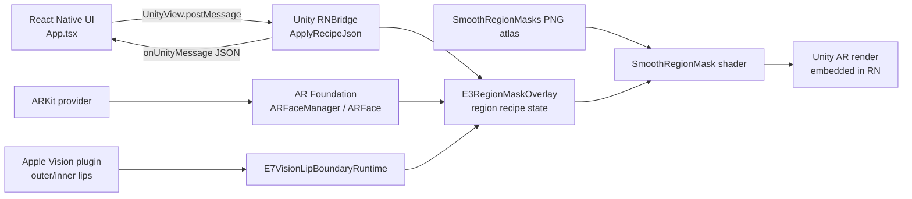

# AR Makeup Tooling Landscape

Status: Architecture reference  
Date: 2026-06-27 KST  
Scope: 현재 레포가 실제로 쓰는 도구와 AR 메이크업 앱 개발자가 알아둘 주변 생태계 도구를 비교한다. 이 문서는 상용 SDK, AI/model inference, backend upload, Android 구현을 시작하지 않는다.

## 요약

현재 레포의 핵심 선택은 `React Native host + embedded Unity + AR Foundation + ARKit on real iPhone`이다. RN은 제품 UI와 레시피 컨트롤을 맡고, Unity는 AR 카메라/얼굴 메시/메이크업 렌더링을 맡으며, iOS 네이티브 플러그인은 Apple Vision 립 랜드마크 보강에 쓰인다.

이 구조의 장점은 App Store용 iPhone 앱 안에 자체 렌더링 엔진을 만들 수 있고, Unity 셰이더/마스크/ARFace mesh를 직접 통제할 수 있다는 점이다. 단점은 상용 뷰티 SDK처럼 완성된 얼굴 부위 분리, 피부 보정, 색상 매칭, 제품 질감 시뮬레이션이 자동으로 오지 않는다는 점이다. 즉, 현재 방향은 "엔진을 산다"보다 "플랫폼 SDK와 Unity를 조합해 우리 렌더러를 만든다"에 가깝다.

상용/소셜 생태계의 Banuba, DeepAR, Perfect Corp, Snap Camera Kit, TikTok Effect House, Lens Studio 등은 레시피 설계와 UX/렌더링 벤치마크로는 매우 유용하다. 하지만 이 레포에 직접 통합하려면 사용자 승인, 라이선스/상업성 검토, 개인정보/카메라 데이터 검토가 먼저 필요하다.

## 현재 코드에서 실제 사용 중인 도구

| 구분 | 도구 | 현재 쓰는 곳 | 용도 | 특징 | 장점 | 단점/주의 |
| --- | --- | --- | --- | --- | --- | --- |
| 앱 셸 | React Native `0.86.0`, React `19.2.3`, TypeScript | `rn/MakeupARValidation/package.json`, `App.tsx` | iOS 앱 UI, AR 화면 진입, 레시피 조작, Unity 이벤트 표시 | JS/TS로 네이티브 앱 UI를 빠르게 구성 | 제품 UI와 AR 엔진을 분리하기 좋음. 테스트/Jest와 궁합 좋음 | AR 자체 기능은 없음. Unity embed lifecycle, iOS native dependency와 충돌할 수 있음 |
| Unity embed | `@azesmway/react-native-unity` `^1.0.11` | `App.tsx`, `react-native-unity.d.ts`, `scripts/patch-react-native-unity-ios.js` | RN 화면 안에 `UnityView`를 띄우고 `postMessage`/`onUnityMessage`로 통신 | Unity as a Library를 RN 컴포넌트로 감싼 bridge | 현재 구조의 핵심 연결부. RN UI와 Unity AR 런타임을 한 앱에 넣음 | iOS timing/lifecycle이 까다로워 package-local patch가 존재. 패키지 업데이트 때 패치 재검증 필요 |
| AR/렌더 엔진 | Unity `6000.3.18f1` | `unity/MakeupARUnityValidation/ProjectSettings/ProjectVersion.txt` | AR scene, face mesh renderer, shader/material, iOS UnityFramework export | C# + shader + iOS export 지원 | AR Foundation, custom shader, asset pipeline을 한곳에서 다룸 | Unity 버전/패키지/빌드 캐시 의존성이 큼. UnityFramework sync가 필요 |
| AR 추상화 | Unity AR Foundation `6.3.5` | `Packages/manifest.json`, `E3RegionMaskOverlay.cs`, `FaceTrackingStatusReporter.cs` | `ARFaceManager`, `ARFace`, `ARCameraManager`, `ARCameraBackground` 기반 얼굴 추적/카메라 배경 | ARKit/ARCore 같은 provider를 Unity API로 추상화 | iOS ARKit primary path를 유지하면서 Unity 렌더러와 결합 가능 | 추상화 계층이라 provider별 제약은 직접 확인해야 함. 얼굴 부위 메이크업 렌더러는 직접 구현해야 함 |
| iOS AR provider | Unity ARKit XR Plug-in `6.3.5`, Apple ARKit | `Packages/manifest.json`, `MakeupARValidationSetup.cs`, build script 검증 | iPhone 전면 카메라 face tracking, ARFace mesh/UV/blendshape provider | ARKit face tracking을 Unity에서 사용 | iPhone 실기기 AR 메이크업의 primary tracking basis | 지원 기기/카메라 방향/권한/실기기 검증 필요. Android 경로가 아님 |
| XR 설정 | XR Plug-in Management `4.5.4`, XR Management assets | `Packages/manifest.json`, `Assets/XR/*`, `MakeupARValidationSetup.cs` | iOS ARKit loader 할당, XR runtime 구성 | build target별 XR loader를 관리 | Unity scene 생성/빌드 자동화에 필수 | 설정 asset이 깨지면 ARKit loader가 누락될 수 있음 |
| 얼굴 상태 진단 | `FaceTrackingStatusReporter.cs` | Unity runtime | ARSession state, face count, trackable lifecycle, FPS/메모리/thermal 일부 로그 | AR runtime 상태를 RN/로그로 보내는 진단 계층 | alignment/lifecycle 문제를 제품 UX와 분리해 볼 수 있음 | 로그가 많아질 수 있음. 실제 readiness claim은 증거와 함께 해야 함 |
| RN-Unity 프로토콜 | `RNBridge.cs` | Unity runtime | RN recipe JSON 수신, Unity event JSON 송신, capture/visibility command 처리 | 앱 레시피와 Unity 렌더러 사이의 contract | recipe schema를 제품 엔진 API처럼 발전시키기 좋음 | JSON string 기반이라 schema validation/버전 관리가 중요 |
| 부위 렌더러 | `E3RegionMaskOverlay.cs` | Unity runtime | lip/cheek/eye region recipe, ARFace mesh, mask texture, Vision lip boundary를 합성 | mesh/UV mask, screen/UV Vision mask, tracking visibility, diagnostics를 함께 처리 | 상용 SDK 없이 자체 region renderer를 키우는 중심 | 파일이 커지고 책임이 많음. 향후 renderer/model/state 분리가 필요할 수 있음 |
| 커스텀 셰이더 | `SmoothRegionMask.shader` | `Assets/Shaders`, `SmoothRegionMaskMaterial.mat` | 부위 마스크를 soft sample하고 pigment/gloss/gradient/overline 계층 렌더링 | mask channel, feather, threshold, blend, gloss 파라미터를 shader에서 합성 | 메이크업 질감/마스크 edge를 직접 제어 | 피부/조명/색 재현은 아직 제한적. shader sampling이 늘면 성능 비용 증가 |
| 마스크 asset | `Assets/Resources/SmoothRegionMasks/*.png` | Unity Resources | lip/cheek/eye mask, lip style atlas, gradient density atlas | 런타임 `Resources`로 불러오는 PNG atlas | 빌드 없는 preview와 Unity runtime이 같은 asset을 볼 수 있음 | Resources 남용은 규모가 커질 때 관리/메모리 부담. asset provenance 기록 필요 |
| texture import 자동화 | `SmoothRegionMaskTextureImporter.cs` | Unity Editor | mask PNG를 non-sRGB, readable, uncompressed, clamp/bilinear로 강제 | 마스크 샘플링 오류를 줄이는 import rule | 실수로 압축/sRGB가 들어가는 위험 감소 | import path가 `Assets/Resources/SmoothRegionMasks/`에 묶여 있음 |
| iOS native lip boundary | Apple Vision native plugin | `Assets/Plugins/iOS/E7VisionLipBoundary.mm`, `E7VisionLipBoundaryRuntime.cs` | PNG frame에서 `VNDetectFaceLandmarksRequest`로 outer/inner lips 검출 | C/Obj-C++ bridge로 Unity C#에서 Vision 호출 | ARKit mesh mask의 립 경계 보강 후보 | 프레임 캡처/PNG encode/landmark 변환 비용이 있음. 실시간 품질/프라이버시 검토 필요 |
| reference capture | `E7SynchronizedCaptureExporter.cs` | Unity runtime | frame, projected mesh overlay, ARFace export JSON 저장 | 화면과 mesh/UV/indices를 동기화해 증거 생성 | region mask/UV atlas 검증에 강함 | raw frame 저장은 기본 금지 원칙과 충돌할 수 있어 명시적 목적/관리 필요 |
| UnityFramework build | `scripts/build_m3_unityframework.sh` | repo root | Unity iOS export, ARKit native links 검증, `UnityFramework.framework` 빌드/동기화 | batchmode Unity + xcodebuild + artifact verification | 재현 가능한 iOS UnityFramework 생성 루프 | 실기기/RN build 전 사용자 승인 필요. Unity/Hub/Licensing 프로세스 이슈 주의 |
| iOS build chain | Xcode, `xcodebuild`, CocoaPods, Bundler | `ios/Podfile`, `Gemfile`, build script | RN iOS native dependency 설치와 앱/UnityFramework 빌드 | iOS 앱 배포의 표준 툴체인 | App Store 방향과 맞음 | signing team, device, DerivedData, Pods 상태에 민감 |
| JS build/dev | Node `>=22.11.0`, npm, Metro, Babel | `package.json`, `metro.config.js`, `babel.config.js` | RN bundling, dev server, package install | RN 개발 표준 | 빠른 UI 반복 | native/Unity 문제는 Metro만으로 검증 불가 |
| JS 테스트 | Jest, `react-test-renderer` | `__tests__/App.test.tsx` | recipe payload, Unity event display, UI state 검증 | RN logic unit test | real device 없이 recipe schema 회귀를 잡음 | AR visual alignment, shader 품질, iOS lifecycle은 못 잡음 |
| 정적 품질 | ESLint, Prettier, TypeScript | `package.json`, config files | JS/TS 코드 스타일과 type check | RN 기본 품질 루프 | 작은 UI/schema 실수 방지 | Unity C#/shader/iOS native는 별도 검증 필요 |
| 이미지/atlas 도구 | Python, NumPy, Pillow | `scripts/e7_reference_atlas/*.py` | lip atlas 생성, preview sheet, soft SDF 검증, runtime expected preview | buildless 이미지 렌더/검증 | Unity 빌드 전 shader/atlas 아이디어를 빠르게 검증 | Python dependency 재현성 관리가 필요. 실제 Unity shader와 완전 동일하지 않을 수 있음 |
| Vision gate script | Swift + Vision/CoreImage/ImageIO | `scripts/e7_reference_atlas/run_vision_lip_boundary_gate.swift` | 정지 이미지 립 landmark/mask gate | native Vision 결과를 Unity 밖에서 빠르게 확인 | iOS Vision logic 검증에 유용 | runtime AR camera/motion 상황을 완전히 대체하지 못함 |
| 증거/미디어 검사 | `ffmpeg`, `ffprobe` 권장 | `AGENTS.md`, runbook/evidence 규칙 | screen recording/contact sheet/log evidence 확인 | 영상/프레임 분석 표준 도구 | motion evidence를 요약 가능 | raw recording은 기본 보관 금지. 필요할 때만 metadata/대표 frame 중심 |

## 현재 코드 파이프라인

현재 product-quality 메이크업의 중심 abstraction은 `region recipe layer`다. RN은 `lip`, `cheek`, `eye`의 색상, opacity, intensity, finish, blend mode, mask texture id 등을 batch payload로 보내고, Unity는 이를 ARFace mesh/UV와 mask texture에 적용한다.

## 현재 구조의 장단점

| 관점 | 장점 | 단점/리스크 | 현재 판단 |
| --- | --- | --- | --- |
| 제품 통제권 | 자체 UI, 자체 recipe schema, 자체 shader/mask를 가짐 | 상용 SDK처럼 완성 기능이 자동 제공되지 않음 | 계속 유지. 학습/제품 소유권이 큼 |
| iPhone AR 품질 | ARKit face tracking과 Unity renderer를 직접 사용 | 실기기, signing, UnityFramework sync, camera alignment 검증 비용 | 현재 primary path |
| 렌더링 확장성 | mask atlas, finish, gloss, gradient, overline 등 직접 확장 가능 | shader/state가 복잡해질수록 디버깅 난이도 증가 | renderer 모듈 분리 여지 있음 |
| QA/증거 | RN unit test, Unity logs, reference capture, preview scripts가 있음 | visual QA는 여전히 수동/실기기 중심 | 증거 루프를 유지해야 함 |
| 라이선스/상업성 | Apple/Unity/RN/open-source 중심이라 검토 가능성이 높음 | Unity license, third-party package, mask/asset provenance는 계속 관리 필요 | 상용 SDK 도입 전까지는 비교적 통제 가능 |
| 개인정보 | 기본적으로 backend/upload 없이 on-device AR 중심 | Vision capture/export는 frame 처리와 raw artifact 관리가 민감 | frame 저장/AI/backend는 승인 필요 |

## AR 메이크업 앱 개발자가 알아둘 도구 생태계

### 1. Native iOS / Apple stack

| 도구 | 어디에 쓰나 | 특징 | 장점 | 단점/주의 | 현재 레포와 관계 |
| --- | --- | --- | --- | --- | --- |
| ARKit Face Tracking | iPhone/iPad face pose, face mesh, blendshape, eye tracking | Apple platform AR provider | 실기기 AR 품질, App Store 친화성 | 지원 기기/전면 카메라/권한/기기 발열 제약 | Unity ARKit XR Plug-in을 통해 사용 중 |
| Apple Vision | face landmarks, segmentation/classification, image analysis | `VNDetectFaceLandmarksRequest` 등 on-device computer vision | lip landmarks 같은 2D 보강에 유용 | frame capture/좌표계/성능/프라이버시 부담 | 립 경계 보강용 native plugin 사용 중 |
| Core Image | 이미지 필터, mask blend, blur, color processing | iOS/macOS 이미지 처리 프레임워크 | offline gate/preview에 편함 | realtime AR renderer로 쓰려면 GPU/좌표 동기화 필요 | Swift gate에서 mask feather/blend에 사용 |
| Metal / Metal Performance Shaders | GPU rendering, compute, optimized image/ML primitives | Apple GPU low-level stack | 최적화 한계까지 갈 때 유리 | 구현 난이도 높음 | 현재 Unity/iOS export가 MPS framework를 링크 |
| AVFoundation | camera capture/photo/video pipeline | native camera/media framework | photo/video product mode에 필수 | Unity AR camera와 병행 시 pipeline 설계가 어려움 | 아직 직접 product mode로 쓰지 않음 |
| RealityKit / SceneKit | iOS native 3D/AR rendering | Swift-native AR app option | Unity 없이 native 앱 가능 | Unity shader/asset ecosystem보다 AR makeup renderer 자산이 적을 수 있음 | 대체 경로 후보 |
| Core ML / Vision ML | on-device model inference | segmentation/recommendation/analysis 후보 | 서버 업로드 없이 AI 가능 | AI/model inference는 명시 승인/프라이버시 검토 필요 | 현재 scope 밖 |
| Xcode Instruments / GPU capture | CPU/GPU/memory/thermal profiling | Apple official profiling tools | real-device bottleneck 확인 | 해석 난이도 있음 | 실기기 QA 때 필수 후보 |

### 2. Unity / XR / rendering stack

| 도구 | 어디에 쓰나 | 특징 | 장점 | 단점/주의 | 현재 레포와 관계 |
| --- | --- | --- | --- | --- | --- |
| Unity AR Foundation | cross-provider AR API | ARKit/ARCore를 Unity API로 추상화 | iOS primary와 Android future를 같은 architecture로 생각 가능 | provider별 기능 차이는 직접 확인 | 사용 중 |
| Unity ARKit XR Plug-in | AR Foundation의 iOS provider | ARKit face tracking, session, camera provider | iPhone AR path의 핵심 | Unity/ARKit package version 민감 | 사용 중 |
| XR Plug-in Management | loader/settings 관리 | build target별 XR runtime 선택 | build reproducibility | settings asset 누락 시 AR 실패 | 사용 중 |
| Unity as a Library | Unity를 iOS framework로 export | `UnityFramework.framework` embedded runtime | RN host app과 Unity runtime 결합 | fullscreen/single runtime/lifecycle caveat | 사용 중 |
| URP / Shader Graph | Unity 렌더 파이프라인/노드 shader | custom material authoring | 아티스트/디자이너 협업에 좋음 | 현재 shader는 수기 CGPROGRAM. URP 전환은 별도 비용 | 후보 |
| Unity Profiler / Frame Debugger | runtime profiling/render pass debug | CPU/GPU/draw call/material 확인 | shader/AR bottleneck 분석 | device attach가 필요 | 후보 |
| AR Foundation Samples | official sample reference | face mesh, blendshape, scene setup 비교 | 현재 scene/pose alignment 검증 기준 | sample license/버전 확인 필요 | 참고 후보 |
| Addressables / AssetBundles | asset delivery/versioning | mask/texture가 늘 때 관리 | Resources보다 규모 관리에 좋음 | 초기 설정 비용 | future candidate |

### 3. Google / cross-platform CV stack

| 도구 | 어디에 쓰나 | 특징 | 장점 | 단점/주의 | 추천 위치 |
| --- | --- | --- | --- | --- | --- |
| MediaPipe Face Landmarker | face landmarks, blendshapes, facial transform | 3D landmark 중심의 cross-platform face analysis | ARKit fallback/reference, offline analysis에 강함 | 메이크업 renderer는 직접 만들어야 함. Unity/RN native integration 비용 | fallback/reference |
| ML Kit Face Detection | mobile face detection/landmarks/contours | app-friendly Google mobile vision API | lightweight face detection UX에 유용 | dense face mesh/AR makeup renderer로는 부족 | non-AR utility 후보 |
| ARCore Augmented Faces | Android face mesh/region poses | 468-point dense 3D face mesh와 face texture overlay use case | Android future path | 현재 iPhone-first scope 밖 | future Android candidate |
| TensorFlow Lite / LiteRT | on-device model runtime | custom segmentation/recommendation model 실행 | 자체 AI 모델 배포 가능 | AI/model inference 승인과 privacy review 필요 | approved AI scope에서만 |
| OpenCV | image processing/CV utilities | mask ops, color, geometry, calibration | offline tooling에 강함 | mobile realtime AR face tracking 대체로는 부족 | scripts/tools 후보 |

### 4. Commercial beauty AR SDKs

| 도구 | 어디에 쓰나 | 특징 | 장점 | 단점/주의 | 현재 판단 |
| --- | --- | --- | --- | --- | --- |
| Perfect Corp / YouCam | virtual makeup try-on, product SKU, shade/finish, skin analysis | 뷰티 커머스용 완성형 SDK/SaaS | 빠른 polished beauty UX, 제품 catalog 기능 | 유료/상용, vendor lock-in, 내부 renderer closed | 벤치마크. 직접 통합은 승인 필요 |
| Banuba Face AR SDK | face AR effects, makeup prefabs, effect player | foundation/blush/lipstick/eyeshadow/gloss 등 typed makeup parameters | recipe schema 참고 가치가 큼 | commercial SDK/license, runtime dependency | 벤치마크. 직접 통합은 승인 필요 |
| DeepAR | face filters, beauty API/effect player | beauty/makeup namespaces, mobile/web SDK | effect player와 beauty controls 제공 | commercial SDK, 내부 tracking/rendering closed | 벤치마크. 직접 통합은 승인 필요 |
| Snap Camera Kit | Snap AR lenses를 app에 embed | Lens Studio asset/runtime ecosystem과 연결 | 고품질 creator ecosystem 활용 가능 | Snap terms, review, branding, dependency | 별도 승인/검토 필요 |
| ModiFace | L'Oreal 계열 beauty AR/try-on | 업계 대표 virtual try-on tech | 상용 품질 benchmark | public low-level SDK 접근 제한/closed | 벤치마크 |
| Revieve / Twinit류 beauty AI vendors | skin analysis, personal color, virtual try-on, recommendation | AI/beauty SaaS 성격 | product/UX benchmark | backend/upload/AI/privacy/commercial scope | 리서치만 |

상용 SDK의 공통 장점은 빠른 완성도다. 공통 단점은 비용, 라이선스, vendor lock-in, 데이터 처리 조건, 내부 알고리즘 비공개다. 이 레포의 현재 목표가 "자체 AR makeup engine"이면 상용 SDK는 당장 도입할 대상이 아니라 비교 기준과 설계 힌트로 보는 편이 맞다.

### 5. Social AR authoring tools

| 도구 | 어디에 쓰나 | 특징 | 장점 | 단점/주의 | AR makeup에서 배울 점 |
| --- | --- | --- | --- | --- | --- |
| TikTok Effect House | TikTok effect 제작 | face effects, material editor, segmentation, visual scripting | creator UX와 region/effect authoring 참고 | TikTok platform runtime이지 우리 RN app engine이 아님 | lip/eye/skin object, performance budget, material controls |
| Snapchat Lens Studio | Snap lens 제작 | face mesh/mask/material/effects authoring | face mask/opacity texture/blend mode 참고 | Snap platform 중심. app embed는 Camera Kit 검토 필요 | face mask authoring workflow, preview/QA 방식 |
| Meta Spark / Spark AR | 과거 Instagram/Facebook AR effect 제작 | third-party effect ecosystem이 있었음 | platform dependency risk의 교훈 | 2025년 이후 third-party Spark effects/tooling은 안전한 신규 dependency로 보기 어려움 | platform ecosystem shutdown risk |

이 계열은 "앱 엔진"이라기보다 "효과 제작 툴/플랫폼"이다. 메이크업 레시피, material UI, QA checklist를 배울 수는 있지만, 우리 앱에 직접 들어가는 runtime으로 착각하면 안 된다.

### 6. Web AR / 3D / browser stack

| 도구 | 어디에 쓰나 | 특징 | 장점 | 단점/주의 | 추천 위치 |
| --- | --- | --- | --- | --- | --- |
| Three.js / WebGL / WebGPU | web preview, 3D/face demo | browser rendering stack | 공유 가능한 web demo 제작에 강함 | native iPhone ARKit face tracking과 다름 | product marketing/demo 후보 |
| 8th Wall | WebAR/face effects history and migration reference | hosted platform retirement 공지가 있어 신규 의존성으로는 위험 | web-based AR/face effects 설계 참고 | 2026-02-28 hosted platform retired, existing experiences도 2027-02-28까지만 유지 공지 | legacy/reference only |
| Zappar | WebAR/face tracking | web/mobile AR tools | web-based face effects 가능 | native app engine 대체는 아님 | campaign/prototype 후보 |
| WebAssembly | CV/model web runtime | browser에서 native-like performance | MediaPipe web 등과 결합 가능 | mobile Safari/GPU/thermal 제약 | web prototype 후보 |

웹 AR은 배포/마케팅에는 매력적이지만, 현재 레포의 실기기 App Store iPhone AR makeup engine과는 별개 제품 경로로 보는 게 안전하다.

### 7. Face parsing / segmentation / research models

| 도구/자료 | 어디에 쓰나 | 특징 | 장점 | 단점/주의 | 현재 판단 |
| --- | --- | --- | --- | --- | --- |
| CelebAMask-HQ | face parsing class reference | skin, lip, eye, brow 등 semantic labels | region taxonomy 참고에 좋음 | non-commercial research 조건. shipping asset/model로 쓰면 안 됨 | research only |
| LaPa dataset | face parsing/landmark research | face part labels + landmarks | lip/eye/face boundary 연구 참고 | license/redistribution 검토 필요 | research only |
| BiSeNet face parsing | face parsing implementation | pretrained face segmentation 예시 | offline mask prototype 참고 | dataset/weights license 별도 | research only |
| SegFace | face segmentation benchmark | long-tail segmentation 참고 | mobile/lightweight backbone 아이디어 | weights/datasets 조건 확인 필요 | research only |
| Segment Anything 계열 | generic segmentation | promptable segmentation | asset prep/offline annotation 보조 | realtime face makeup 전용 아님. license/model review 필요 | tooling 후보 |
| FLAME/DECA/3DDFA류 3D face models | 3D face reconstruction research | canonical face model/mesh fitting | UV/topology 연구에 도움 | realtime mobile product integration 난이도/라이선스/AI scope | research only |

AI/model inference, recommendation, backend upload, raw-frame storage는 사용자 승인과 privacy review 없이 구현하지 않는다. 연구 자료는 region semantics를 배우는 용도와 shipping dependency를 명확히 분리해야 한다.

### 8. Asset, color, visual QA tools

| 도구 | 어디에 쓰나 | 특징 | 장점 | 단점/주의 |
| --- | --- | --- | --- | --- |
| Blender | face mask/mesh/UV asset 확인 | free 3D tool | Unity asset 검수와 UV 이해에 좋음 | ARKit runtime mesh와 topology가 다를 수 있음 |
| Substance 3D / Photoshop / Procreate | texture, mask, gloss/specular asset 제작 | artist tooling | product-quality finish texture 제작에 강함 | license/provenance 기록 필요 |
| Figma | UI/product flow/design doc | collaborative design | RN UI/controls 설계에 유용 | AR visual result 검증 도구는 아님 |
| OpenColorIO / ICC profiles / ColorChecker | color management/calibration | 색 재현 기준 도구 | 립 컬러/피부 톤 QA에 중요 | 모바일 카메라/조명 변수가 큼 |
| DaVinci Resolve / ffmpeg | video evidence/contact sheet | motion evidence 분석 | 실기기 recording QA에 유용 | raw video 보관 정책 주의 |

## 주요 비교표

### Build vs Buy vs Platform

| 선택지 | 대표 도구 | 좋은 경우 | 장점 | 비용/리스크 | 현재 추천 |
| --- | --- | --- | --- | --- | --- |
| 직접 구축 | RN + Unity + AR Foundation + ARKit + custom shader | 장기적으로 자체 엔진/제품 통제권이 필요할 때 | 소유권, 학습, 커스터마이즈 | 구현/QA 시간이 큼 | 현재 primary |
| 상용 SDK 구매 | Perfect Corp, Banuba, DeepAR, Camera Kit | 빠른 polished demo나 commercial try-on suite가 필요할 때 | 완성 기능 빠름 | 비용, vendor lock-in, closed runtime, privacy/license 검토 | 지금은 벤치마크 |
| 플랫폼 effect 제작 | Effect House, Lens Studio | TikTok/Snap 안에서 effect를 배포할 때 | creator ecosystem, 빠른 노출 | 우리 앱 runtime이 아님, 정책 종속 | 참고만 |
| 연구/오픈 CV 조합 | MediaPipe, ML Kit, OpenCV, face parsing models | fallback, offline analysis, prototype | 유연성, 비용 낮음 | renderer/좌표계/라이선스/AI scope 직접 관리 | 부분 후보 |
| native-only iOS | ARKit + RealityKit/SceneKit/Metal | Unity를 제거하고 Swift-native 앱을 만들 때 | iOS 최적화/단순 앱 구조 | Unity shader/asset pipeline 상실, 재작성 비용 | 대체 경로 |

### 기능별 최적 도구

| 목표 | 현재 도구 | 후보/대안 | 추천 |
| --- | --- | --- | --- |
| iPhone face tracking | ARKit via AR Foundation | native ARKit, MediaPipe fallback | 현재 유지 |
| lip boundary 보강 | Apple Vision plugin | MediaPipe contours, face parsing model | Vision은 후보로 유지, 성능/프라이버시 검증 |
| lip/cheek/eye region mask | custom PNG atlas + ARFace UV | Banuba-style prefab schema, face parsing reference | 자체 atlas/schema 강화 |
| makeup finish/gloss | `SmoothRegionMask.shader` | URP/Shader Graph, commercial SDK reference | shader를 작게 나누어 검증 |
| RN UI controls | React Native | native SwiftUI, Unity UI | RN 유지 |
| RN-Unity bridge | `react-native-unity` + local patch | custom native bridge, Unity-only app | patch를 durable하게 관리 |
| unit regression | Jest | Detox/Maestro/EarlGrey for e2e | Jest 유지, later e2e 추가 |
| performance profiling | Unity logs, xcodebuild logs | Unity Profiler, Xcode Instruments, Metal capture | 실기기 QA 때 추가 |
| competitor research | manual research notes | browser tools | 제품 런타임과 분리해 리서치 산출물만 보관 |

## 현재 레포 기준 권장 원칙

1. `ARKit + Unity AR Foundation`을 primary runtime으로 유지한다.
2. RN은 product UI와 recipe authoring surface, Unity는 AR tracking/rendering surface로 역할을 분리한다.
3. `MakeupRecipe`는 region, color, opacity, intensity, finish, blend mode, feather, mask texture id를 가진 versioned schema로 계속 키운다.
4. 상용 SDK는 "참고/벤치마크"로 문서화하되, 통합은 별도 승인과 라이선스/개인정보 검토 뒤에만 한다.
5. AI/model inference, backend upload, recommendation, raw-frame storage는 구현 전에 승인과 privacy review가 필요하다.
6. raw camera frame은 기본 저장하지 않는다. 증거가 필요하면 목적, 위치, 보관/삭제 정책을 함께 기록한다.
7. real-device Unity/RN build 전에는 정적 테스트, Unity import/compile, asset/script checks를 먼저 수행하고 사용자 승인을 받는다.
8. 제품 품질 주장은 App Store, commercial, privacy, license, production readiness 각각에 맞는 증거가 있을 때만 한다.

## 다음에 문서화하면 좋은 후속 항목

| 문서 | 위치 | 목적 |
| --- | --- | --- |
| MakeupRecipe schema v1 | `docs/architecture/` | RN-Unity payload field 의미와 versioning |
| Region mask/atlas map | `docs/architecture/` | lip/cheek/eye mask texture, channel, UV 기준 |
| iOS privacy/camera runbook | `docs/runbooks/` | camera permission, raw frame, evidence 저장 정책 |
| Visual QA checklist | `docs/runbooks/` | front/side/motion/lighting/finish별 acceptance checks |
| Commercial SDK decision memo | `docs/roadmaps/research/` | Banuba/DeepAR/Perfect/Snap 도입 여부 검토 |

## 참고한 현재 레포 파일

| 파일 | 확인 내용 |
| --- | --- |
| `AGENTS.md` | AR product scope, build approval, privacy/data boundaries, docs 위치 규칙 |
| `rn/MakeupARValidation/package.json` | RN, React, `@azesmway/react-native-unity`, Jest/TS/Metro 의존성 |
| `rn/MakeupARValidation/App.tsx` | UnityView, recipe payload, lip/cheek/eye controls, Unity event handling |
| `rn/MakeupARValidation/scripts/patch-react-native-unity-ios.js` | RNUnityView timing/lifecycle patch |
| `unity/MakeupARUnityValidation/Packages/manifest.json` | AR Foundation, ARKit XR Plug-in, XR Management versions |
| `unity/MakeupARUnityValidation/ProjectSettings/ProjectVersion.txt` | Unity `6000.3.18f1` |
| `unity/MakeupARUnityValidation/Assets/Scripts/RNBridge.cs` | RN-Unity message contract |
| `unity/MakeupARUnityValidation/Assets/Scripts/E3RegionMaskOverlay.cs` | region renderer, mask/vision diagnostics |
| `unity/MakeupARUnityValidation/Assets/Scripts/E7VisionLipBoundaryRuntime.cs` | Vision capture/detection runtime |
| `unity/MakeupARUnityValidation/Assets/Plugins/iOS/E7VisionLipBoundary.mm` | native Vision lip landmarks bridge |
| `unity/MakeupARUnityValidation/Assets/Shaders/SmoothRegionMask.shader` | makeup mask/finish shader |
| `scripts/build_m3_unityframework.sh` | UnityFramework export/build/sync loop |
| `scripts/e7_reference_atlas/` | lip atlas/preview/verification tooling |
| `docs/product/two-stage-ar-makeup-product-strategy.md` | product/license/privacy/documentation expectations |

## 외부 공식 자료

- Unity AR Foundation face tracking: https://docs.unity3d.com/Packages/com.unity.xr.arfoundation%406.3/manual/features/face-tracking/arfacemanager.html
- Unity ARFace lifecycle: https://docs.unity3d.com/Packages/com.unity.xr.arfoundation%406.3/manual/features/face-tracking/arface.html
- Unity face tracking platform support: https://docs.unity3d.com/Packages/com.unity.xr.arfoundation%406.3/manual/features/face-tracking/platform-support.html
- Unity as a Library for iOS: https://docs.unity3d.com/Manual/UnityasaLibrary-iOS.html
- React Native documentation: https://reactnative.dev/docs/getting-started
- `@azesmway/react-native-unity`: https://github.com/azesmway/react-native-unity
- Apple ARKit face tracking reference: https://developer.apple.com/documentation/arkit/tracking-and-visualizing-faces
- Apple Vision face landmarks reference: https://developer.apple.com/documentation/vision/vndetectfacelandmarksrequest
- Google MediaPipe Face Landmarker: https://ai.google.dev/edge/mediapipe/solutions/vision/face_landmarker
- Google ARCore Augmented Faces: https://developers.google.com/ar/develop/augmented-faces
- Google ML Kit Face Detection: https://developers.google.com/ml-kit/vision/face-detection
- Google LiteRT: https://developers.google.com/edge/litert
- Banuba makeup docs: https://docs.banuba.com/face-ar-sdk-v1/effect_api/makeup/
- Perfect Corp Makeup AR: https://www.perfectcorp.com/business/products/makeup-ar
- DeepAR official site: https://www.deepar.ai/
- TikTok Effect House: https://effecthouse.tiktok.com/
- Lens Studio: https://lensstudio.snapchat.com/
- 8th Wall docs and retirement notice: https://www.8thwall.com/docs/
- Zapworks docs: https://docs.zap.works/
- Three.js docs: https://threejs.org/docs/
