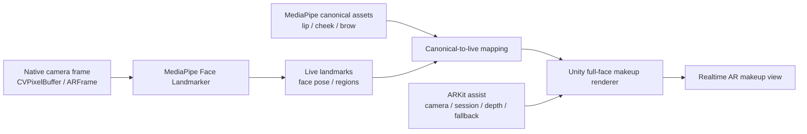

# MediaPipe-first AR Makeup Learning Notes

Status: Learning / architecture note
Date: 2026-06-30 KST
Scope: 이번 대화에서 나온 얼굴 인식, 좌표계, 메이크업 asset, 런타임 성능, QA 판단 기준을 학습 문서로 정리한다. 이 문서는 구현을 시작하지 않으며, AI/model inference 제품화, backend upload, raw-frame storage, 상용 SDK 통합은 별도 승인과 privacy review 없이는 범위에 포함하지 않는다.

## 왜 이 문서를 남기는가

이번 이슈의 핵심은 "메이크업이 안 예쁘다"가 아니라 "어떤 얼굴 좌표계를 제품 기준으로 삼을 것인가"였다.

눈썹은 한때 실제 눈썹보다 눈 위에 붙었고, 립은 입술 위치가 계속 어긋났고, 블러셔는 아예 보이지 않는 상태가 있었다. 이후 눈썹 위치는 많이 개선됐지만, 립과 치크 문제는 남았다. 이 흐름에서 배운 점은 명확하다.

메이크업 품질은 색상이나 PNG만의 문제가 아니다. 제품 asset이 그려진 좌표계, 런타임 얼굴 인식 좌표계, Unity 렌더러가 실제로 붙이는 좌표계가 서로 일치해야 한다.

## 대화 중 관찰한 증상

- 얼굴이 인식된 것처럼 보이는데도 debug HUD에는 `Guide waiting for face`, `Mesh waiting for face` 같은 메시지가 보였다.
- 눈썹 asset이 실제 눈썹이 아니라 눈 위쪽에 붙었다.
- 눈썹 위치 보정 후에도 립 위치는 여전히 틀렸고, 치크는 표시되지 않았다.
- 브로우를 켜면 립, 치크, 브로우가 모두 사라지는 현상이 있었다.
- 앱이 느려지고 화면이 계속 떨리는 현상이 있었다.
- 실제 기기 빌드 중 `passcode protected` 경고가 반복됐지만, 앱 설치/실행 자체를 막지는 않았다.
- UI에는 `ATLAS`, `PSD ARCORE`, `VISION`, `FLAT`, `PSD FLAT`처럼 비슷해 보이는 선택지가 많아 사용 목적이 불분명했다.

## 주요 원인 해석

### 1. Asset 좌표계와 런타임 부착 좌표계가 섞였다

현재 제공된 PSD/asset은 MediaPipe 또는 ARCore canonical face texture 기준에 가깝다. 그런데 기존 렌더링은 ARKit/AR Foundation의 `ARFace` mesh와 UV를 중심으로 붙이는 흐름이 강했다.

이 둘은 같은 얼굴처럼 보여도 같은 도화지가 아니다. MediaPipe canonical canvas에 그린 눈썹을 ARKit UV 기준 위치에 그대로 붙이면 실제 눈썹이 아니라 눈, 이마, 볼처럼 엉뚱한 위치에 갈 수 있다.

### 2. "얼굴 인식"과 "asset 도화지"는 다르다

MediaPipe canonical face는 asset을 그릴 기준 도화지다. 하지만 그것만으로 카메라 속 실제 사람의 눈썹, 입술, 볼을 자동으로 찾는 것은 아니다.

실제 placement에는 매 프레임 얼굴 landmark가 필요하다. 즉:

```text
authored asset canvas
  -> canonical face landmarks / regions
  -> live face landmarks
  -> runtime warp / mesh / screen placement
  -> makeup compositing
```

asset이 MediaPipe 기준이면 런타임도 MediaPipe landmark를 1차 기준으로 삼는 것이 가장 자연스럽다.

### 3. Debug/실험용 MediaPipe 경로가 제품 경로처럼 돌면 성능이 무너진다

대화 중 확인한 구조에서는 `ReadPixels + PNG encode` 같은 방식이 있었다. 이 방식은 화면을 GPU에서 CPU로 읽고, 이미지를 PNG로 인코딩하고, 다시 분석에 넣는 흐름이다.

이 방식은 디버그나 검증에는 쓸 수 있지만 실시간 AR 제품 경로에는 맞지 않는다. 프레임이 밀리고, 인식 결과가 늦게 오고, smoothing과 렌더 타이밍이 어긋나면서 덜덜 떨리는 화면이 나온다.

제품 구조에서는 native camera frame 또는 GPU texture 기반 입력으로 MediaPipe에 바로 넣어야 한다.

## 용어 정리

| 용어 | 이번 대화에서의 의미 | 주의점 |
| --- | --- | --- |
| ARKit / ARFace UV | iOS AR Foundation이 제공하는 얼굴 mesh와 UV | 빠르고 iOS에 잘 붙지만, MediaPipe asset과 좌표가 자동 일치하지 않는다 |
| MediaPipe canonical | MediaPipe/ARCore 계열 얼굴 asset 기준 도화지 | asset authoring 기준으로 쓰기 좋지만, live landmark pipeline이 필요하다 |
| ATLAS | 미리 만든 UV texture mask를 샘플링하는 방식 | 색감 선택이 아니라 영역/경계 소스다 |
| VISION | Apple Vision 또는 vision landmark 기반 runtime 경계 | 립 경계 실험에 유용하지만 성능/좌표 변환 리스크가 있다 |
| FLAT / DRAWN | 단순 수동 mask 또는 비교용 mask | 빠른 fallback이나 debug에는 좋지만 정밀도가 낮다 |
| PSD ARCORE | PSD에서 추출한 ARCore/MediaPipe canonical 기준 asset | ARKit UV에 bbox-fit하면 원래 의도가 깨질 수 있다 |
| Renderer | asset을 얼굴 위에 실제로 합성하는 Unity 경로 | region별로 lip/cheek/brow가 같은 renderer를 공유하면 원인 분리가 어렵다 |

## 대화에서 정리된 방향

장기적으로 정확한 메이크업 좌표가 우선이면, 제품 좌표계는 MediaPipe canonical을 기준으로 두는 편이 낫다.

정리하면:

- 새 메이크업 asset의 기준 도화지는 MediaPipe canonical으로 둔다.
- ARKit UV는 iOS camera/session/pose/depth/fallback 또는 과거 asset 호환용으로 쓴다.
- 립, 치크, 브로우 asset을 ARKit 기준으로 다시 만드는 것은 단기 patch가 될 수 있지만 장기 표준으로는 약하다.
- MediaPipe-first, ARKit-assist 구조가 장기적으로 더 일관적이다.



## 추천 아키텍처 원칙

### MediaPipe-first

MediaPipe landmark와 canonical coordinate를 제품 좌표계의 1차 기준으로 둔다. 립, 치크, 브로우 asset은 같은 얼굴 도화지 위에서 관리하고, 런타임도 같은 landmark topology를 기준으로 warping한다.

### ARKit-assist

ARKit은 버리는 것이 아니라 보조 역할로 둔다. iOS camera session, face tracking 안정성, pose/depth 보정, fallback, Unity scene integration에는 계속 가치가 있다.

다만 "메이크업이 얼굴 어디에 붙는가"의 기준은 ARKit UV가 아니라 MediaPipe canonical-to-live mapping이 되어야 한다.

### Full-face mesh renderer

부위별로 임시 bbox를 맞추는 방식보다, 전체 얼굴 canonical mesh 또는 full-face landmark 기반 renderer로 가는 편이 낫다. 그래야 lip, cheek, brow가 서로 다른 기준으로 흔들리지 않는다.

### Runtime frame path 교체

`ReadPixels + PNG encode`는 제품 경로에서 제거해야 한다. 목표는 다음 중 하나다.

- iOS native camera frame: `CVPixelBuffer` 또는 `ARFrame.capturedImage`
- GPU/Metal texture 기반 입력
- 최소 copy / 최소 encode / timestamp 동기화

### Smoothing과 frame sync는 엔진 책임이다

MediaPipe-first로 가면 우리가 직접 책임져야 하는 것이 늘어난다.

- landmark confidence
- lost face 처리
- landmark jitter smoothing
- expression 변화 대응
- render frame과 inference result timestamp 동기화
- 느린 inference frame을 렌더에 어떻게 적용할지
- region별 fallback과 fade

## 왜 ARKit asset 재제작보다 MediaPipe 기준이 나은가

ARKit 기준으로 asset을 다시 만들면 지금 iOS/Unity 경로에는 빨리 맞출 수 있다. 하지만 다음 문제가 남는다.

- 현재 PSD asset 기준과 계속 충돌한다.
- Android나 다른 engine으로 갈 때 다시 변환해야 한다.
- 립/치크/브로우가 점점 늘수록 ARKit UV 전용 asset 관리 비용이 커진다.
- 얼굴 부위별 정밀 landmark를 제품 기준으로 삼기 어렵다.

반대로 MediaPipe canonical을 제품 좌표계로 쓰면 초기에 엔진 작업은 더 크지만, asset 제작/QA/확장이 한 기준으로 모인다.

## 현재 선택지가 5개처럼 보였던 이유

`ATLAS`, `PSD ARCORE`, `VISION`, `FLAT`, `PSD FLAT`은 같은 축의 상품 옵션이라기보다 서로 다른 실험/호환 경로가 UI에 함께 노출된 상태에 가깝다.

제품 UI 또는 QA UI에서는 축을 분리해야 한다.

| 축 | 예시 | 설명 |
| --- | --- | --- |
| Region | lip, cheek, brow | 어느 부위를 켤지 |
| Asset source | PSD canonical, legacy ARKit atlas, flat debug | 어떤 도화지/원본에서 왔는지 |
| Boundary method | canonical mesh, vision boundary, drawn mask | 어디까지 칠할지 |
| Finish/look | matte, glossy, powder, hair detail | 어떻게 보일지 |
| Debug view | final, raw, processed, mesh, guide | QA용 표시 방식 |

이 축들이 섞이면 사용자는 색을 고르는지, 좌표계를 고르는지, 경계 알고리즘을 고르는지 알 수 없게 된다.

## 제품화 전 체크리스트

### 좌표계

- 새 asset이 어떤 canonical canvas 기준인지 명시한다.
- lip/cheek/brow가 같은 coordinate standard를 쓰는지 확인한다.
- ARKit UV fallback asset과 MediaPipe canonical asset을 파일명/metadata로 구분한다.
- bbox-fit이나 임시 scale/offset이 제품 표준이 되지 않게 기록한다.

### 런타임 입력

- 실시간 inference 입력이 `ReadPixels + PNG encode`를 통하지 않아야 한다.
- camera frame timestamp와 MediaPipe result timestamp를 기록한다.
- inference latency와 render latency를 분리해서 측정한다.
- raw camera frame 저장은 기본 금지이며, 필요 시 별도 승인과 privacy review를 거친다.

### 렌더링

- lip, cheek, brow를 같은 renderer에 넣더라도 region별 renderer id와 diagnostics를 분리한다.
- 한 region이 실패해도 다른 region이 사라지지 않게 한다.
- debug capture 중 최종 overlay가 숨겨지는 부작용을 만들지 않는다.
- shader mask는 color texture가 아니라 data texture로 처리한다.

### 성능과 안정화

- landmark smoothing은 region별로 적용한다.
- confidence가 낮을 때는 갑자기 튀지 말고 fade 또는 last-good pose를 쓴다.
- inference interval과 render frame rate를 분리한다.
- 오래된 landmark result를 무리하게 렌더에 적용하지 않는다.
- 브로우 같은 diagnostic feature가 전체 makeup rendering을 막지 않도록 runtime gate를 둔다.

### QA

- Clean view에서 실제 제품 결과를 본다.
- Debug view에서는 final/raw/processed/mask/guide/mesh를 분리해서 본다.
- 립, 치크, 브로우를 각각 단독으로 켜고, 조합으로도 켠다.
- 한 부위 활성화가 다른 부위를 숨기지 않는지 확인한다.
- 정면, 좌/우 회전, 표정 변화, 입 벌림, 눈썹 움직임을 각각 본다.

## 구현 로드맵으로 바꿀 때의 단계

1. 현재 ARKit 중심 렌더 경로와 MediaPipe 실험 경로를 명확히 분리한다.
2. MediaPipe canonical asset metadata를 정리한다.
3. iOS native frame 또는 GPU texture 입력으로 MediaPipe inference path를 만든다.
4. MediaPipe live landmarks를 Unity에 전달하는 bridge contract를 고정한다.
5. canonical asset을 live face로 warping하는 full-face mesh renderer를 만든다.
6. lip, cheek, brow를 같은 canonical mapping 위에서 표시한다.
7. smoothing, confidence, lost-face, fallback 정책을 renderer와 분리해서 관리한다.
8. ARKit assist 역할을 camera/session/pose/depth/fallback으로 정리한다.
9. QA UI에서 product option과 debug option을 분리한다.
10. 실기기에서 latency, jitter, region alignment acceptance를 기록한다.

## 남은 질문

- MediaPipe landmark만으로 립 경계의 제품 품질이 충분한가, 아니면 립은 별도 segmentation/contour 보강이 필요한가?
- 치크는 landmark 기반 region만으로 자연스러운가, 아니면 피부/광대 위치 보정이 필요한가?
- 브로우 hair detail은 canonical texture warping만으로 충분한가, 아니면 실제 눈썹 segmentation cleanup이 필요한가?
- Unity 렌더러를 언제 shared renderer에서 region-specific renderer로 나눌 것인가?
- MediaPipe inference를 RN native module, Unity native plugin, 또는 별도 iOS layer 중 어디에서 소유할 것인가?

## 한 줄 결론

정확한 메이크업 좌표가 목표라면 asset도, runtime landmark도, renderer도 같은 얼굴 도화지를 봐야 한다. 이번 대화의 결론은 ARKit을 버리는 것이 아니라, MediaPipe canonical을 제품 좌표계로 삼고 ARKit은 iOS AR 보조 계층으로 재배치하는 것이다.
