# E7 아이라인 Anchor-to-Band 대량 샘플 실험 보고서

상태: `pending_user_visual_pick`  
판정: buildless/local-only 샘플 생성 완료. iPhone runtime Green 또는 product-quality-ready 판정 아님.

## 1. 한 줄 결론

MediaPipe upper eyelid anchor를 기준으로 아이라인 band 후보 **144개**를 생성했다. 자동 필터 기준 pass는 **137개**, reject sheet로 보낸 후보는 **7개**다. 지금 단계의 목표는 자동 선택이 아니라, 사용자가 contact sheet에서 후보 ID를 고르는 것이다.

## 2. 왜 이 실험을 했나

직전 실험에서 `mp-upper-balanced-v0`는 가장 깔끔한 기준선으로 확인됐고, 여성 리뷰는 눈꼬리까지 채우는 wing 계열을 선호했다. 이번 실험은 그 결론을 이어서, 기준선을 그대로 칠하는 대신 두께, 눈꼬리 채움, tail 길이, angle, taper, softness를 바꾼 실제 아이라인 band 후보를 대량으로 만든 것이다.

외부 레퍼런스 이미지는 shape taxonomy로만 사용했다. repo asset, runtime texture, 학습 데이터로 복사하지 않았다.

## 3. 입력

| 항목 | 값 |
| --- | --- |
| Capture pair | `pair_face_20260627T091334Z_06` |
| Frame | `evidence/e7-reference-atlas/capture_pairs/pair_face_20260627T091334Z_06/frame.png` |
| Landmark | `mediapipe_face_landmarks.json` |
| ARFace export | `arface_export.json` |
| Best reference usage | `Cat / Puppy / Sexy / Winged / Colored / Doll` shape taxonomy only |

## 4. Geometry 기준

<figure>
  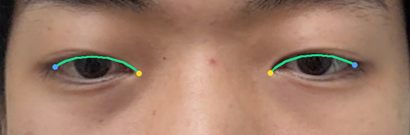
  <figcaption>그림 1. 초록색이 MediaPipe upper eyelid anchor다. 이번 후보들은 이 선을 기준으로 두께와 눈꼬리 band를 확장했다.</figcaption>
</figure>

## 5. 전체 Top 후보

<figure>
  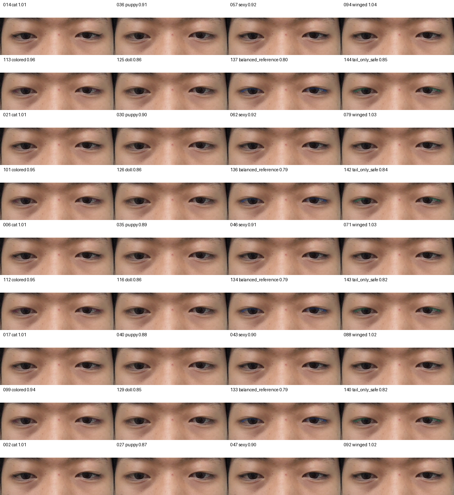
  <figcaption>그림 2. 사용자가 고르기 좋도록 family와 shape를 섞은 review 후보 36개 eye crop이다. score는 정렬 보조일 뿐이고 최종 선택은 사람이 한다.</figcaption>
</figure>

<figure>
  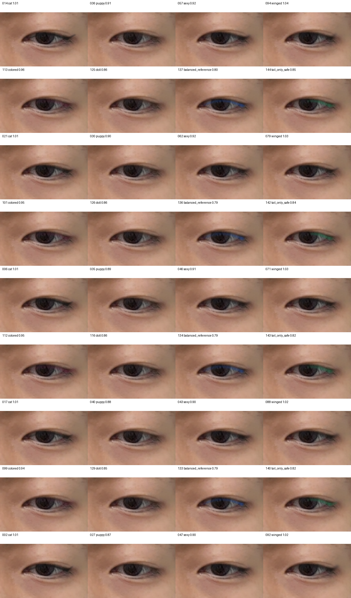
  <figcaption>그림 2-1. 왼쪽 눈만 확대한 review 후보 36개다. wide crop에서 잘 안 보이는 tail 두께와 눈꼬리 채움 차이를 여기서 본다.</figcaption>
</figure>

<figure>
  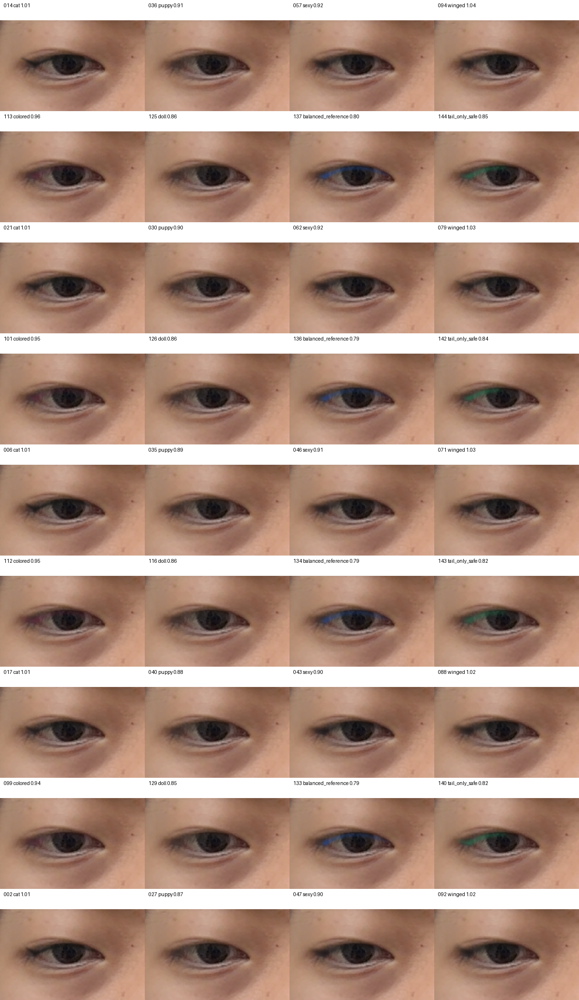
  <figcaption>그림 2-2. 오른쪽 눈만 확대한 review 후보 36개다. 좌우 대칭과 한쪽 눈에서만 어색한 후보를 확인한다.</figcaption>
</figure>

### 5.1 선택용 고대비 보기

검은 제품색 preview는 실제 아이라인 느낌을 보기에는 맞지만, 후보 선택 단계에서는 속눈썹/눈꺼풀 그림자와 겹쳐 tail 길이와 band 두께가 잘 안 보일 수 있다. 아래 이미지는 같은 후보를 cyan + white halo로 다시 표시한 **선택용 debug preview**다. 앱 제품색이나 최종 렌더링 스타일을 의미하지 않는다.

<figure>
  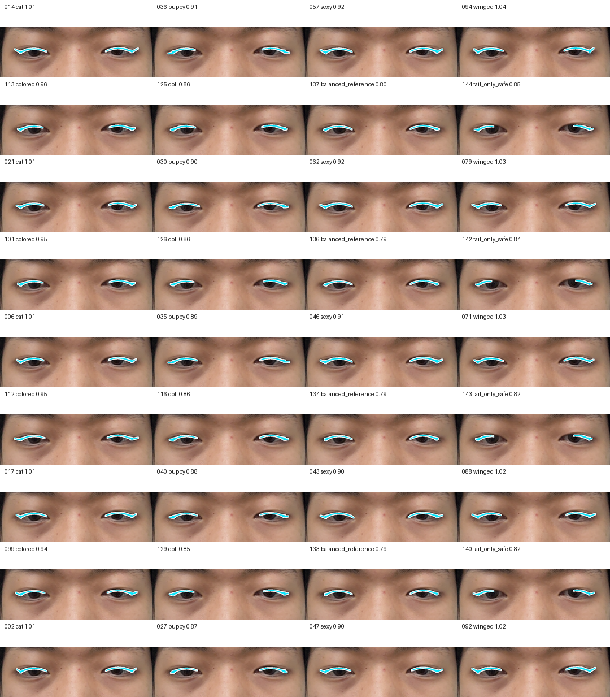
  <figcaption>그림 2-3. 전체 눈 crop 기준 고대비 review 후보 36개다. 검은색 preview에서 묻히는 아이라인 면적과 꼬리 방향을 확인하기 위한 용도다.</figcaption>
</figure>

<figure>
  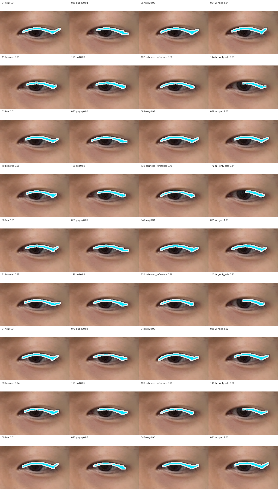
  <figcaption>그림 2-4. 왼쪽 눈 고대비 view. 후보 선택 시 tail 길이, 두께, 눈꼬리 채움 차이를 우선 확인한다.</figcaption>
</figure>

<figure>
  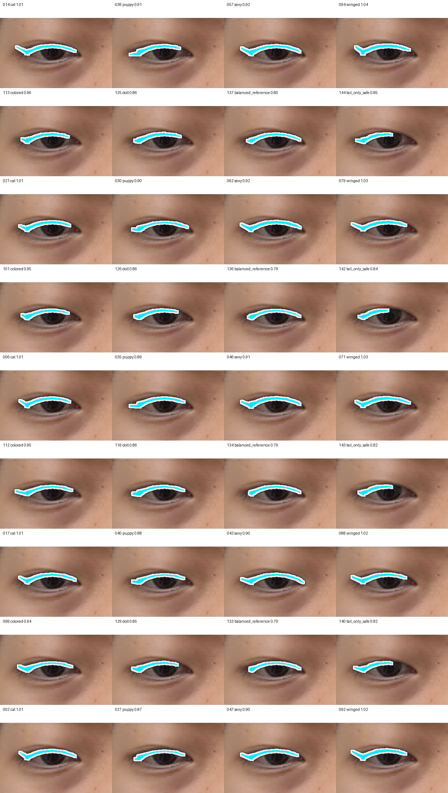
  <figcaption>그림 2-5. 오른쪽 눈 고대비 view. 좌우에서 한쪽만 과하거나 어색한 후보를 걸러내기 위한 용도다.</figcaption>
</figure>

## 6. Family별 후보

각 family는 사용자가 지정한 최고 레퍼런스의 style 이름을 shape family로만 사용했다.

| Family | 후보 수 |
| --- | ---: |
| cat | 24 |
| puppy | 18 |
| sexy | 24 |
| winged | 30 |
| colored | 18 |
| doll | 18 |
| balanced_reference | 6 |
| tail_only_safe | 6 |

<figure>
  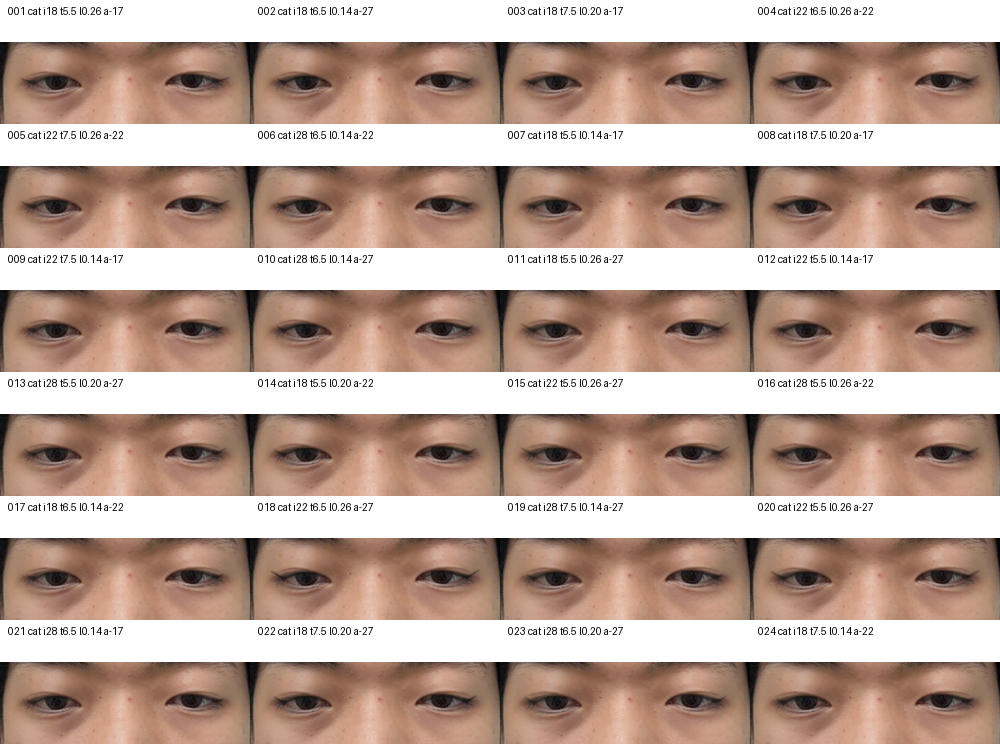
  <figcaption>그림 3. Cat: sharp, lifted, outer-focused.</figcaption>
</figure>

<figure>
  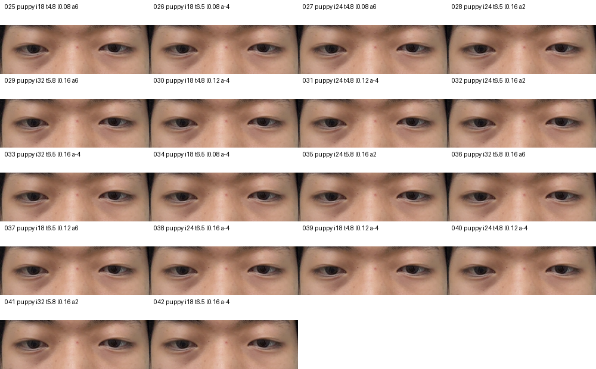
  <figcaption>그림 4. Puppy: soft, rounded, slightly lowered.</figcaption>
</figure>

<figure>
  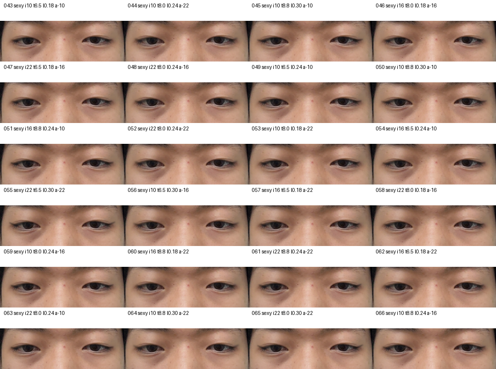
  <figcaption>그림 5. Sexy: longer, smoky, outer third emphasized.</figcaption>
</figure>

<figure>
  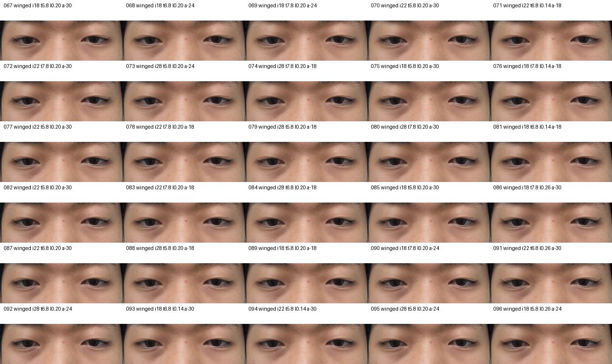
  <figcaption>그림 6. Winged: clean default wing 후보군. 기본 preset이 여기서 나올 가능성이 높다.</figcaption>
</figure>

<figure>
  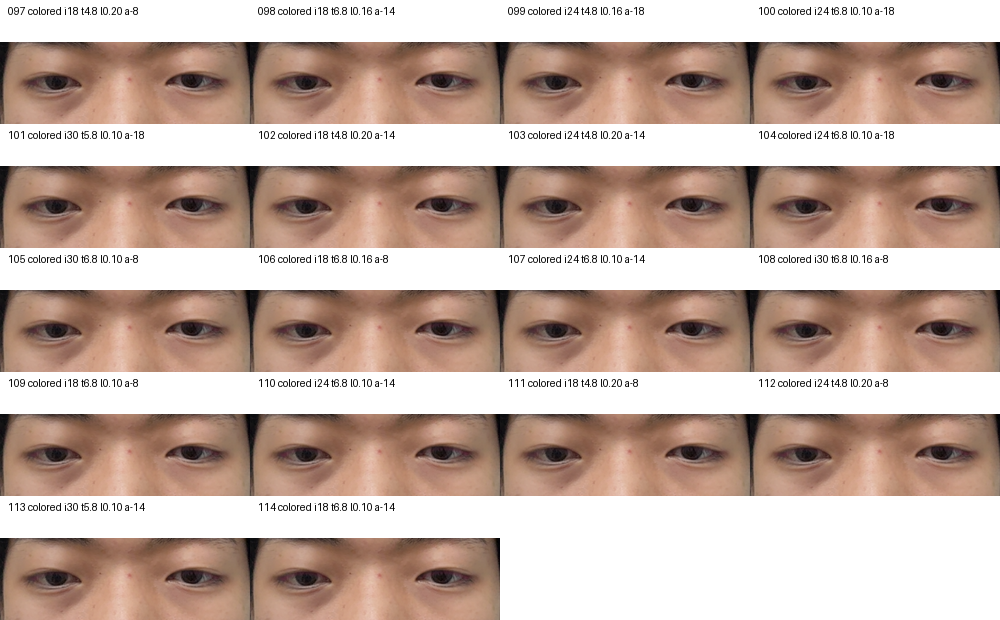
  <figcaption>그림 7. Colored: 색 자체보다 soft wing shape를 보기 위한 후보군이다.</figcaption>
</figure>

<figure>
  
  <figcaption>그림 8. Doll: rounder, shorter, softer 후보군.</figcaption>
</figure>

<figure>
  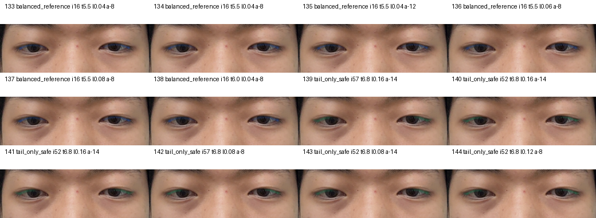
  <figcaption>그림 9. Balanced reference와 Tail-only safe. 기본 후보가 과하면 여기서 fallback을 고른다.</figcaption>
</figure>

## 7. Reject 후보

<figure>
  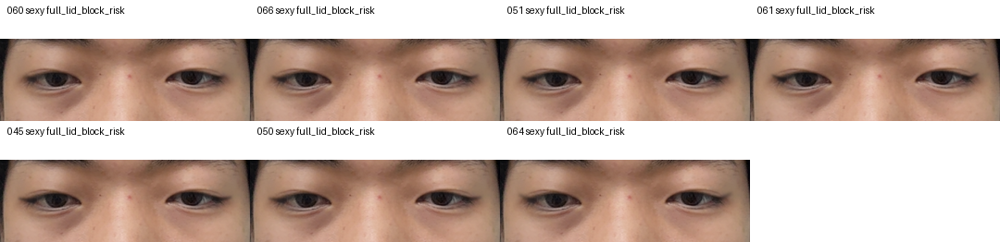
  <figcaption>그림 10. 자동 reject sheet. eye opening 침범, component 불안정, 과한 lid fill risk 등을 확인하기 위한 참고용이다.</figcaption>
</figure>

## 8. UV round-trip Top 12

<figure>
  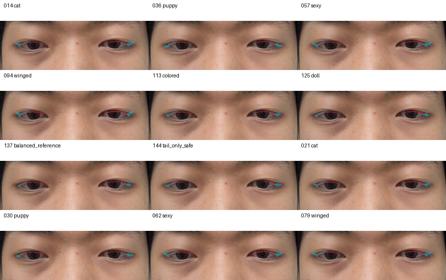
  <figcaption>그림 11. 상위 12개 후보의 ARFace UV round-trip sanity check. 얇은 선은 IoU가 낮게 나올 수 있으므로 깨짐/위치 이탈 여부를 위주로 본다.</figcaption>
</figure>

## 9. 후보 고르는 법

아래처럼 candidate ID로 골라주면 바로 앱 구현 기본 preset으로 승격할 수 있다.

```txt
1순위: winged-i18-t58-o16-l14-a18-s28-v001
2순위: cat-i22-t65-o22-l20-a22-s30-v009
싫은 방향: sexy는 너무 진함, puppy는 꼬리가 내려감
수정 요청: 1순위에서 꼬리 10% 짧게, 두께 살짝 얇게
```

Review 후보 중 상위 12개:

| 후보 ID | Family | Score | Reject | 핵심 파라미터 |
| --- | --- | ---: | --- | --- |
| `cat-i18-t55-o22-l20-a22-s22-u25-v014` | cat | 1.012 | pass | inner=0.18, thick=5.5, tail=0.2, angle=-22.0 |
| `puppy-i32-t58-o18-l16-a06-s50-u10-v012` | puppy | 0.909 | pass | inner=0.32, thick=5.8, tail=0.16, angle=6.0 |
| `sexy-i16-t65-o30-l18-a22-s38-u18-v015` | sexy | 0.924 | pass | inner=0.16, thick=6.5, tail=0.18, angle=-22.0 |
| `winged-i22-t58-o28-l14-a30-s44-u20-v028` | winged | 1.041 | pass | inner=0.22, thick=5.8, tail=0.14, angle=-30.0 |
| `colored-i30-t58-o22-l10-a14-s45-u16-v017` | colored | 0.957 | pass | inner=0.3, thick=5.8, tail=0.1, angle=-14.0 |
| `doll-i30-t52-o14-l08-a02-s62-u08-v011` | doll | 0.861 | pass | inner=0.3, thick=5.2, tail=0.08, angle=-2.0 |
| `balanced-reference-i16-t55-o08-l08-a08-s30-u00-v005` | balanced_reference | 0.802 | pass | inner=0.16, thick=5.5, tail=0.08, angle=-8.0 |
| `tail-only-safe-i52-t68-o12-l12-a08-s34-u00-v006` | tail_only_safe | 0.846 | pass | inner=0.52, thick=6.8, tail=0.12, angle=-8.0 |
| `cat-i28-t65-o28-l14-a17-s22-u15-v021` | cat | 1.008 | pass | inner=0.28, thick=6.5, tail=0.14, angle=-17.0 |
| `puppy-i18-t48-o18-l12-a04-s50-u10-v006` | puppy | 0.902 | pass | inner=0.18, thick=4.8, tail=0.12, angle=-4.0 |
| `sexy-i16-t65-o30-l18-a22-s38-u05-v020` | sexy | 0.919 | pass | inner=0.16, thick=6.5, tail=0.18, angle=-22.0 |
| `winged-i28-t58-o28-l20-a18-s28-u30-v013` | winged | 1.030 | pass | inner=0.28, thick=5.8, tail=0.2, angle=-18.0 |

## 10. 앱 구현 handoff

이번 산출물은 `selected_policy_pending_user.json` 상태다. 사용자가 후보를 고르면:

```txt
selected_policy_pending_user.json -> selected_policy.json
chosen candidate axes -> app default preset
nearby variants 12개 추가 생성 여부 결정
RN/Unity 구현으로 진입
```

현재 추천은 자동으로 확정하지 않는다. 다만 product 방향상 `winged` 또는 `cat` family에서 기본값이 나올 가능성이 높고, 너무 과하면 `balanced_reference` 또는 `tail_only_safe`를 fallback으로 둔다.

## 11. 산출물 위치

| 항목 | 위치 |
| --- | --- |
| 실험 root | `evidence/e7-eyeliner-anchor-to-band-experiment/experiment-20260627T151914Z` |
| candidate_grid | `evidence/e7-eyeliner-anchor-to-band-experiment/experiment-20260627T151914Z/candidate_grid.json` |
| scorecard | `evidence/e7-eyeliner-anchor-to-band-experiment/experiment-20260627T151914Z/scorecard.json` |
| shortlist | `evidence/e7-eyeliner-anchor-to-band-experiment/experiment-20260627T151914Z/shortlist.json` |
| selected pending | `evidence/e7-eyeliner-anchor-to-band-experiment/experiment-20260627T151914Z/selected_policy_pending_user.json` |
| adjustment axes | `evidence/e7-eyeliner-anchor-to-band-experiment/experiment-20260627T151914Z/adjustment_axes_candidates.json` |
| app handoff | `evidence/e7-eyeliner-anchor-to-band-experiment/experiment-20260627T151914Z/app_handoff_notes.md` |
| report artifact mirror | `docs/product/e7-eyeliner-anchor-to-band-experiment-report-2026-06-27/artifacts` |

## 12. 남은 한계

- static buildless frame 기준이다.
- blink/yaw/squint 안정성은 iPhone AR에서 따로 봐야 한다.
- UV round-trip은 sanity check이며 제품 품질 증명이 아니다.
- 사용자의 visual pick이 끝나야 앱 default preset이 확정된다.
