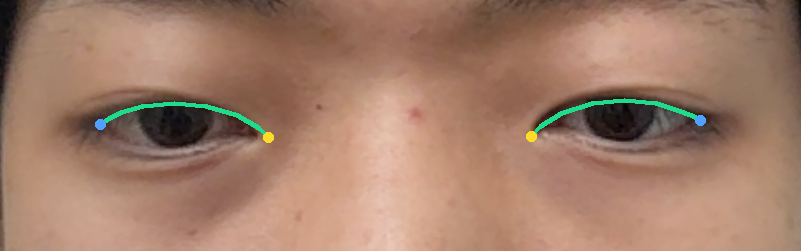
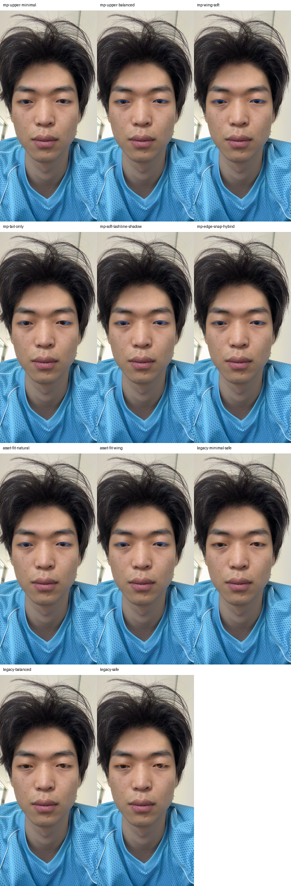
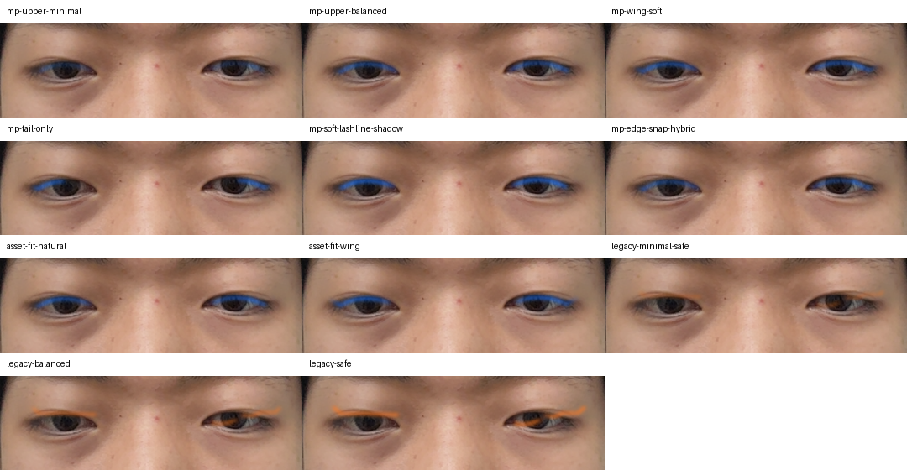
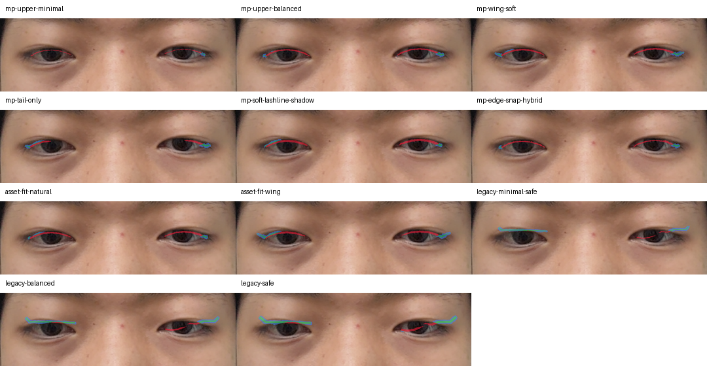
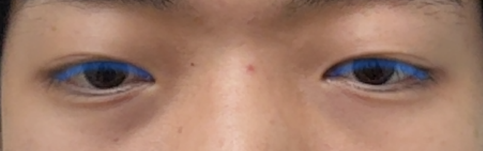

# E7 아이라인 마스크 후보 최종 실험 보고서

상태: buildless/local-only 실험 완료. iPhone runtime Green 또는 product-quality-ready 판정 아님.

## 1. 한 줄 결론

여성 리뷰 피드백을 반영한 최종 추천 조합은 **`asset-fit-wing-local-style-v0`** 이다. 추적 기준은 MediaPipe upper eyelid landmark를 유지하되, 최종 아이라인 모양은 눈꼬리까지 채우는 wing style preset으로 만든다. 기준선/reference이자 함께 비교할 자연형 후보는 **`mp-upper-balanced-v0`**, 안전 fallback은 **`mp-tail-only-v0`** 로 둔다.

## 2. 왜 다시 실험했나

기존 `eyeliner-minimal-safe-lashline-v0`는 앱 구현 전 baseline으로는 유용했지만, 실제 trace가 direct MediaPipe eyelid landmark라기보다 broad eye prior 안의 dark upper-lashline 추정에 가까웠다. 아이라인은 얇은 선이라 작은 오차가 바로 보이므로, 이번에는 MediaPipe landmark에서 upper eyelid curve를 직접 뽑아 후보를 만들었다.

## 3. 입력

| 항목 | 값 |
| --- | --- |
| Capture pair | `pair_face_20260627T091334Z_06` |
| Primary frame | `evidence/e7-reference-atlas/capture_pairs/pair_face_20260627T091334Z_06/frame.png` |
| Primary landmark | `mediapipe_face_landmarks.json` |
| Landmark count | `478` |
| 후보 수 | MediaPipe/parametric `8`개 + same-frame legacy baseline `3`개 |

용어를 짧게 정리하면 이렇다.

| 용어 | 의미 |
| --- | --- |
| MediaPipe upper eyelid | 눈 위쪽 경계 landmark. 이번 실험의 주 추적 기준 |
| Parametric curve | landmark를 그대로 칠하지 않고, 두께/꼬리/부드러움을 가진 곡선으로 다시 만든 마스크 |
| Eye opening overlap | 눈동자/눈 안쪽으로 침범했는지 보는 안전 지표. 이번 표에서는 boundary가 아니라 안쪽 safety zone 기준 |
| Legacy baseline | 기존 eye prior + dark pixel 방식. 같은 frame에서 다시 생성해 비교 |
| Human-review selected | 숫자 점수보다 실제 화장처럼 보이는지를 우선해 사람이 고른 후보 |

## 4. Geometry 확인

<figure>
  
  <figcaption>그림 1. 초록색 선이 MediaPipe upper eyelid curve, 노란 점이 inner corner, 파란 점이 outer corner다. 이번 후보들은 이 선을 기준으로 생성했다.</figcaption>
</figure>

## 5. 전체 후보 비교

<figure>
  
  <figcaption>그림 2. full-frame overlay 비교. 얼굴 전체에서는 선이 작게 보이므로 위치가 크게 틀어졌는지와 좌우 균형을 먼저 본다.</figcaption>
</figure>

<figure>
  
  <figcaption>그림 3. 실제 판단은 eye crop이 중요하다. 아이라인은 얇기 때문에 full-frame보다 crop에서 eye opening 침범, 눈꼬리 시작점, 꼬리 각도를 봐야 한다.</figcaption>
</figure>

## 6. UV round-trip 확인

<figure>
  
  <figcaption>그림 4. ARFace UV로 보냈다가 같은 frame으로 되돌린 preview다. 얇은 선이라 IoU만으로 품질을 단정하면 안 되고, 선이 완전히 깨지거나 엉뚱한 곳으로 가지 않는지를 본다.</figcaption>
</figure>

## 7. 선택 후보

<figure>
  
  <figcaption>그림 5. 선택 후보 `asset-fit-wing-local-style-v0`. MediaPipe upper eyelid 기준선을 쓰되, 눈꼬리까지 채우는 wing style로 확장한 형태다.</figcaption>
</figure>

선택 이유:

- 여성 리뷰에서 `asset-fit-wing`이 가장 아이라인처럼 보인다는 피드백이 나왔다.
- 실제 아이라인은 눈꼬리까지 채워져야 하므로, 단순 upper-line보다 wing style이 제품 기대에 더 맞다.
- eye opening overlap은 `0.0`으로 안전 지표를 통과했다.
- `tailStartDistanceFromOuterCornerPx=2.571`로 눈꼬리 시작점이 outer corner에 잘 붙는다.
- `mp-upper-balanced-v0`는 tracking anchor/reference이면서, 더 자연스러운 balanced 후보로 나중에 함께 비교한다.

## 8. Fallback

Fallback은 `mp-tail-only-v0` 이다.

이 후보는 전체 라인을 그리지 않고 바깥쪽을 중심으로 잡는다. 눈 안쪽이 불안정하거나 full-line이 어색한 사람에게 안전한 대안이다.

함께 볼 후보:

- `asset-fit-wing-local-style-v0`: 여성 리뷰 기준 기본 visual preset
- `mp-upper-balanced-v0`: 자연형/균형형 비교 후보이자 추적 기준선 reference
- `mp-tail-only-v0`: full-line이 불안정할 때의 안전 fallback

## 9. 사용자 레퍼런스 반영

사용자가 추가로 제공한 레퍼런스는 좋은 예시 4장과 실패 예시 2장이다. 이 중 `Cat / Puppy / Sexy / Winged / Colored / Doll`이 들어간 6-style grid가 가장 좋은 예시로 지정됐다. 원본 이미지는 출처/라이선스가 확정된 runtime asset이 아니므로 repo asset으로 복사하지 않고, 아래의 형태 기준만 제품 룰로 반영한다.

| 묶음 | 판단 | 제품 룰 |
| --- | --- | --- |
| 사진 1-4 | 잘된 아이라인 | upper lashline을 기준으로 하되 눈꼬리 바깥쪽을 채우고, inner corner는 얇거나 비운다. tail은 lower lashline 연장선보다 살짝 올라가는 wing 형태가 좋다. |
| 사진 5 | 실패 | 검은 면이 눈두덩 전체를 덮는 block fill은 금지한다. stage/editorial makeup처럼 보여 앱 기본 preset으로 쓰면 안 된다. |
| 사진 6 | 실패 | 위아래가 두껍게 닫힌 ring 형태는 금지한다. 특히 lower lashline과 inner corner를 과하게 채우면 자연스러운 아이라인이 아니라 눈 외곽선처럼 보인다. |

좋은 후보의 공통점:

- 눈동자 윗가장자리가 아니라 속눈썹/upper eyelid anchor를 따라간다.
- 바깥쪽 1/3부터 눈꼬리까지는 끊기지 않고 채운다.
- tail은 얇게 뻗고 끝이 taper 처리된다.
- inner corner는 처음부터 두껍게 시작하지 않는다.
- 모노리드/속쌍에서는 full inner line보다 outer corner fill과 wing 방향이 더 중요하다.

금지 규칙:

- 눈두덩을 넓은 검정 면으로 덮지 않는다.
- lower lashline을 기본값으로 진하게 닫지 않는다.
- inner corner까지 두껍게 감싸는 closed ring을 만들지 않는다.
- tail이 sticker처럼 뭉툭하거나 너무 넓게 끝나면 실패로 본다.

이 기준을 반영하면 최종 정책은 더 분명해진다. 기본값은 `asset-fit-wing-local-style-v0`처럼 눈꼬리까지 채우는 wing preset이고, `mp-upper-balanced-v0`는 자연형/기준선 후보로 계속 함께 본다. 즉 `mp-upper-balanced-v0`를 그대로 최종 아이라인으로 칠하는 것이 아니라, upper eyelid tracking anchor와 보수적인 비교 후보로 둔 뒤 그 anchor 위에 제품형 wing shape를 합성한다.

앱 구현 전 마지막 추가 실험은 이 합성 단계를 직접 검증하는 **anchor-to-band 대량 샘플 실험**으로 둔다. 계획 문서는 `docs/roadmaps/research/E7_EYELINER_ANCHOR_TO_BAND_MASS_SAMPLE_PLAN_KO.md`다. 목표는 `Cat / Puppy / Sexy / Winged / Colored / Doll` 계열을 우리 frame 위에서 100-180개 후보로 뽑고, 사용자가 contact sheet에서 후보 ID를 고르는 것이다.

구현 파라미터 가드:

```txt
outerCornerFill: required
innerStart: 0.18-0.28 기본, 사용자 조정 가능
tailLength: 0.12-0.22 eyeWidth 기본 범위
tailAngle: 살짝 upward wing
maxLidFillHeight: eyeHeight의 약 18% 이하 기본값
lowerLidCoverage: 기본 0 또는 매우 약하게
closedRing: reject
fullLidBlock: reject
```

자세한 레퍼런스 리뷰와 구현용 rubric은 `artifacts/reference_review.md`, `artifacts/reference_rubric.json`에 따로 고정했다.

## 10. Score 요약

| 후보 | Score | Eye opening overlap | Upper lid mean distance | Continuity | UV IoU |
| --- | ---: | ---: | ---: | ---: | ---: |
| `mp-upper-balanced-v0` | 0.572 | 0.0 | 4.382px | 1.0 | 0.081067 |
| `mp-tail-only-v0` | 0.547 | 0.0 | 3.828px | 1.0 | 0.16472 |
| `asset-fit-natural-local-style-v0` | 0.545 | 0.0 | 3.605px | 1.0 | 0.083118 |
| `mp-upper-minimal-v0` | 0.521 | 0.0 | 5.566px | 1.0 | 0.048193 |
| `mp-soft-lashline-shadow-v0` | 0.517 | 0.0 | 2.954px | 1.0 | 0.090354 |
| `asset-fit-wing-local-style-v0` | 0.514 | 0.0 | 3.684px | 1.0 | 0.151548 |
| `mp-wing-soft-v0` | 0.486 | 0.0 | 4.108px | 1.0 | 0.103335 |
| `mp-edge-snap-hybrid-v0` | 0.466 | 0.0 | 4.532px | 1.0 | 0.08885 |
| `baseline-legacy-safe-eye-prior-current-frame-v0` | 0.347 | 0.195494 | 16.965px | 0.833333 | 0.393224 |
| `baseline-legacy-balanced-eye-prior-current-frame-v0` | 0.346 | 0.192697 | 15.383px | 0.833333 | 0.352056 |
| `baseline-legacy-minimal-safe-eye-prior-current-frame-v0` | 0.318 | 0.184866 | 14.928px | 0.666667 | 0.300251 |


Legacy baseline 해석:

- same-frame legacy 후보는 이미지에서 주황색으로 보인다.
- UV IoU만 보면 높아 보이는 후보가 있지만, eye opening overlap과 upper lid distance가 훨씬 나쁘다.
- 따라서 기존 방식은 앱 기본 tracking으로 쓰지 않고, 비교용 baseline 또는 보조 참고로만 둔다.

Human review 해석:

- 기술 점수만 보면 `mp-upper-balanced-v0`가 가장 높다.
- 하지만 이 후보는 "아이라인 완성형"이라기보다 깔끔한 기준선에 가깝다.
- 여성 리뷰에서는 눈꼬리까지 채우는 `asset-fit-wing-local-style-v0`가 더 아이라인처럼 보인다는 판단이 나왔다.
- 따라서 앱 구현의 기본 visual preset은 `asset-fit-wing-local-style-v0` 방향으로 잡고, `mp-upper-balanced-v0`는 기준선/reference이자 자연형 후보로 함께 노출한다.

## 11. 앱 구현으로 넘길 결정

```txt
primary tracker: MediaPipe upper eyelid landmark
tracking/reference anchor: mp-upper-balanced-v0
selected visual preset: asset-fit-wing-local-style-v0
secondary visual candidate: mp-upper-balanced-v0
shape model: parametric eyeliner curve
style preset: wing/default, natural as conservative option
runtime substrate: ARFace UV
fallback: tail-only or soft lashline
color/edge: optional snap helper only
face parsing: offline/evaluation helper only
```

사용자 조정축:

```txt
lineHeight
lineThickness
innerStart
outerReach
tailLength
tailAngle
tailLift
taper
softness
leftRightBalance
blinkFade
```

빠른 버튼:

```txt
얇게
조금 위로
조금 아래로
안쪽 비우기
꼬리 짧게
꼬리 올리기
바깥쪽만
좌우 맞추기
왼쪽만 조정
오른쪽만 조정
```

## 12. 남은 한계

- 이 결과는 static buildless frame 기준이다.
- blink/yaw/squint 안정성은 iPhone AR 화면에서 따로 봐야 한다.
- UV round-trip은 얇은 선 특성상 IoU가 낮을 수 있으므로, runtime에서는 실제 렌더링 crop으로 판단해야 한다.
- authored wing preset은 여성 리뷰 기준 가장 좋아 보였지만, blink/yaw에서 튀는지는 iPhone에서 확인해야 한다.

## 13. 산출물 위치

| 항목 | 위치 |
| --- | --- |
| 실험 root | `evidence/e7-eyeliner-candidate-experiment/experiment-20260627T140808Z` |
| Scorecard | `evidence/e7-eyeliner-candidate-experiment/experiment-20260627T140808Z/scorecard.json` |
| Selected policy | `evidence/e7-eyeliner-candidate-experiment/experiment-20260627T140808Z/selected_policy.json` |
| Adjustment axes | `evidence/e7-eyeliner-candidate-experiment/experiment-20260627T140808Z/adjustment_axes.json` |
| App handoff | `evidence/e7-eyeliner-candidate-experiment/experiment-20260627T140808Z/app_handoff_ui_notes.md` |
| Report artifact mirror | `docs/product/e7-eyeliner-candidate-experiment-report-2026-06-27/artifacts` |

## 14. 최종 판정

아이라인 앱 구현은 진행 가능하다. 최종 구현 전략은 **MediaPipe upper eyelid anchor + asset-fit wing style preset + balanced 자연형 후보 + tail-only fallback + 사용자 조정**으로 갱신한다. `mp-upper-balanced-v0`는 추적 기준선/reference이면서 나중에 함께 볼 자연형 후보로 유지하고, 기존 eye-prior/dark-pixel 방식은 baseline 또는 보조 참고로만 둔다.
