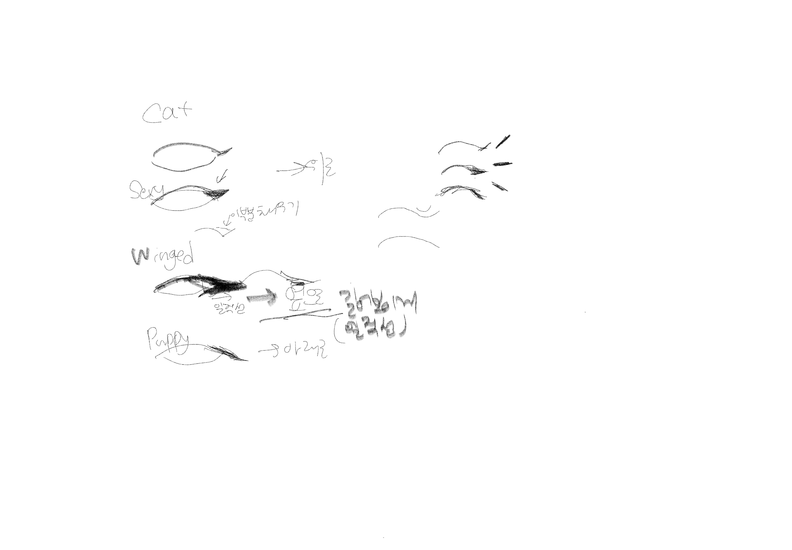
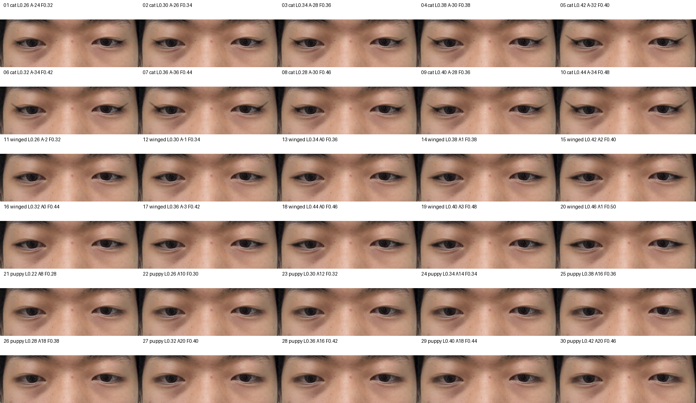
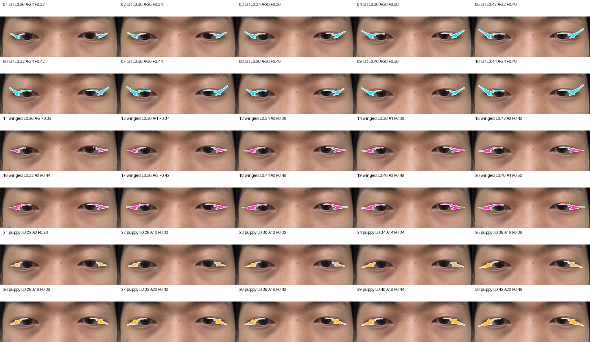
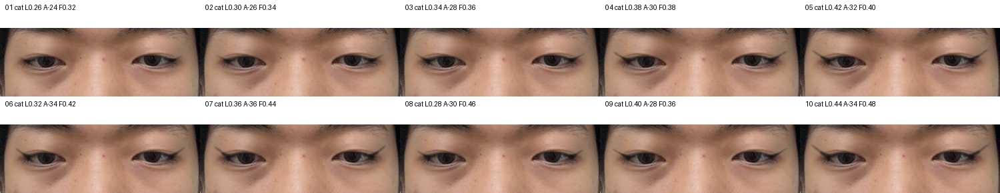
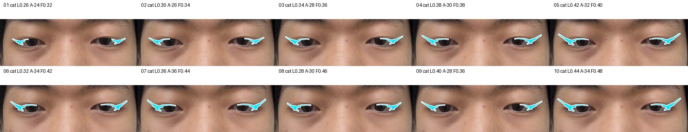
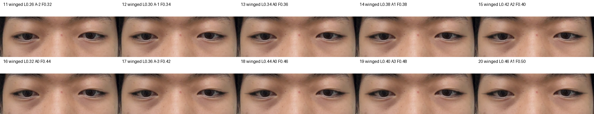
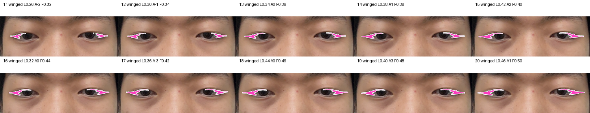
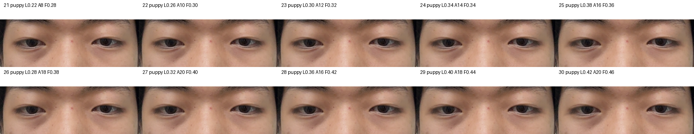
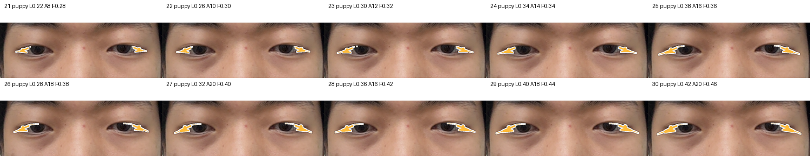

# E7 아이라인 팀원 피드백 v2 샘플 보고서

상태: `pending_user_visual_pick`  
판정: buildless/local-only 샘플 생성 완료. iPhone runtime Green 또는 product-quality-ready 판정 아님.

## 1. 한 줄 결론

팀원 피드백에 맞춰 아이라인 후보를 `cat`, `winged`, `puppy` 세 family로 줄이고, 각 family마다 **10개씩 총 30개**를 새로 만들었다.

이번 v2는 기존 후보보다 아래 세 가지를 더 강하게 반영한다.

- 눈꼬리 tail을 더 길게 뺀다.
- `cat`은 위로, `winged`는 거의 수평, `puppy`는 아래로 내려가게 한다.
- 외안각의 작은 파인 V자 홈을 별도 `outerCanthusFill` polygon으로 채운다.

## 2. 입력과 원칙

| 항목 | 값 |
| --- | --- |
| Capture pair | `pair_face_20260627T091334Z_06` |
| Frame | `evidence/e7-reference-atlas/capture_pairs/pair_face_20260627T091334Z_06/frame.png` |
| Landmark | `evidence/e7-reference-atlas/capture_pairs/pair_face_20260627T091334Z_06/mediapipe_face_landmarks.json` |
| 후보 수 | `cat=10`, `winged=10`, `puppy=10` |
| 실험 성격 | 같은 프레임 기반 buildless/local-only visual sample |

<figure>
  
  <figcaption>그림 1. 팀원 피드백 스케치. v2에서는 family를 3개로 줄이고 tail 방향과 외안각 채움을 명시적으로 분리했다.</figcaption>
</figure>

## 3. 전체 샘플

아래 검은색 시트는 실제 제품색에 가까운 보기다.

<figure>
  
  <figcaption>그림 2. 전체 30개 제품색 preview. family별 10개씩이며 candidate ID로 선택하면 된다.</figcaption>
</figure>

아래 고대비 시트는 shape 선택용이다. 제품색이 아니라 tail 길이, 방향, 외안각 채움 차이를 보기 위한 debug preview다.

<figure>
  
  <figcaption>그림 3. 전체 30개 고대비 preview. 속눈썹/그림자에 검은 선이 묻히는 문제를 피하기 위한 선택용 보기다.</figcaption>
</figure>

## 4. Family별 샘플

### 4.1 Cat

<figure>
  
  <figcaption>그림 4. Cat 10개. 눈꼬리가 위로 올라가는 방향을 강하게 반영했다.</figcaption>
</figure>

<figure>
  
  <figcaption>그림 5. Cat 고대비 view. tail 상승각과 외안각 채움 정도를 우선 본다.</figcaption>
</figure>

### 4.2 Winged

<figure>
  
  <figcaption>그림 6. Winged 10개. 눈꼬리를 길게 빼되 수평에 가깝게 유지했다.</figcaption>
</figure>

<figure>
  
  <figcaption>그림 7. Winged 고대비 view. 너무 위로 들리거나 아래로 떨어지는 후보를 걸러낸다.</figcaption>
</figure>

### 4.3 Puppy

<figure>
  
  <figcaption>그림 8. Puppy 10개. tail이 아래로 내려가도록 만든 후보군이다.</figcaption>
</figure>

<figure>
  
  <figcaption>그림 9. Puppy 고대비 view. 내려가는 방향이 충분한지, 처져 보이는 정도가 과한지 확인한다.</figcaption>
</figure>

## 5. UV round-trip sanity

이번 빠른 v2 샘플은 shape 선택이 목적이라 기본 실행에서는 UV round-trip을 생략했다. 후보가 좁혀지면 선택 후보만 `--with-uv`로 다시 계산하는 편이 빠르고 낫다.


## 6. 후보 표

외안각을 채우기 위해 outer eye opening 일부 overlap은 의도적으로 허용했다. 아래 overlap 값은 중앙 눈동자 침범 판정이 아니라, 외안각 patch를 포함한 참고값이다.

| 후보 ID | Family | Tail length | Tail angle | 외안각 채움 | 허용 outer overlap |
| --- | --- | ---: | ---: | ---: | ---: |
| `team-v2-cat-01-tail26-angle24-fill32` | cat | 0.26 | -24 | 0.32 | 0.3883 |
| `team-v2-cat-02-tail30-angle26-fill34` | cat | 0.30 | -26 | 0.34 | 0.3084 |
| `team-v2-cat-03-tail34-angle28-fill36` | cat | 0.34 | -28 | 0.36 | 0.2503 |
| `team-v2-cat-04-tail38-angle30-fill38` | cat | 0.38 | -30 | 0.38 | 0.2114 |
| `team-v2-cat-05-tail42-angle32-fill40` | cat | 0.42 | -32 | 0.40 | 0.1928 |
| `team-v2-cat-06-tail32-angle34-fill42` | cat | 0.32 | -34 | 0.42 | 0.2118 |
| `team-v2-cat-07-tail36-angle36-fill44` | cat | 0.36 | -36 | 0.44 | 0.1858 |
| `team-v2-cat-08-tail28-angle30-fill46` | cat | 0.28 | -30 | 0.46 | 0.2343 |
| `team-v2-cat-09-tail40-angle28-fill36` | cat | 0.40 | -28 | 0.36 | 0.2523 |
| `team-v2-cat-10-tail44-angle34-fill48` | cat | 0.44 | -34 | 0.48 | 0.1692 |
| `team-v2-winged-01-tail26-angle02-fill32` | winged | 0.26 | -2 | 0.32 | 0.3849 |
| `team-v2-winged-02-tail30-angle01-fill34` | winged | 0.30 | -1 | 0.34 | 0.3254 |
| `team-v2-winged-03-tail34-angle00-fill36` | winged | 0.34 | 0 | 0.36 | 0.2596 |
| `team-v2-winged-04-tail38-angle01-fill38` | winged | 0.38 | 1 | 0.38 | 0.2369 |
| `team-v2-winged-05-tail42-angle02-fill40` | winged | 0.42 | 2 | 0.40 | 0.2200 |
| `team-v2-winged-06-tail32-angle00-fill44` | winged | 0.32 | 0 | 0.44 | 0.2460 |
| `team-v2-winged-07-tail36-angle03-fill42` | winged | 0.36 | -3 | 0.42 | 0.2311 |
| `team-v2-winged-08-tail44-angle00-fill46` | winged | 0.44 | 0 | 0.46 | 0.2038 |
| `team-v2-winged-09-tail40-angle03-fill48` | winged | 0.40 | 3 | 0.48 | 0.2106 |
| `team-v2-winged-10-tail46-angle01-fill50` | winged | 0.46 | 1 | 0.50 | 0.1819 |
| `team-v2-puppy-01-tail22-angle08-fill28` | puppy | 0.22 | 8 | 0.28 | 0.4115 |
| `team-v2-puppy-02-tail26-angle10-fill30` | puppy | 0.26 | 10 | 0.30 | 0.3700 |
| `team-v2-puppy-03-tail30-angle12-fill32` | puppy | 0.30 | 12 | 0.32 | 0.3400 |
| `team-v2-puppy-04-tail34-angle14-fill34` | puppy | 0.34 | 14 | 0.34 | 0.3145 |
| `team-v2-puppy-05-tail38-angle16-fill36` | puppy | 0.38 | 16 | 0.36 | 0.2629 |
| `team-v2-puppy-06-tail28-angle18-fill38` | puppy | 0.28 | 18 | 0.38 | 0.3082 |
| `team-v2-puppy-07-tail32-angle20-fill40` | puppy | 0.32 | 20 | 0.40 | 0.2748 |
| `team-v2-puppy-08-tail36-angle16-fill42` | puppy | 0.36 | 16 | 0.42 | 0.2599 |
| `team-v2-puppy-09-tail40-angle18-fill44` | puppy | 0.40 | 18 | 0.44 | 0.2442 |
| `team-v2-puppy-10-tail42-angle20-fill46` | puppy | 0.42 | 20 | 0.46 | 0.2275 |

## 7. 고르는 법

아래처럼 candidate ID로 골라주면 된다.

```txt
1순위: team-v2-winged-08-tail44-angle00-fill46
2순위: team-v2-cat-05-tail42-angle32-fill40
방향: winged는 좋은데 tail 10% 짧게, 외안각 채움은 유지
```

## 8. 한계

- 한 프레임 buildless 샘플이다.
- blink/yaw/squint, 실기기 AR attachment, FPS/latency/memory/thermal은 아직 검증하지 않았다.
- 외안각 채움은 의도적으로 outer eye opening 일부를 허용하므로, 실제 iPhone에서는 blink와 좌우 yaw에서 과한지 다시 봐야 한다.
- 최종 family/default preset은 사용자 visual pick 이후 확정한다.

## 9. 산출물 위치

| 항목 | 위치 |
| --- | --- |
| 실험 root | `evidence/e7-eyeliner-team-feedback-samples/experiment-20260628T163907Z` |
| scorecard | `evidence/e7-eyeliner-team-feedback-samples/experiment-20260628T163907Z/scorecard.json` |
| shortlist | `evidence/e7-eyeliner-team-feedback-samples/experiment-20260628T163907Z/shortlist.json` |
| report artifact mirror | `docs/product/e7-eyeliner-team-feedback-samples-2026-06-29/artifacts` |
