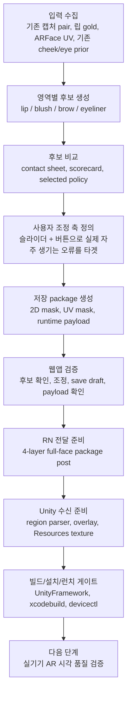
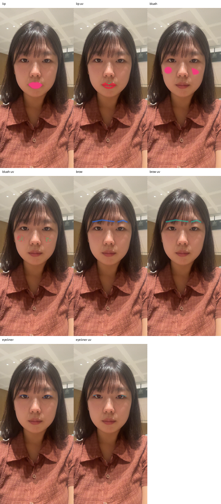
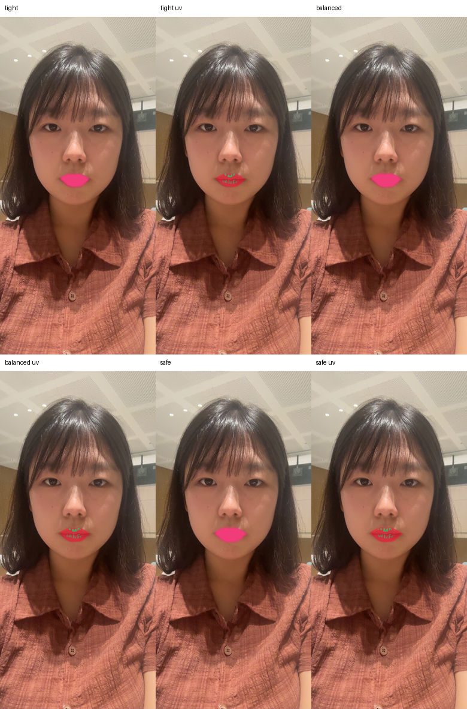
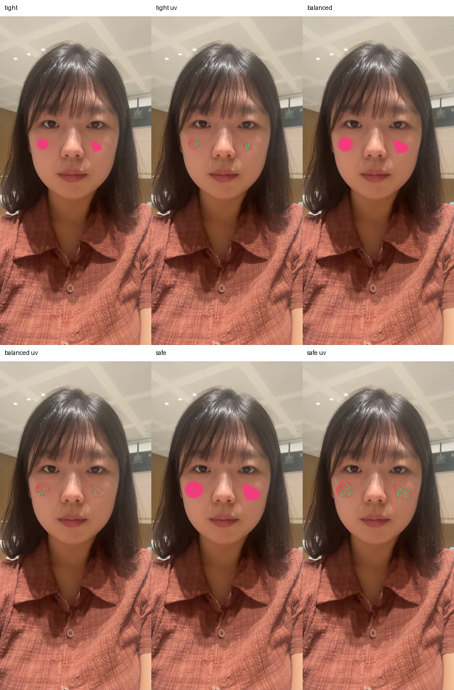
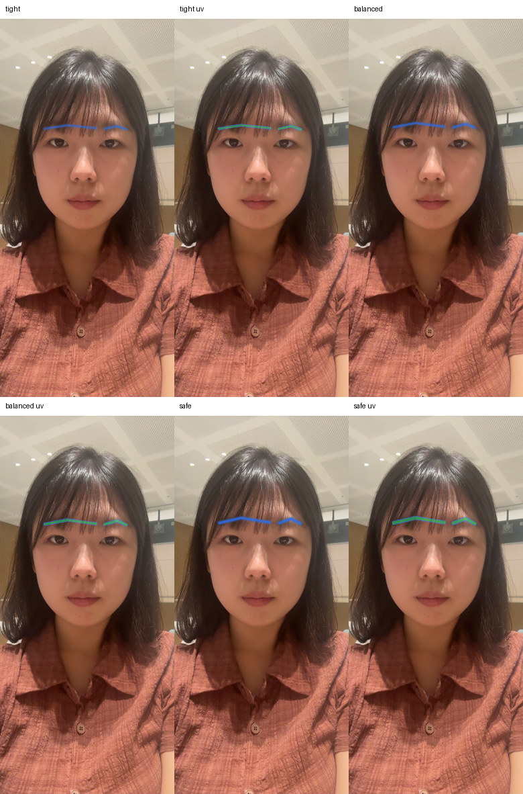
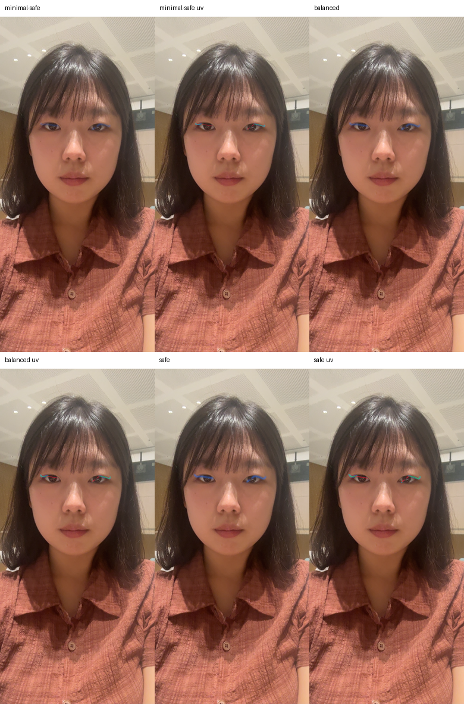
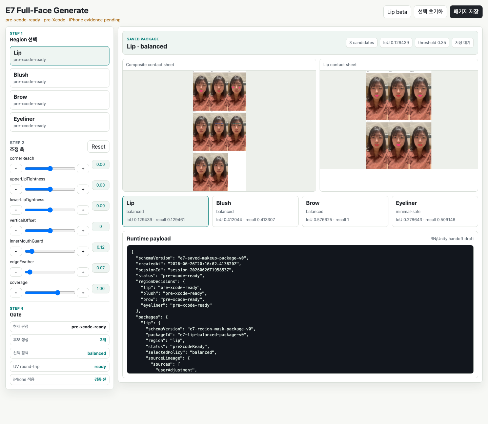

# E7 립·블러셔·눈썹·아이라인 마스크 생성 실험 보고서

작성일: 2026-06-27 KST

대상 범위: Lip, Blush, Brow, Eyeliner region mask 생성, 조정, 저장, RN/Unity 전달, 웹앱 검증, 빌드/설치/런치 게이트

## 한 줄 결론

이번 세션의 결과물은 `립`, `블러셔`, `눈썹`, `아이라인` 네 영역의 mask package를 모두 만들고, 웹앱에서 후보 확인/조정/저장 흐름을 검증한 뒤, RN/Unity가 네 영역 payload를 받아들이는 단계까지 연결한 것이다. 다만 이 결과는 아직 "얼굴 위에서 제품처럼 예쁘게 붙었다"는 최종 판정이 아니다. 현재 판정은 **패키지와 앱 연결은 준비됨, 시각 품질은 iPhone 실기기 AR 화면에서 추가 검증 필요**이다.

## 먼저 이해해야 할 핵심

| 용어 | 쉬운 설명 | 이번 실험에서의 의미 |
| --- | --- | --- |
| Region mask | 화장이 칠해져도 되는 얼굴 영역 지도 | 입술, 볼, 눈썹, 아이라인마다 별도 지도 생성 |
| 2D mask | 원본 사진 위의 mask | 사람이 보기에 후보가 맞는지 확인하는 단계 |
| UV mask | ARFace 얼굴 표면 좌표로 변환한 mask | iPhone AR 화면에서 얼굴이 움직여도 같은 얼굴 부위에 붙게 하기 위한 단계 |
| Round-trip | 2D mask를 UV로 보냈다가 다시 사진으로 돌려보는 검사 | 좌표 변환이 완전히 깨지지 않았는지 보는 sanity check |
| `pre-xcode-ready` | Xcode/기기 전 또는 기기 시각 검증 전 준비 완료 | 파일, payload, 웹앱, RN/Unity 연결은 준비됐지만 제품 품질 판정은 아님 |

중요한 점은 `Round-trip IoU`가 "예쁜 화장 점수"가 아니라는 것이다. 특히 얇은 아이라인이나 입술처럼 경계가 좁은 영역은 UV 해상도, 보이는 얼굴 표면, sampling 방식 때문에 점수가 낮아질 수 있다. 그래서 이 숫자는 후보 비교와 좌표 보존성 확인에만 사용하고, 최종 품질은 실기기 AR 화면에서 사람 눈으로 다시 확인해야 한다.

## 최종 상태 요약

| 영역 | 선택 후보 | Runtime texture | 현재 상태 | 판단 |
| --- | --- | --- | --- | --- |
| Lip | `lip-balanced-gold-v0` | `e7-lip-balanced-uv-v0` | `pre-xcode-ready` | 기존 립 gold와 사용자 조정 인사이트를 가장 많이 활용한 균형 후보 |
| Blush | `blush-balanced-soft-oval-v0` | `e7-blush-balanced-uv-v0` | `pre-xcode-ready` | 경계가 선명한 영역이 아니라 부드러운 placement가 더 중요한 영역이라 soft oval 선택 |
| Brow | `brow-balanced-stroke-envelope-v0` | `e7-brow-balanced-uv-v0` | `pre-xcode-ready` | 실제 눈썹털 segmentation은 아니고, 눈 주변 prior 기반 stroke envelope |
| Eyeliner | `eyeliner-minimal-safe-lashline-v0` | `e7-eyeliner-minimal-safe-uv-v0` | `pre-xcode-ready` | 불안정한 굵은 라인보다, 일단 붙는 안전한 upper lashline 후보 선택 |

## 전체 작업 흐름

사용자 입장에서 앱 흐름은 이렇게 정리된다.

1. 얼굴 기준 입력을 준비한다.
2. `립`, `블러셔`, `눈썹`, `아이라인` 후보를 생성한다.
3. 후보를 비교한다.
4. 실제로 자주 생기는 문제를 슬라이더와 작은 버튼으로 고친다.
5. 선택한 mask package를 저장한다.
6. 저장된 package를 들고 AR 화면으로 넘어간다.
7. AR 화면에서는 Unity가 저장된 UV mask와 cosmetic payload를 사용한다.

## 실험 결과 사진

### 1. 전체 네 영역 contact sheet

<figure>
  
  <figcaption>그림 1. 네 영역 후보와 UV projection을 한 번에 보는 전체 contact sheet. 위에서부터 lip, blush, brow, eyeliner 후보와 UV 결과가 함께 정리되어 있다.</figcaption>
</figure>

이 이미지는 이번 실험의 중심 증거다. 한 장 안에서 "원본 사진 위 후보가 어느 위치에 생겼는지"와 "ARFace UV 좌표로 보냈을 때 어떤 texture가 만들어졌는지"를 같이 볼 수 있다. 즉, 단순히 사진 위에 예쁜 mask를 그린 것이 아니라, 나중에 AR 얼굴 표면에서 재사용할 수 있는 형태까지 갔는지를 확인한다.

### 2. Lip 후보

<figure>
  
  <figcaption>그림 2. Lip 후보 비교. `tight`, `balanced`, `safe` 계열 후보를 비교했고, 최종 선택은 기존 립 gold를 반영한 `balanced` 후보이다.</figcaption>
</figure>

립은 이전 세션에서 가장 많이 검증된 영역이다. 여기서 얻은 중요한 인사이트는 "사용자가 마지막에 직접 조절할 수 있어야 한다"는 점이었다. 특히 실제 사용 중 자주 나온 문제는 높낮이, 입꼬리, 윗입술/아랫입술 경계, 안쪽 입술 침범이었다. 그래서 립 조정 축은 `cornerReach`, `upperLipTightness`, `lowerLipTightness`, `verticalOffset`, `innerMouthGuard`, `edgeFeather`, `coverage`로 잡았다.

이번 립 후보의 round-trip 값은 `IoU 0.129439`, `precision 0.998674`, `recall 0.129461`이다. 이 숫자는 낮은 recall 때문에 "UV로 다시 돌아왔을 때 원래 mask 전체를 넓게 덮지는 못한다"는 신호로 읽어야 한다. 반대로 precision이 매우 높다는 점은 "돌아온 부분은 엉뚱한 곳으로 크게 새지 않는다"는 신호다. 그래서 립은 제품 판정이 아니라, 이미 받아들인 gold 기반 후보를 runtime package로 옮기는 준비 단계로 보는 것이 맞다.

### 3. Blush 후보

<figure>
  
  <figcaption>그림 3. Blush 후보 비교. 블러셔는 날카로운 경계보다 자연스러운 중심, 크기, feather가 중요하므로 soft oval 계열의 `balanced` 후보가 선택됐다.</figcaption>
</figure>

블러셔는 입술처럼 명확한 외곽선이 있는 영역이 아니다. 그래서 완벽한 binary gold를 찾기보다, cheek prior와 얼굴 위치를 기준으로 "볼 중앙에 부드럽게 올라오는 영역"을 만드는 쪽이 더 합리적이다. 조정 축도 `centerX`, `centerY`, `size`, `angle`, `noseGuard`, `underEyeGuard`, `mouthCornerGuard`, `feather`, `intensity`처럼 배치와 번짐을 다루는 항목으로 잡았다.

Blush의 round-trip 값은 `IoU 0.412044`, `precision 0.992639`, `recall 0.413307`이다. 이 값은 후보가 비교적 안정적으로 같은 볼 영역에 남아 있음을 보여주지만, 여전히 "화장이 자연스럽다"는 증거는 아니다. 블러셔는 색감, 농도, 얼굴 움직임, 광원에서 더 많은 변수가 생기므로 실기기 확인이 필수다.

### 4. Brow 후보

<figure>
  
  <figcaption>그림 4. Brow 후보 비교. 현재 brow는 실제 눈썹털 segmentation이 아니라 눈 주변 기준선에서 만든 stroke envelope이다.</figcaption>
</figure>

눈썹은 가장 오해하기 쉬운 영역이다. 이번 후보는 "내 눈썹털을 정확히 딴 mask"가 아니다. 지금은 눈 주변 landmark와 기존 eye prior를 이용해, 눈썹 화장이 놓일 가능성이 높은 envelope를 만든 것이다. 이 방식은 빠르고 안정적인 시작점이지만, 사람마다 눈썹 숱, 모양, 꼬리 방향이 다르기 때문에 사용자 조정이 특히 중요하다.

Brow 조정 축은 `headPosition`, `archHeight`, `tailLength`, `tailAngle`, `thickness`, `verticalOffset`, `leftRightBalance`, `softness`다. 이 축들은 실제 메이크업에서 자주 바꾸는 "눈썹 앞머리, 산, 꼬리, 두께, 좌우 균형"을 직접 겨냥한다.

Brow의 round-trip 값은 `IoU 0.576625`, `precision 0.576625`, `recall 1.0`이다. recall이 높은 것은 원래 후보가 대부분 다시 포착된다는 뜻이고, precision이 낮은 것은 envelope가 넓게 잡혀 있을 수 있다는 뜻이다. 그래서 brow는 "후보 생성과 조정 UI의 출발점"으로는 좋지만, 제품 품질에서는 사람별 hair-aware 보정이나 강한 사용자 조정이 필요하다.

### 5. Eyeliner 후보

<figure>
  
  <figcaption>그림 5. Eyeliner 후보 비교. 아주 얇고 움직임에 민감한 영역이므로, 이번 선택은 bold한 라인보다 `minimal-safe` upper lashline 후보이다.</figcaption>
</figure>

아이라인은 네 영역 중 가장 위험한 영역이다. 이유는 간단하다. 선이 얇고, 눈 깜빡임과 yaw에 민감하고, 조금만 아래위로 틀어져도 바로 어색해진다. 그래서 이번 실험에서는 "무조건 화려한 아이라인"보다 "깨지지 않는 최소 안전 후보"를 먼저 만들었다.

Eyeliner 조정 축은 `upperLineOffset`, `lineThickness`, `tailLength`, `tailAngle`, `outerCornerReach`, `innerCornerStart`, `softness`, `blinkFade`다. 특히 `blinkFade`를 둔 이유는 눈을 감거나 깜빡일 때 라인이 피부 위에 이상하게 남는 문제를 나중에 다루기 위해서다.

Eyeliner의 round-trip 값은 `IoU 0.278643`, `precision 0.380989`, `recall 0.509146`이다. 이 숫자는 현재 후보가 최종 품질로 충분하다는 뜻이 아니라, 얇은 라인을 어떻게든 runtime package까지 보낼 수 있는 최소 후보를 확보했다는 의미다. 다음 실기기 검증에서는 blink, yaw, 눈꺼풀 움직임이 가장 중요한 체크포인트다.

## 웹앱 제작 결과

<figure>
  
  <figcaption>그림 6. Full-face Generate 웹 검증 화면. 왼쪽에서 region을 고르고, 조정 축을 움직이고, 중앙에서 contact sheet와 runtime payload를 확인한 뒤 package를 저장하는 구조다.</figcaption>
</figure>

웹앱은 최종 iPhone 앱 UI를 그대로 복사한 것이 아니라, 빌드 전에 mask 생성 로직과 저장 흐름을 빠르게 검증하기 위한 작업대다. 이번에 구현된 화면은 `web/lip-generate-beta` 안의 full-face shell이며, 다음 기능을 갖는다.

| 기능 | 결과 |
| --- | --- |
| Region 선택 | `Lip`, `Blush`, `Brow`, `Eyeliner`를 전환하며 후보 확인 |
| 후보/정책 표시 | 각 영역의 선택 policy, 후보 수, IoU, threshold 표시 |
| 조정 UI | 영역별 adjustment 값을 slider와 작은 버튼으로 수정 |
| Contact sheet 확인 | 전체 composite와 개별 region contact sheet를 한 화면에서 확인 |
| Payload 확인 | RN/Unity에 넘길 runtime payload draft를 직접 확인 |
| 저장 | local-only draft package 저장 흐름 제공 |

이 웹앱에서 중요한 설계 원칙은 "사용자가 많이 겪는 실패를 조정 축으로 바로 연결한다"는 것이다. 립에서 이미 확인한 것처럼, 막연한 `tightness` 하나보다 `입꼬리`, `윗입술`, `아랫입술`, `높낮이`처럼 실제 불만이 생기는 축을 나누는 것이 훨씬 유리하다. 이번 full-face 작업도 같은 원칙을 확장했다.

또한 웹앱은 실험용이어도 privacy 기준을 유지한다. package는 local-only이고, 외부 업로드를 전제로 하지 않으며, runtime payload에 필요한 최소 정보만 다음 단계로 넘긴다.

## 사용한 신호와 그 역할

| 신호 | 사용 방식 | 이번 결론 |
| --- | --- | --- |
| ARFace mesh / UV | runtime 좌표계의 기준 | 최종 AR 부착을 위해 반드시 필요 |
| Apple Vision | 입술 같은 명확한 contour의 보조 신호 | primary tracker가 아니라 sanity/helper |
| MediaPipe | landmark geometry, 중심선, inner-mouth 힌트 | 단독 후보보다 helper signal로 유리 |
| Face parsing | 외부/로컬 silver mask 또는 평가 보조 | runtime primary나 gold로 쓰지 않음 |
| Color / gradient confidence | 색 대비, 경계 신뢰도 평가 | boundary source가 아니라 confidence gate |
| 외부 mask prior | 블러셔/눈/눈썹처럼 gold가 약한 영역의 silver draft | 제품 학습 데이터처럼 쓰지 않고 local draft로만 사용 |
| 사용자 조정 | 최종 subjective boundary 보정 | 실제 제품 흐름에서 가장 중요한 마지막 보정 레이어 |

따라서 "face parsing과 색 추출을 버렸는가?"에 대한 답은 아니다. 다만 역할이 바뀌었다. 이 둘은 최종 runtime 추적의 주인공이 아니라, 후보를 만들고 평가하고 위험을 표시하는 보조 신호다. 지금 구조에서 runtime의 중심은 ARFace UV이고, subjective boundary의 마지막 책임은 사용자 조정과 실기기 시각 검증에 둔다.

## RN/Unity 앱 연결 결과

이번 작업은 웹앱에서 끝나지 않고 RN/Unity 연결까지 갔다.

| 레이어 | 구현/검증 결과 |
| --- | --- |
| RN | `lip,blush,brow,eyeliner` 네 layer를 담은 full-face package payload 전송 경로 준비 |
| Unity RNBridge | product region ID와 `e7-*` mask texture ID를 받아들이도록 확장 |
| Unity Overlay | `E3RegionMaskOverlay`가 full-face region mask texture ID를 인식 |
| Unity Resources | 선택된 UV mask 4종과 runtime asset registry 설치 |
| Unity batchmode smoke | stale Unity project lock을 닫은 뒤 네 region parse/dispatch smoke 통과 |
| UnityFramework / Xcode | UnityFramework 재생성/sync 및 iPhoneOS xcodebuild 성공 |
| 설치/런치 | `devicectl`로 `com.makeupar.rnvalidation` 설치 및 launch 성공 |

여기서도 선을 분명히 그어야 한다. build/install/launch가 성공했다는 것은 앱이 기기에 올라가고 실행될 수 있다는 뜻이지, 화장 mask가 얼굴 위에서 제품 품질로 보인다는 뜻은 아니다. 다음 단계는 반드시 카메라 화면에서 face attachment, 표정 변화, blink/yaw, FPS, latency, memory, thermal, 그리고 사람 눈의 boundary acceptance를 확인해야 한다.

## 왜 이런 조합이 현재 가장 합리적인가

각 부위는 성격이 다르다.

| 부위 | 가장 유리한 조합 | 이유 |
| --- | --- | --- |
| Lip | Apple Vision/MediaPipe helper + 사용자 gold + ARFace UV + 사용자 조정 | 경계가 비교적 명확하고 기존 성공 인사이트가 있음 |
| Blush | ARFace cheek prior + soft parametric placement + 사용자 강도/크기 조정 | 명확한 경계보다 자연스러운 분포가 중요 |
| Brow | Eye/brow prior + stroke envelope + 강한 사용자 조정 | 실제 털 segmentation 없이도 첫 제품형 조정 흐름을 만들 수 있음 |
| Eyeliner | Eye prior + minimal lashline curve + blink/yaw 전용 검증 | 얇고 민감하므로 안전한 최소 라인을 먼저 확보해야 함 |

공통적으로는 "자동 추정 100%"보다 "좋은 초기값 + 사용자가 이해 가능한 조정축 + ARFace UV runtime 좌표"가 더 낫다. 특히 makeup은 boundary 정답이 수학적으로 하나가 아니다. 같은 얼굴이라도 원하는 스타일, 진하기, 자연스러움의 기준이 다르다. 그래서 완전 자동 segmentation보다, 사람이 납득할 수 있는 후보와 조정 흐름이 제품에 더 가깝다.

## 검증한 것과 아직 검증하지 않은 것

### 이번에 검증한 것

- 네 영역 모두 candidate package가 생성된다.
- 선택 policy와 adjustment axis가 영역별로 존재한다.
- 2D mask와 UV mask, round-trip overlay를 contact sheet로 확인할 수 있다.
- 웹앱에서 region review, adjustment, package save draft, runtime payload 확인이 가능하다.
- RN은 네 region layer payload를 보낼 수 있다.
- Unity는 product region ID와 mask texture ID를 parse/dispatch할 수 있다.
- Unity Resources에 네 영역 UV texture와 registry가 설치되어 있다.
- Unity batchmode smoke가 통과했다.
- iPhoneOS xcodebuild, 설치, launch 게이트가 통과했다.

### 아직 검증하지 않은 것

- 실제 iPhone AR 카메라 화면에서 mask가 얼굴에 자연스럽게 붙는지
- neutral, smile, open/close mouth, yaw, blink에서 boundary가 안정적인지
- eyeliner가 눈 깜빡임과 눈꺼풀 움직임에서 어색하게 남지 않는지
- makeup 색감과 opacity가 제품처럼 보이는지
- FPS, frame-time, latency, memory, thermal이 충분한지
- 사용자가 각 영역 boundary를 주관적으로 수용할 수 있는지

따라서 현재 상태를 Green으로 부르면 안 된다. 현재 상태는 **full-face Generate package와 앱 연결의 강한 준비 완료**, 그리고 **실기기 시각 품질 검증 대기**다.

## 다음 실기기 검증 체크리스트

1. 앱을 iPhone에서 실행하고 카메라 권한과 Unity AR 화면 진입을 확인한다.
2. 저장된 full-face package를 AR 화면으로 넘긴다.
3. `lip`, `blush`, `brow`, `eyeliner`를 개별 on/off 하며 위치를 확인한다.
4. neutral, smile, open/close mouth, yaw, blink를 촬영 또는 대표 프레임으로 기록한다.
5. eyeliner는 blink/yaw를 따로 본다.
6. HUD가 시각 판단을 방해하면 Compact/Clean 모드로 전환해 비교한다.
7. FPS, frame-time, recipe latency, memory/thermal 로그를 함께 남긴다.
8. 각 영역을 `Green`, `Yellow`, `Red`가 아니라 먼저 `accept / revise / reject` 관점으로 사람이 판정한다.
9. 판정 결과를 `TECH_VALIDATION_RESULT.md`에 evidence와 known limitation으로 기록한다.

## 산출물 위치

| 종류 | 위치 |
| --- | --- |
| 실험 세션 루트 | `evidence/e7-region-generate/session-20260626T195853Z/` |
| 전체 contact sheet | `evidence/e7-region-generate/session-20260626T195853Z/contact_sheet.png` |
| Composite payload | `evidence/e7-region-generate/session-20260626T195853Z/composite_apply_payload.json` |
| Pre-Xcode gate | `evidence/e7-region-generate/session-20260626T195853Z/pre_xcode_gate.md` |
| 웹앱 shell | `web/lip-generate-beta/src/FullFaceRegionShell.tsx` |
| 웹앱 screenshot | `docs/product/e7-full-face-region-generate-report-2026-06-27/assets/web-full-face-shell.png` |
| RN full-face package path | `rn/MakeupARValidation/App.tsx` |
| Unity bridge | `unity/MakeupARUnityValidation/Assets/Scripts/RNBridge.cs` |
| Unity overlay | `unity/MakeupARUnityValidation/Assets/Scripts/E3RegionMaskOverlay.cs` |
| Unity runtime assets | `unity/MakeupARUnityValidation/Assets/Resources/SmoothRegionMasks/e7-full-face-region-runtime-assets.json` |
| Unity smoke log | `evidence/logs/e7-full-face-region-package-editor-smoke-20260627.log` |
| RN iPhone build log | `evidence/logs/e7-full-face-rn-ios-xcodebuild-20260627-1430.log` |
| iPhone install/launch logs | `evidence/logs/e7-full-face-rn-ios-devicectl-install-20260627-1430.log`, `evidence/logs/e7-full-face-rn-ios-devicectl-launch-20260627-1430.log` |

## 최종 판단

이번 작업은 "네 영역을 어떻게든 만들 수 있는가?"라는 질문에는 예라고 답한다. 단, 더 정확하게는 "네 영역 후보를 local-only로 만들고, 비교하고, 조정하고, 저장하고, RN/Unity가 받아들일 수 있는 package로 만들 수 있는가?"에 대한 예다.

제품 품질 질문은 아직 남아 있다. 그 질문은 "실제 얼굴 위에서 움직일 때 예쁜가?", "사용자가 이 boundary를 받아들일 수 있는가?", "성능이 충분한가?"이다. 이 질문들은 웹앱이나 contact sheet만으로 끝낼 수 없고, 다음 iPhone AR 시각 검증에서 닫아야 한다.

현재 가장 좋은 전략은 지금 만든 full-face Generate package를 기준선으로 삼고, 다음 실기기 세션에서 영역별로 빠르게 `accept / revise / reject`를 나누는 것이다. 특히 립은 기존 성공 인사이트를 더 밀고, 블러셔는 자연스러운 placement와 intensity, 눈썹은 조정축, 아이라인은 blink/yaw 안정성을 최우선으로 보면 된다.
