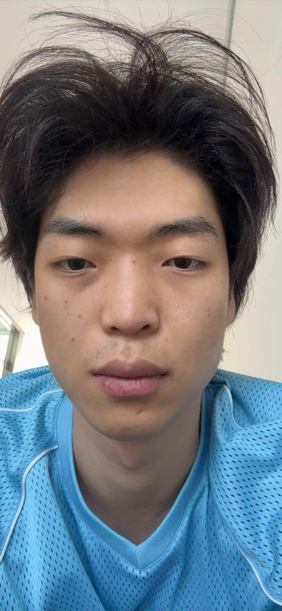
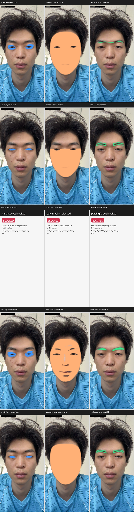
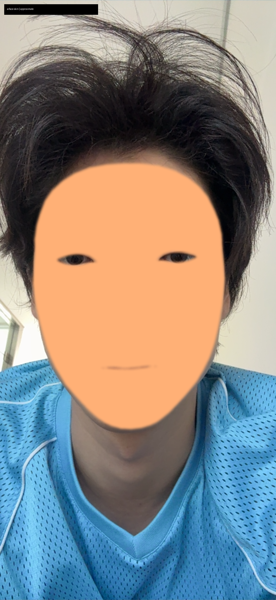
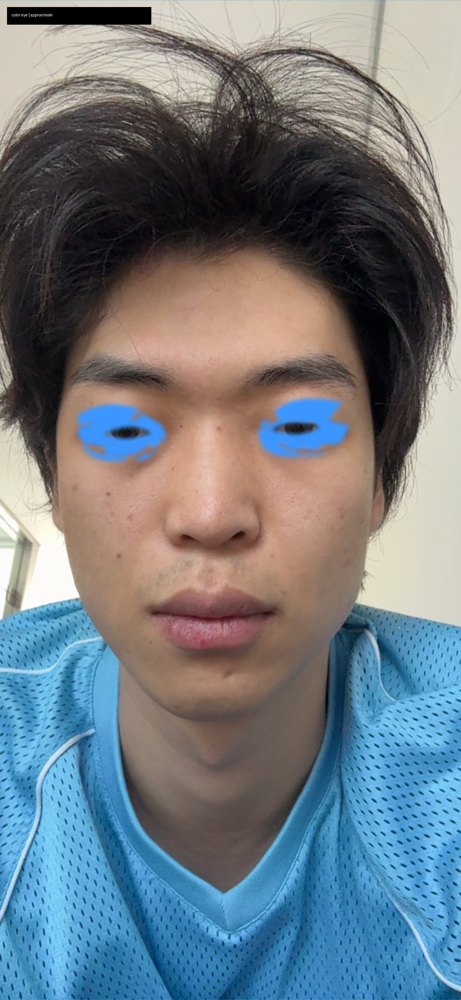
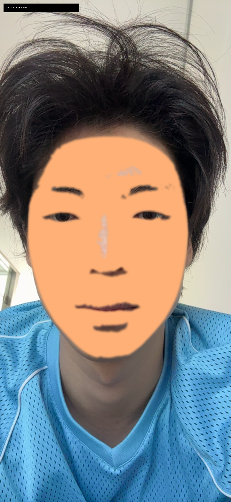
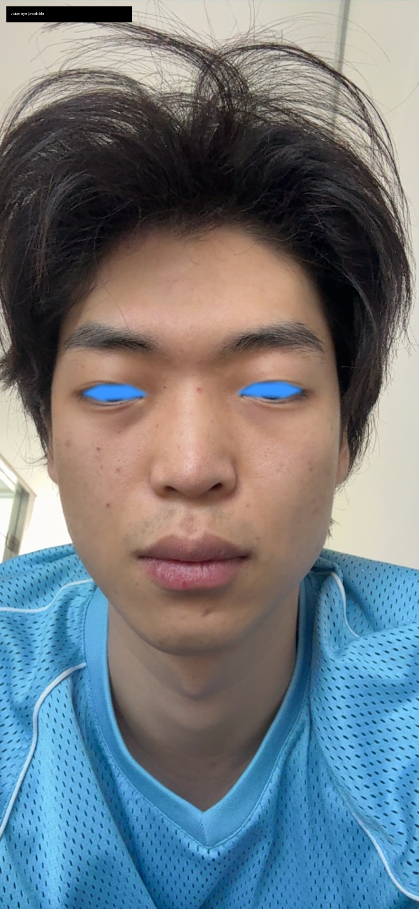
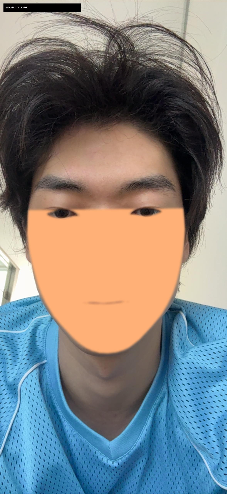
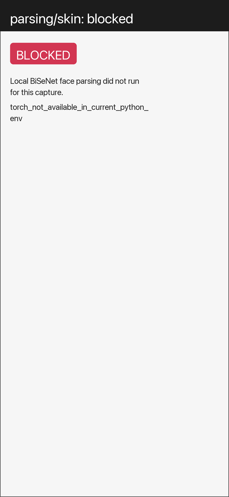
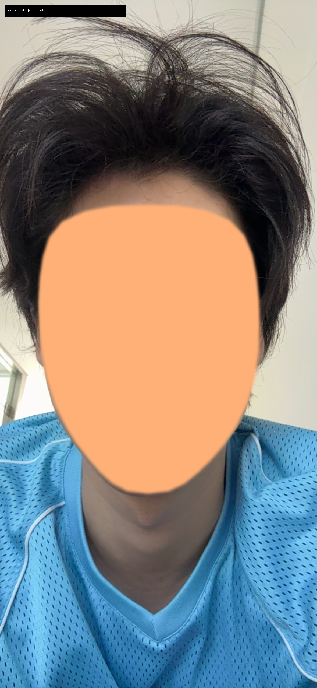

# E7 눈·피부·눈썹 자동 인식 후보 비교 보고서

작성일: 2026-06-27 KST  
대상 캡처: `pair_face_20260627T091334Z_06`  
범위: 눈, 피부, 눈썹 마스크 후보 비교  
상태: buildless 비교 실험. 제품 품질 승인이나 iPhone runtime 검증 아님.

## 1. 한 줄 결론

이번 캡처는 정상적으로 들어왔고, 로컬에서 ARFace / Apple Vision / MediaPipe / 색 기반 비교 이미지를 생성했다. Apple Vision과 MediaPipe는 눈과 눈썹 landmark를 실제로 만들었고, 피부는 둘 다 semantic skin이 아니라 face contour 또는 face oval 기반의 approximate mask로 생성했다. Face parsing만 현재 Python 환경의 `torch` 부재로 blocked다.

2026-06-27 추가 체크포인트: Apple Vision은 sandbox 안에서는 Vision/ANE 리소스 접근 문제로 실패했지만, sandbox 밖 local Swift 실행에서는 `vision_face_landmarks.json`을 생성했다. MediaPipe는 Codex shell에서는 macOS GL/Metal helper 문제로 abort됐지만, GUI-capable Terminal 세션에서는 `mediapipe_face_landmarks.json`을 생성했다. 따라서 이번 보고서는 iPhone 앱 실행 없이 local-only 생성 결과를 기준으로 정리한다.

## 2. 왜 이 실험을 했나

입술은 이미 MediaPipe 또는 Apple Vision에 사용자 조정을 더하는 방향이 거의 잡혔다. 문제는 눈, 피부, 눈썹, 나중에는 볼/아이라인까지 같은 방식으로 갈 수 있느냐다.

그래서 이번에는 사용자가 앱에서 직접 찍은 capture pair 하나를 기준으로, 후보들을 같은 사진 위에 올려 비교했다.

비교 후보는 아래 5개다.

| 후보 | 이번 실험에서 하려던 역할 | 이번 결과 |
| --- | --- | --- |
| ARFace / ARKit | 얼굴 mesh와 UV 좌표를 이용한 안정적인 위치 기준 | 실행됨. 단, 직접 인식이 아니라 geometry 기반 추론 |
| Apple Vision | 눈, 눈썹 landmark 직접 추출 | 실행됨. 눈/눈썹 available, 피부는 face contour 기반 approximate |
| Face parsing | 피부, 눈, 눈썹 semantic label 추출 | 현재 Python 환경에 `torch`가 없어 blocked |
| 색 / 밝기 / gradient | 피부색, 눈 흰자/어두운 눈, 눈썹 털 보조 추출 | 실행됨. 단, 보조 신호 수준 |
| MediaPipe | face landmark로 눈/눈썹/face oval 추출 | GUI Terminal 우회로 실행됨. 눈/눈썹 available, 피부는 face oval 기반 approximate |

## 3. 입력 사진

아래 사진은 앱의 `CAPTURE PAIR` 흐름으로 저장된 clean frame이다. HUD가 없는 상태로 저장되어 마스크 비교 기준으로 쓰기 적합하다.



기본 메타데이터:

| 항목 | 값 |
| --- | --- |
| capture pair id | `pair_face_20260627T091334Z_06` |
| frame size | `1179 x 2556` |
| ARFace vertex count | `1220` |
| ARFace index count | `6912` |
| ARFace UV count | `1220` |
| tracking state | `Tracking` |
| local-only | `true` |
| off-device upload | `false` |

## 4. 전체 비교 시트

아래 이미지는 모든 후보를 같은 행렬로 본 것이다. 행은 후보, 열은 눈 / 피부 / 눈썹이다.



표기 의미:

| 표기 | 뜻 |
| --- | --- |
| `available` | 해당 후보가 직접 landmark 또는 semantic label을 생성함 |
| `approximate` | 직접 인식이 아니라 geometry, UV prior, 색 등의 추론 결과 |
| `blocked` | 현재 로컬 실행 환경에서 실행 실패 또는 필수 dependency 없음 |

이번 결과에서 `available`은 Vision eye/brow, MediaPipe eye/brow다. 단, 피부는 Vision/MediaPipe 모두 true skin semantic label이 아니라 얼굴 윤곽 기반 approximate다. 이 결과는 제품 품질 승인이나 iPhone runtime 증거가 아니라, 로컬 단일 프레임 비교용이다.

## 5. 후보별 상세 결과

### 5.1 ARFace 기반 추론

ARFace는 얼굴 mesh와 UV 좌표를 안정적으로 준다. 하지만 "눈", "피부", "눈썹"을 semantic mask로 직접 알려주지는 않는다. 이번 결과는 기존 smooth region UV prior 또는 현재 ARFace mesh를 화면에 투영해 만든 추론이다.

<table>
  <tr>
    <th>눈</th>
    <th>피부</th>
    <th>눈썹</th>
  </tr>
  <tr>
    <td></td>
    <td></td>
    <td></td>
  </tr>
</table>

관찰:

- 눈: 실제 눈 영역보다 넓은 타원형 prior다. eye makeup이나 아이라인 시작점으로는 쓸 수 있지만, 눈꺼풀/속눈썹 경계로는 부족하다.
- 피부: 얼굴 mesh 전체를 채우므로 안정적이지만, 입술/눈/눈썹까지 같이 포함한다. 피부 semantic mask라기보다는 얼굴 표면 mask다.
- 눈썹: 눈 위치 위에 그린 arc다. 실제 눈썹 털 모양을 인식한 것이 아니라, 위치 추정용 envelope에 가깝다.

판단:

ARFace는 runtime substrate로는 계속 유리하다. 다만 눈썹/아이라인처럼 세밀한 부위는 ARFace 단독으로는 부족하고, Vision/MediaPipe landmark나 색 기반 refine, 사용자 조정이 필요하다.

### 5.2 색 / 밝기 기반 추론

색 기반은 피부색, 눈 주변의 밝고 어두운 픽셀, 눈썹의 어두운 털을 찾는다. 사진 한 장에서는 꽤 그럴듯한 힌트를 줄 수 있지만, 조명/머리카락/그림자/기존 화장에 매우 취약하다.

<table>
  <tr>
    <th>눈</th>
    <th>피부</th>
    <th>눈썹</th>
  </tr>
  <tr>
    <td></td>
    <td></td>
    <td></td>
  </tr>
</table>

관찰:

- 눈: ARFace eye prior 안에서 밝은 눈 흰자와 어두운 눈동자/속눈썹 쪽을 잡는다. 눈꺼풀 전체 경계는 아니다.
- 피부: 얼굴 중앙 피부는 잘 덮지만, 코/입 주변의 색 변화와 그림자를 같이 잡는다. 피부를 "정확히" 분리했다기보다는 피부색에 가까운 픽셀 묶음이다.
- 눈썹: 이번 사진에서는 실제 눈썹 털 위치를 꽤 따라간다. 다만 눈썹이 밝거나 조명이 바뀌면 쉽게 무너질 수 있다.

판단:

색 기반은 primary tracker가 아니라 refine 신호로 쓰는 편이 맞다. 특히 눈썹은 `landmark로 대략 위치 잡기 -> 색으로 실제 털 영역 좁히기 -> 사용자 조정` 조합이 좋아 보인다.

### 5.3 Apple Vision

Apple Vision은 눈과 눈썹 landmark를 직접 제공한다. sandbox 안의 Mac buildless Swift 실행에서는 `VNDetectFaceLandmarksRequest`가 모든 orientation에서 실패했지만, sandbox 밖 local Swift 실행에서는 같은 입력 사진에서 face contour, eye, eyebrow, nose, lip landmark를 생성했다.

<table>
  <tr>
    <th>눈</th>
    <th>피부</th>
    <th>눈썹</th>
  </tr>
  <tr>
    <td></td>
    <td></td>
    <td></td>
  </tr>
</table>

직접 실행 결과:

- `vision_face_landmarks.json` 생성 완료
- face confidence: `1.0`
- `leftEye/rightEye`: 각 6점
- `leftEyebrow/rightEyebrow`: 각 6점
- `faceContour`: 17점

sandbox doctor 결과:

- `VNDetectFaceRectanglesRequest`: 모든 orientation에서 ANE model load 오류로 실패
- `VNDetectFaceLandmarksRequest`: 모든 orientation에서 `Unspecified error`
- `face rectangles -> inputFaceObservations -> landmarks`: rectangle 단계에서 먼저 실패

중요한 해석:

- 이것은 "Apple Vision이 이 얼굴을 못 찾는다"는 증거가 아니다.
- sandbox 환경에서 Vision/ANE 리소스 접근이 실패했다는 증거에 가깝다.
- sandbox 밖 local Swift 실행은 성공했으므로, Vision은 이번 부위 비교에서 실제 샘플을 만들 수 있는 후보로 복구됐다.

관찰:

- 눈: 실제 눈 opening에 매우 가까운 작은 mask를 만든다. ARFace eye prior보다 훨씬 좁고 직접적이다.
- 피부: Vision은 true skin label을 주지 않으므로 faceContour를 ARFace face surface로 clip한 approximate다. 이마 위쪽은 덜 잡히고, 볼/하관 중심이다.
- 눈썹: eyebrow landmark stroke가 실제 눈썹 위치와 대체로 잘 맞는다. 다만 털 두께/농도는 알지 못한다.

### 5.4 Face parsing

Face parsing은 피부, 눈, 눈썹 같은 semantic label을 직접 줄 수 있어서 비교 기준으로 매우 좋다. 하지만 현재 Python 실행 환경에는 `torch`가 없어 local BiSeNet runner를 실행하지 못했다.

<table>
  <tr>
    <th>눈</th>
    <th>피부</th>
    <th>눈썹</th>
  </tr>
  <tr>
    <td></td>
    <td></td>
    <td></td>
  </tr>
</table>

판단:

Face parsing은 runtime primary로 쓰기보다는 offline silver reference나 평가 기준으로 쓰는 편이 맞다. 이번 단계에서 다시 살리려면 `torch`가 있는 로컬 환경을 별도로 준비해야 한다. 단, raw frame 장기 저장/업로드 없이 derived mask만 남기는 현재 privacy 원칙은 유지해야 한다.

### 5.5 MediaPipe

MediaPipe는 얼굴 landmark를 촘촘히 주기 때문에 눈/눈썹/face oval의 geometric 기준으로 유리하다. Codex shell의 Python 실행에서는 FaceLandmarker native graph가 macOS GL/Metal helper service를 열지 못해 abort됐지만, 같은 `.venv`와 같은 model을 GUI-capable Terminal 세션에서 실행하자 full-face landmark 478개가 생성됐다.

<table>
  <tr>
    <th>눈</th>
    <th>피부</th>
    <th>눈썹</th>
  </tr>
  <tr>
    <td></td>
    <td></td>
    <td></td>
  </tr>
</table>

직접 실행 결과:

- `mediapipe_face_landmarks.json` 생성 완료
- full-face landmark count: `478`
- `leftEye/rightEye`: 각 16점
- `leftEyebrow/rightEyebrow`: 각 10점
- `faceOval`: 36점

Codex shell doctor 결과:

- MediaPipe Python import: 성공
- 설치 버전: `0.10.35`
- legacy `mp.solutions.face_mesh`: 현재 wheel에서 없음
- Tasks Vision API: import 가능
- Tasks FaceLandmarker retry: exit code `1`, macOS native helper 문제로 usable landmark 생성 실패

중요한 해석:

- MediaPipe 후보 자체가 실패한 것이 아니라, Codex shell이 GL/Metal helper를 만들지 못한 것이다.
- GUI Terminal에서는 같은 로컬 사진과 같은 model로 성공했다.
- 따라서 현재 로컬 실험에서는 MediaPipe eye/brow/face oval 샘플을 비교 후보로 사용할 수 있다.

관찰:

- 눈: Vision과 비슷하게 좁은 eye opening mask를 만든다. 눈 위치는 잘 맞는다.
- 피부: face oval polygon이라 얼굴 전체 표면 substrate로는 유용하지만, 눈/입/눈썹 제외 semantic skin은 아니다.
- 눈썹: Vision보다 점이 많아 arc가 조금 더 안정적으로 보인다. 실제 털 경계는 색 refine이 필요하다.

## 6. 숫자로 본 이번 결과

| 후보 | 눈 pixel | 피부 pixel | 눈썹 pixel | 상태 요약 |
| --- | ---: | ---: | ---: | --- |
| ARFace | 31,479 | 733,128 | 9,562 | 전부 approximate |
| Apple Vision | 11,404 | 473,674 | 21,150 | eye/brow available, skin approximate |
| Face parsing | 0 | 0 | 0 | `torch` 없음 |
| 색 기반 | 41,604 | 684,685 | 23,127 | 전부 approximate |
| MediaPipe | 12,389 | 722,579 | 21,584 | eye/brow available, skin approximate |

숫자는 품질 점수가 아니다. 어떤 후보가 어느 정도 면적을 잡았는지 보는 참고값이다.

## 7. 현재 품질 판단

이번 결과만 놓고 보면 제품 품질 마스크로 바로 쓰기는 어렵다.

이유:

- 눈은 "눈 주변 영역" 정도는 잡았지만, 아이라인이나 아이섀도우 경계에 필요한 눈꺼풀/속눈썹 라인은 아니다.
- 피부는 얼굴 표면이나 피부색 영역을 크게 잡았을 뿐, 볼/블러셔 영역처럼 의도된 cosmetic placement가 아니다.
- 눈썹은 Vision/MediaPipe landmark가 위치 기준으로 가장 안정적이고, 색 기반은 실제 털 영역 refine에 유용하다.
- Face parsing semantic label은 아직 없어 피부/눈/눈썹을 semantic mask 기준으로 평가하지는 못했다.

이번 실험의 핵심 인사이트는 역할 분리다. Vision/MediaPipe는 눈과 눈썹의 직접 landmark 기준으로 유리하고, ARFace는 runtime 고정/face surface substrate로 유리하며, 색 기반은 실제 털/피부색 refine에 유용하다. 피부/볼은 아직 "피부 전체 인식"보다 "ARFace substrate 위 cheek placement" 문제로 보는 편이 맞다.

## 8. 부위별 유력 조합 가설

### 눈

현재 최선 가설:

```txt
Vision 또는 MediaPipe eye landmarks
+ ARFace UV/mesh로 runtime 고정
+ 색 기반 dark/white pixel 보조
+ 사용자 조정: 위아래 위치, 두께, 눈꼬리, 부드러움
```

ARFace 단독은 눈 영역이 너무 넓다. 색 단독은 눈동자/흰자/그림자에 흔들린다. 눈은 landmark가 먼저 필요하다.

### 피부 / 볼

현재 최선 가설:

```txt
ARFace face surface
+ cheek UV prior 또는 parametric cheek placement
+ 피부색 guard로 머리카락/옷/그림자 제외
+ smile/yaw capture로 볼 위치 안정성 확인
+ 사용자 조정: 높낮이, 안쪽/바깥쪽, 크기, 강도, 부드러움
```

피부 전체 mask와 블러셔 mask는 다르다. 제품에 필요한 것은 "피부 전체 인식"이 아니라 "볼에 자연스럽게 올라갈 placement"다.

### 눈썹

현재 최선 가설:

```txt
Vision 또는 MediaPipe eyebrow landmarks
+ 색 기반 dark-hair refine
+ ARFace로 얼굴 움직임에 고정
+ 사용자 조정: 높이, arch, tail 길이, 두께, 좌우 밸런스
```

이번 사진에서는 색 기반 눈썹이 꽤 유용했다. 하지만 landmark 없이 색만 쓰면 머리카락, 그림자, 안경, 조명에 취약하다.

## 9. 다음 작업 제안

가장 중요한 다음 단계는 로컬 단일 프레임 결과를 바탕으로 부위별 조합을 좁히는 것이다. iPhone runtime 검증은 나중에 필요하지만, 지금 질문의 답은 local-only 사진 생성과 비교이므로 앱 실행은 이번 보고서의 필수 조건이 아니다.

우선순위:

1. 눈: Vision vs MediaPipe eye opening 중 어느 쪽이 아이라인/아이섀도우 seed로 더 좋은지 crop 기준으로 비교한다.
2. 눈썹: Vision/MediaPipe brow landmark를 색 기반 dark-hair refine과 결합해 실제 털 두께에 가까운 후보를 만든다.
3. 피부/볼: ARFace face surface를 substrate로 두고, cheek placement는 parametric/UV prior로 따로 만든다.
4. Face parsing은 local research 기준으로 필요할 때만 `torch` 환경을 복구해 semantic reference로 쓴다.
5. 다음 비교는 `neutral` 한 장이 아니라 `neutral / smile / blink / yaw`까지 포함해 안정성을 본다.

## 10. 남은 한계

- 이 보고서는 buildless 실험이다.
- iPhone runtime에서 Vision/MediaPipe가 실제로 같은 결과를 내는지는 아직 검증하지 않았다.
- 마스크가 얼굴 움직임, 표정, blink, yaw에서 안정적인지는 아직 모른다.
- 사람의 시각 판단으로 "메이크업 boundary로 괜찮다"는 승인을 받은 상태가 아니다.
- 이 결과만으로 Green 또는 product-quality-ready를 주장하면 안 된다.

## 11. 산출물 위치

| 산출물 | 경로 |
| --- | --- |
| 한국어 요약 | `evidence/e7-region-detection-comparison/pair_face_20260627T091334Z_06/summary.md` |
| 전체 contact sheet | `evidence/e7-region-detection-comparison/pair_face_20260627T091334Z_06/contact_sheet_eye_skin_brow.png` |
| 구조화 요약 JSON | `evidence/e7-region-detection-comparison/pair_face_20260627T091334Z_06/summary.json` |
| 비교 생성 스크립트 | `scripts/e7_region_detection_compare/build_capture_pair_region_masks.py` |
| iPhone capture pair pull helper | `scripts/e7_region_detection_compare/pull_ios_capture_pair_and_rebuild.py` |
| Apple Vision helper | `scripts/e7_region_detection_compare/extract_apple_vision_face_landmarks.swift` |
| Apple Vision local landmark JSON | `evidence/e7-reference-atlas/capture_pairs/pair_face_20260627T091334Z_06/vision_face_landmarks.json` |
| MediaPipe local full-face helper | `scripts/e7_region_detection_compare/run_mediapipe_full_face_landmarker.py` |
| MediaPipe GUI Terminal helper | `scripts/e7_region_detection_compare/run_mediapipe_full_face_gui_terminal.sh` |
| MediaPipe local landmark JSON | `evidence/e7-reference-atlas/capture_pairs/pair_face_20260627T091334Z_06/mediapipe_face_landmarks.json` |
| Apple Vision local doctor | `evidence/e7-region-detection-comparison/pair_face_20260627T091334Z_06/vision/local_doctor/vision_local_doctor.json` |
| MediaPipe local doctor | `evidence/e7-region-detection-comparison/pair_face_20260627T091334Z_06/mediapipe/local_doctor/mediapipe_local_doctor.md` |
| iOS native provider source | `rn/MakeupARValidation/ios/MakeupARValidation/E7NativeLipBoundaryProviders.swift` |

## 12. 최종 판단

이번 실험은 "마스크 품질이 좋다"는 결론이 아니라, 눈/피부/눈썹에서 어떤 후보가 어떤 역할을 해야 하는지 분리한 실험이다.

현재 바로 쓸 수 있는 인사이트는 다음이다.

- ARFace는 얼굴에 붙이는 기준으로 계속 필요하다.
- 색 기반은 눈썹과 피부 refine에 도움이 되지만 단독 primary는 아니다.
- Vision과 MediaPipe는 눈/눈썹 landmark 기준으로 실제 샘플을 만들 수 있다.
- MediaPipe는 Codex shell에서는 막히지만 GUI Terminal local run으로 샘플 생성이 가능하다.
- Vision은 sandbox 안에서는 막히지만 sandbox 밖 local Swift run으로 샘플 생성이 가능하다.
- Face parsing은 runtime 후보보다 offline silver reference/평가 기준으로 살리는 편이 좋다.
- 제품 흐름에서는 자동 인식 후 사용자 조정축이 반드시 필요하다.
