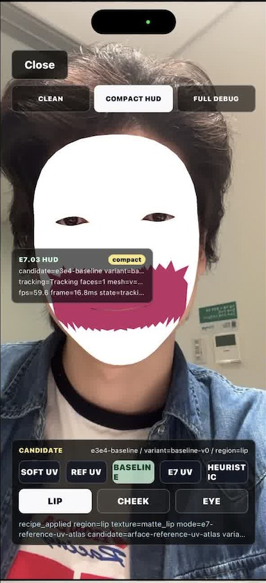
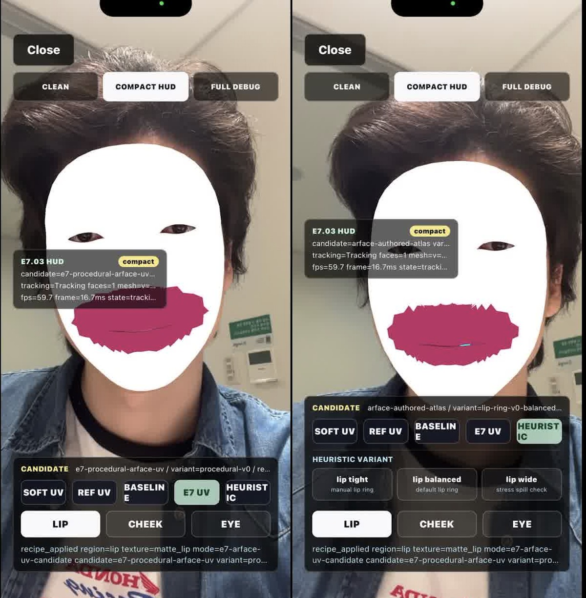
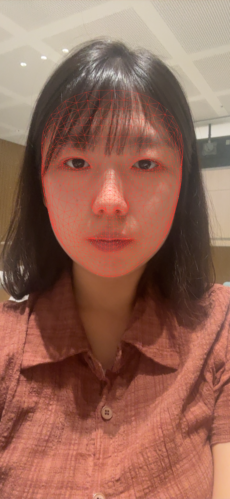
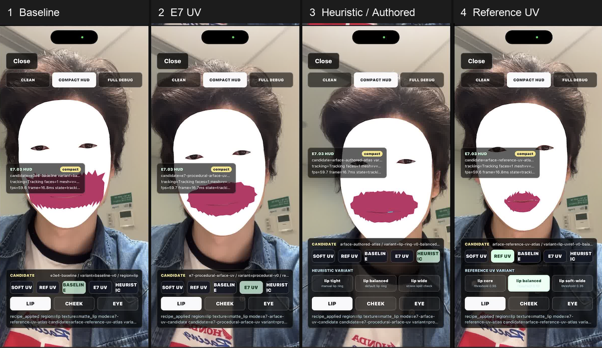
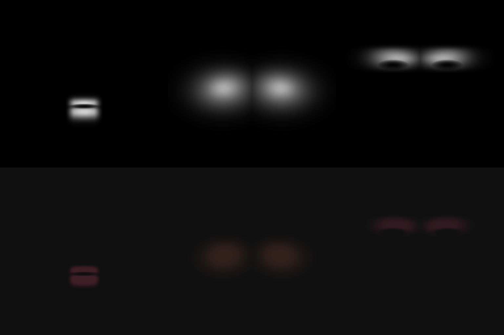
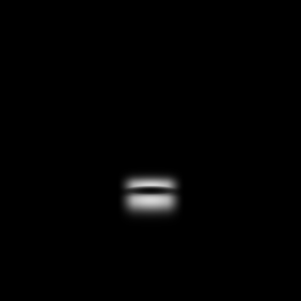
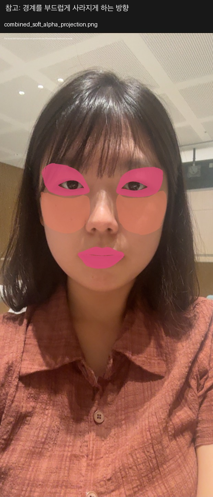
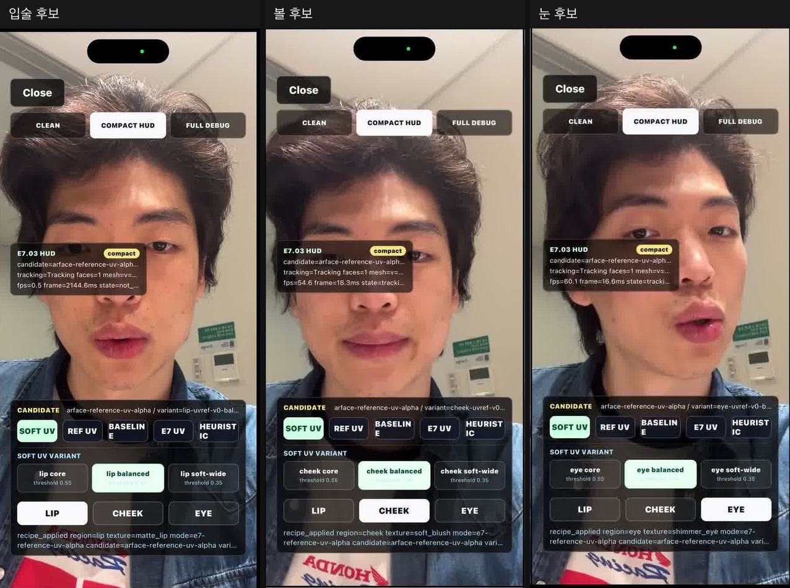
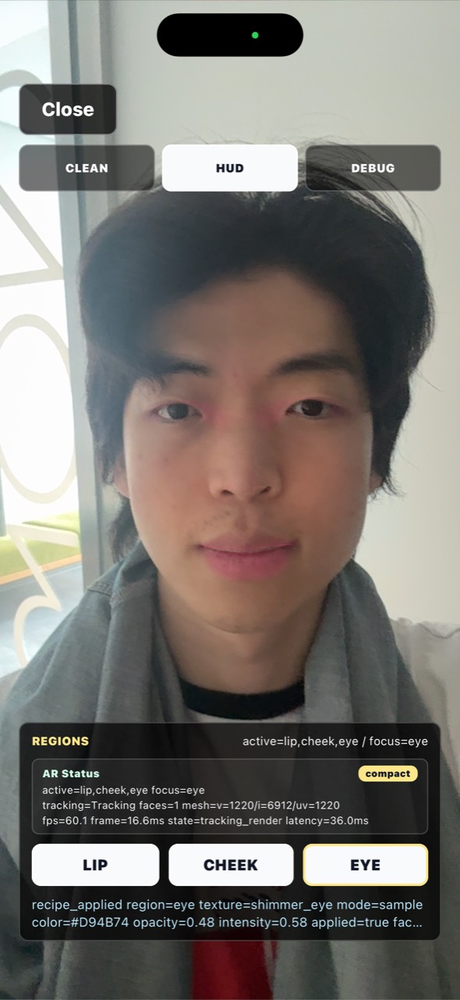
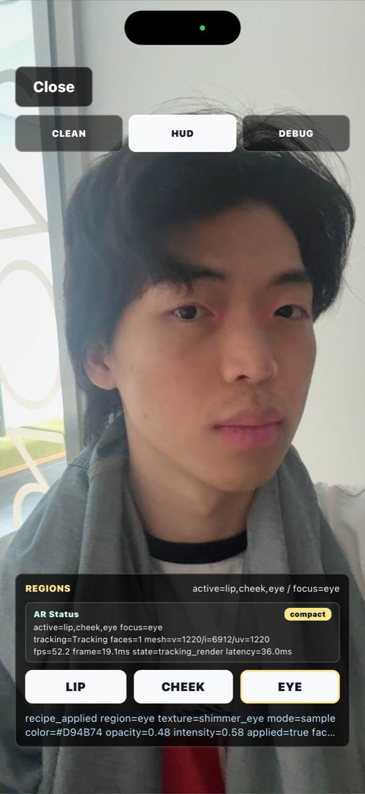

# AR 메이크업 엔진 기술적 챌린지 정리

작성일: 2026-06-24  
목적: 발표 준비용 기술적 챌린지 보고서 초안  
범위: 이번 정리 세션에서 나온 내용 중심. 제품 완성 보고서가 아니라, 지금까지의 검증 흐름과 앞으로 예상되는 어려움을 정리한다.

## 0. 요약

가장 큰 기술적 챌린지는 **메이크업이 올라갈 얼굴 부위 영역을 실제 사람 얼굴에 안정적으로 맞추는 것**이다. 초반에는 얼굴 정렬 자체가 불안정했고, 정렬이 된 뒤에도 입술/볼/눈 영역이 넓은 도형처럼 잡혀 실제 화장 경계로 쓰기 어려웠다. 이후 iPhone에서 같은 순간의 얼굴 사진과 ARKit(Apple의 얼굴 추적 기능) 얼굴 좌표 JSON(구조화된 텍스트 데이터)을 함께 저장했고, 그 데이터를 바탕으로 사람이 직접 칠한 영역과 `UV map`(3D 얼굴을 2D로 펼친 좌표 지도) 위의 `alpha mask`(위치별 투명도 마스크)를 비교하면서 현재의 자연스러운 버전까지 왔다.

현재 버전은 이전보다 훨씬 자연스럽고 얼굴에 잘 붙는다. 다만 여러 사람에게 테스트해보니, 사람마다 입술 두께, 눈 모양, 볼 위치가 달라서 같은 `region mask`(입술/볼/눈처럼 칠할 부위를 정한 마스크)를 그대로 쓰면 경계를 벗어나는 문제가 생긴다. 다음 단계는 “하나의 정답 마스크”를 찾는 것이 아니라, **사람별 얼굴 비율에 따라 부위 영역을 보정하는 방법**을 찾는 것이다.

이 보고서는 세 가지 챌린지를 다룬다.

1. 얼굴 추적과 부위 경계 정밀도
2. 화장품처럼 보이게 만드는 표현 방식
3. 얼굴 데이터의 프라이버시와 보안

## 1. 얼굴 추적과 부위 경계 정밀도

### 1-1. 출발점: 초기 기준 후보는 붙었지만 범위가 크게 벗어났다

초반에는 먼저 얼굴 정렬 문제를 해결해야 했다. Unity(AR 화면을 렌더링하는 엔진) 화면과 실제 카메라 얼굴이 맞지 않으면, 그 위에 어떤 메이크업을 올려도 의미가 없었다. 정렬이 어느 정도 잡힌 뒤에는 초기 기준 후보(`Baseline`)로 입술, 볼, 눈을 각각 켜고 끄는 검증을 했지만, 이때의 영역은 아직 실제 화장 부위가 아니라 넓은 도형에 가까웠다.

사용자 관찰은 “처음에는 런타임에서 직접 보면서 범위와 위치를 계속 조정하는 노가다였다”는 것이다. 검토해보면 이 판단이 맞다. 아래 `Baseline` 이미지는 iPad 마킹 이후가 아니라, 사람이 직접 정답 영역을 만들기 전의 초기 후보에 가깝다. 이 단계는 화장품 품질을 증명한 것이 아니라, React Native 앱(`RN`) + Unity + ARKit 경로에서 얼굴 위에 시각 요소를 올릴 수 있다는 기초 가능성을 확인한 단계였다.



위 이미지는 맨 처음 `Baseline` 후보다. 얼굴에는 붙어 있지만 입술 영역이 실제 입술 경계를 크게 벗어나 있고, 한쪽으로 튀어나간 부분도 보인다. 그래서 다음 문제는 “색을 예쁘게 칠하기”가 아니라 **어디까지 칠해야 하는지**를 잡는 것이 됐다.



그 다음에는 UV 기반 후보(`E7 UV`)와 임시 규칙 기반 후보(`Heuristic`)로 범위를 줄여갔다. `Baseline`보다 입술 영역이 얼굴 중앙에 더 잘 모이고, 옆으로 새는 정도도 줄어들었다. 다만 가장자리는 여전히 거칠고, 입술 모양을 개인별로 맞춘 수준은 아니었다.

발표에서 이렇게 말하면 됨:

> 초반에는 화장품 문제가 아니라 좌표 문제였습니다. `Baseline`은 얼굴에는 붙었지만 범위가 크게 벗어났고, 이후 `E7 UV`와 `Heuristic`으로 점점 줄여가는 흐름이었습니다.

### 1-2. 전환점: 사진 한 장과 얼굴 좌표 JSON을 같은 순간에 저장했다

중요한 전환은 iPhone 앱에서 캡처 버튼을 눌렀을 때, 단순 스크린샷만 저장한 것이 아니라 **그 순간의 얼굴 좌표 데이터까지 JSON으로 함께 저장한 것**이다. 이 덕분에 사람이 iPad로 실제 얼굴 사진 위에 입술/눈/볼 영역을 칠하고, 그 칠한 영역을 다시 ARKit 얼굴 좌표에 연결하는 실험이 가능해졌다.

구체적인 흐름은 이렇다.

1. RN 화면에서 캡처 버튼을 누른다.
2. RN이 Unity에 `CaptureE7ReferenceFrameJson` 메시지를 보낸다.
3. 이때 JSON에는 `capturePairId`, 요청 시각, 요청자, 목적이 들어간다.
4. Unity는 같은 순간의 파일 묶음을 저장한다.

저장된 파일 묶음:

| 파일 | 역할 |
| --- | --- |
| `frame.png` | 사람이 iPad로 칠할 깨끗한 얼굴 사진 |
| `arface_export.json` | 같은 순간의 얼굴 좌표 데이터 |
| `projected_mesh_overlay.png` | `ARFace mesh`(ARKit이 제공하는 얼굴 표면의 점/삼각형 구조)가 사진 위에 잘 맞는지 확인하는 참고 이미지 |
| `capture_summary.json` | 캡처 요약 정보 |

`arface_export.json` 안에는 다음 값이 들어간다.

| JSON 값 | 의미 |
| --- | --- |
| `localVertices`, `worldVertices` | `mesh` 점들의 3D 위치 |
| `screenVertices` | 그 점들이 실제 화면의 어느 픽셀에 보였는지 |
| `uvs` | 3D 얼굴을 `UV map`으로 펼쳤을 때의 좌표 |
| `indices` | 어떤 점 3개가 하나의 삼각형을 이루는지 |
| `display` | 화면 크기, 좌표 방향, 기기 표시 정보 |
| `privacy` | 선택된 검증 프레임만 로컬 저장했고 외부 전송은 없다는 표시 |

실제 캡처 한 건에서는 얼굴 점 `1220개`, 삼각형 인덱스 `6912개`, `UV` 좌표(`UV map` 위 좌표) `1220개`, 화면 좌표 `1220개`가 함께 저장됐다. 즉, 사진만 남긴 것이 아니라 “이 사진의 이 픽셀이 얼굴 `mesh`의 어느 좌표와 연결되는지”를 나중에 계산할 수 있게 만든 것이다.



사용자 관점에서는 이 방식 덕분에 iPad로 실제 마스킹을 할 수 있었다. 검토 관점에서는 이게 리서치의 추상 아이디어를 우리 앱에 맞게 바꾼 핵심 구현이다. ARKit은 얼굴 위에 안정적인 `mesh`와 `UV map`을 제공하지만, “여기가 정확한 입술 경계다”처럼 화장품 부위 경계를 완성해서 주지는 않는다. 그래서 사람이 칠한 영역과 ARKit 좌표를 연결하는 중간 장치가 필요했다.

발표에서 이렇게 말하면 됨:

> 캡처 버튼은 단순 스크린샷 기능이 아니었습니다. 같은 순간의 얼굴 사진과 얼굴 좌표 JSON을 같이 저장해서, 사람이 칠한 영역을 다시 ARKit의 `UV map`에 연결할 수 있게 만든 장치였습니다.

### 1-3. 왜 도형 방식만으로는 부족하다고 판단했나

처음에는 입술이나 눈을 몇 개의 도형처럼 잡고 범위를 조정했다. 하지만 사용자가 확인한 중요한 지점은, **내가 생성한 `mesh` 표현 마스크를 보고 ARKit이 이미 이목구비 구조를 꽤 세밀하게 잡고 있다는 것**이었다. 즉, 문제는 “ARKit이 아무 정보도 못 준다”가 아니었다. 오히려 `mesh`는 충분히 촘촘한데, 우리가 그 위에 올리는 부위 영역이 너무 거칠었던 것이다.

여기서 판단이 바뀌었다. 넓은 도형을 조금씩 옮기는 방식보다, `UV map` 위에 **alpha mask**, 즉 “어느 부분을 얼마나 보이게 할지 정한 투명도 마스크”를 만들어두는 방식이 더 적합해 보였다. 밝은 곳은 강하게 보이고, 어두운 곳은 보이지 않고, 회색 중간값은 투명하게 섞이면 경계가 훨씬 자연스러워진다.

검토 관점에서 정리하면 다음과 같다.

- ARKit `mesh`는 얼굴을 따라붙는 기반으로 쓸 수 있다.
- 도형 단위 영역은 빠르게 테스트하기 좋지만, 실제 화장 경계에는 거칠다.
- 따라서 `UV map` 위의 `alpha mask`를 사용해 픽셀별 표시 강도(`opacity`)를 조절하는 방향이 더 자연스럽다.
- 다만 이것은 실시간 카메라 이미지를 픽셀별로 분석한다는 뜻이 아니다. `UV map`용 이미지에서 각 위치의 밝기를 읽어 표시 강도(`opacity`)를 조절한다는 뜻이다.



위 이미지는 현재 자연스러운 버전 이전의 후보들을 왼쪽부터 정렬한 것이다. `Baseline`은 iPad 마킹 전의 초기 후보이고, `E7 UV`와 `Heuristic / Authored`는 범위를 줄여보던 중간 후보이며, `Reference UV`는 iPad 마킹 데이터 이후의 참고 방향이다.
마킹 이후 범위가 실제 입술 경계에 가깝게 크게 줄어든 것을 알 수 있다. 하지만 아직 경계는 균일하지 않다.

| 이미지 라벨 | 의미 |
| --- | --- |
| `Baseline` | 가장 기본 기준 후보. 넓고 거친 입술 영역 |
| `E7 UV` | ARKit `UV map`을 이용한 후보 |
| `Heuristic / Authored` | 사람이 의도한 입술 고리 형태를 임시 규칙으로 반영한 후보 |
| `Reference UV` | iPad 마스킹 데이터 이후 참고 `UV map` 방향으로 넘어간 후보 |

이 비교를 통해 “단순 도형 보정”보다 “`UV map` 위의 `alpha mask` 조절”이 유리하다는 판단으로 이어졌다.



아래는 생성된 `alpha mask` 예시다. 흰색에 가까울수록 표시 강도(`opacity`)가 높고, 검은색은 거의 보이지 않는다. 가장자리의 회색은 자연스럽게 사라지는 경계를 만든다.

| 입술 alpha mask | 볼 alpha mask | 눈 alpha mask |
| --- | --- | --- |
|  |  |  |



위 참고 이미지는 “영역을 어디에 둘 것인가”뿐 아니라 “가장자리가 어떻게 사라질 것인가”가 중요하다는 점을 보여준다. 이 흐름이 현재 버전의 자연스러운 경계 표현으로 이어졌다.

발표에서 이렇게 말하면 됨:

> ARKit이 얼굴 구조를 못 잡는 게 문제가 아니었습니다. `mesh`는 꽤 잘 잡히는데, 우리가 칠하는 영역이 너무 거칠었습니다. 그래서 도형 보정에서 `alpha mask` 방식으로 넘어갔습니다.

### 1-4. 현재 상태: 자연스러워졌지만 아직 사람별 보정이 필요하다

현재 버전은 `smooth-region-mask`(부드러운 부위 마스크 적용 경로)로 정리되어 있다. 쉽게 말하면 입술, 볼, 눈에 각각 부드러운 `alpha mask`를 적용하고, 색상, 진하기(`opacity`), 가장자리 흐림(`feather`)을 조절해 실제 얼굴 위에 섞는 방식이다. RN에서 Unity로 보내는 메이크업 설정 JSON(`recipe JSON`)에는 이미 색상, 진하기, 피부와 섞는 방식(`blend mode`), 질감 관련 값들이 들어가 있어 다음 화장품 표현 실험으로 이어질 수 있다.



`Reference UV` 후보는 얼굴에 붙는 가능성을 더 잘 보여줬지만, 입술 모양이 아직 거칠고 흰 얼굴 표면이 강해서 제품 수준의 결과로 보기는 어려웠다.



현재 사용자가 받아들인 상태는 이전보다 훨씬 자연스럽다. 화면 정보 기준으로 입술/볼/눈이 모두 켜져 있고, 얼굴 점 `1220개`, 삼각형 인덱스 `6912개`, `UV` 좌표 `1220개`가 잡힌 상태에서 FPS(초당 프레임 수) 약 `52-60`, 설정 적용 지연 약 `36ms`까지 확인됐다.



하지만 사용자 테스트에서 새로운 문제가 보였다. 사람마다 입술 두께, 눈 모양, 볼 위치가 달라서 같은 `region mask`를 그대로 쓰면 어떤 사람에게는 위 입술이 삐져나가고, 어떤 사람에게는 입술 전체보다 영역이 커 보였다. 현재 버전은 “붙는 가능성”과 “자연스러운 경계 가능성”을 보여주지만, 모든 얼굴에 정확히 맞는 단계는 아니다.

발표에서 이렇게 말하면 됨:

> 지금은 많이 자연스러워졌지만, 다음 문제는 평균 얼굴이 아니라 사람마다 다른 얼굴입니다. 같은 입술 `mask`도 사람에 따라 삐져나갈 수 있습니다.

### 1-5. 다음 방향: 평균 `region mask` + 얼굴 유형 + 개인별 보정

사용자가 제안한 방향은 세 가지다.

1. 더 많은 사람을 마스킹해서 가장 좋은 평균 `region mask`를 찾는다.
2. 이목구비 유형을 나눈다. 예를 들어 윗입술이 얇은 유형, 아랫입술이 두꺼운 유형, 입술이 작은 유형.
3. ARKit `mesh`, `UV map`, 표정 변화값(`blendshape`, 입 벌림/웃음 같은 얼굴 움직임 수치) 등을 이용해 실제 경계에 맞춘 보정량을 계산한다.

검토 관점에서는 이 셋을 나누기보다 함께 쓰는 것이 좋다. 평균 `region mask` 하나만으로는 사람별 차이를 해결하기 어렵고, 유형을 너무 많이 만들면 관리가 어려워진다. 현실적인 방향은 **기본 평균 `region mask` + 소수의 얼굴 유형 + 개인별 수치 보정**이다.

예를 들면 입술에서는 다음 값을 볼 수 있다.

- 입 너비
- 윗입술 높이
- 아랫입술 높이
- 입 벌림 정도
- 웃는 정도

이 값에 따라 윗입술 영역만 줄이거나, 아랫입술만 키우거나, 전체 입술 영역을 위아래로 조금 이동시키는 식으로 보정할 수 있다. 눈도 마찬가지로 눈 길이, 눈 높이, 눈꺼풀 위치, 깜빡임 정도를 보고 보정할 수 있다.

주의할 점도 있다. ARKit이 실제 입술 경계를 완성된 화장품용 선으로 알려주는 것은 아니다. ARKit은 얼굴을 따라가는 촘촘한 기반을 주는 것이고, 제품 수준 경계는 우리가 평균 `region mask`, 유형 분류, 보정 규칙, 추가 참고 데이터를 조합해서 만들어야 한다.

발표에서 이렇게 말하면 됨:

> 앞으로는 정답 마스크 하나를 찾는 단계가 아닙니다. 평균 `region mask`를 만들고, 사람별 얼굴 비율에 맞춰 그 `mask`를 변형하는 단계입니다.

## 2. 화장품처럼 보이게 만드는 표현 방식

이 파트는 메인 챌린지보다는 서브 주제지만, 다음 검증에서 중요하다. 지금까지는 “어디에 칠할 것인가”가 중심이었다면, 다음은 “칠한 것이 진짜 화장품처럼 보이는가”를 봐야 한다.

예정된 방식은 3명이 각자 3개씩, 총 9개의 실험용 메이크업 설정을 만드는 것이다. 목표는 9개를 모두 최종 결과로 남기는 것이 아니다. 각 샘플에서 좋은 값을 뽑아 최종 3개 룩으로 압축한다.

| 최종 룩 | 검증할 질문 |
| --- | --- |
| 자연스러운 데일리 | 피부결을 살리면서 색이 자연스럽게 섞이는가 |
| 립 광택 중심 | 입술 색과 광택이 따로 살아 보이는가 |
| 부드러운 볼 + 눈 펄 | 볼 경계와 눈 펄이 어색하지 않게 보이는가 |

예상되는 어려움은 세 가지다.

첫째, 값들이 서로 독립적이지 않다. 진하기(`opacity`)를 올리면 화장이 잘 보이지만 경계가 더 티 난다. 가장자리 흐림(`feather`)을 키우면 자연스럽지만 번져 보일 수 있다. 피부와 섞는 방식(`blend mode`)을 강하게 쓰면 피부결은 살아나지만 색이 탁해질 수 있다. 그래서 한 샘플에서 모든 값을 동시에 바꾸면 무엇이 좋아졌는지 알기 어렵다. 각 샘플은 “이번에는 입술 광택만 본다”, “이번에는 볼 경계만 본다”처럼 주 실험 질문을 고정해야 한다.

둘째, 광택과 펄은 표현과 성능이 같이 어려워진다. 광택은 움직일 때 하이라이트가 자연스럽게 변해야 하지만, 잘못하면 흰 페인트처럼 보인다. 펄은 잘못하면 눈가에 붙은 반짝임이 아니라 화면 위 노이즈처럼 보인다. 또한 실시간으로 빛나는 느낌을 내려면 계산이 필요하므로 FPS와 발열도 같이 봐야 한다.

셋째, 화장품 표현은 얼굴 경계 문제를 더 크게 드러낸다. 은은한 색은 경계가 조금 틀려도 덜 보이지만, 진한 색, 광택, 펄을 넣으면 입술과 눈 경계의 약점이 바로 보인다. 그래서 화장품 모델링은 단순히 예쁘게 만드는 일이 아니라, 얼굴 영역 정밀도를 다시 압박하는 테스트가 된다.

추천 실험 순서:

1. 먼저 매트/크림처럼 계산이 가벼운 표현으로 색과 경계가 안정적인지 확인한다.
2. 입술 광택만 켜서 움직임과 성능을 확인한다.
3. 눈 펄만 켜서 노이즈와 깜빡임을 확인한다.
4. 마지막에 입술/볼/눈을 동시에 켜고 FPS와 자연스러움을 본다.

발표에서 이렇게 말하면 됨:

> 다음 실험은 예쁜 색을 고르는 시간이 아니라, 어떤 값 조합이 화장품처럼 보이고 어떤 순간부터 스티커처럼 무너지는지 찾는 과정입니다.

## 3. 얼굴 데이터의 프라이버시와 보안

사용자가 제기한 중요한 기획 리스크는 얼굴 데이터다. 얼굴 사진이나 얼굴 좌표가 서버로 전송되면 사용자가 불안해할 수 있고, AI 학습에 쓰이는지 여부도 민감한 문제가 된다. 또한 모든 분석을 기기 안에서 처리하면 프라이버시와 지연 시간은 좋아지지만, 기기 성능, 발열, 앱 용량이 문제가 될 수 있다.

현재 검증에서 이미 지킨 원칙이 있다. E5에서 만든 `FaceFeatureSnapshot`(얼굴 상태 요약 JSON)은 얼굴 사진이 아니라 얼굴 상태를 숫자와 상태값으로 정리한 데이터다. 이 요약에는 얼굴 추적 상태, 얼굴 점 개수, 켜진 부위, 샘플 정보, 시간, 프라이버시 표시가 들어가고, 원본 카메라 프레임 저장과 외부 전송은 하지 않는 경로로 검증했다.

단, 앞의 iPad 마스킹용 캡처는 예외적으로 선택된 검증 프레임 `frame.png`를 로컬에 저장했다. 이건 제품 기본 동작이 아니라, 검증을 위해 사람이 직접 마스킹할 깨끗한 한 장을 남긴 것이다. 이때도 외부 전송은 하지 않았다. 제품 방향에서는 기본적으로 얼굴 사진을 저장하지 않는 쪽이 더 안전하다.

현실적인 제품 구조는 다음과 같다.

```txt
실시간 얼굴 추적과 렌더링: 기기 안에서 처리
얼굴 사진/카메라 프레임: 기본적으로 저장하지 않음
서버 역할: 제품 목록, 추천 설정, 색상/질감 자료 제공
선택적 서버 전송: 사진이 아니라 낮은 해상도의 얼굴 특징 요약
AI 학습 사용: 기본 꺼짐, 별도 동의가 있을 때만
```

가능한 선택지는 세 가지다.

| 방식 | 장점 | 리스크 |
| --- | --- | --- |
| 완전 기기 내 처리 | 프라이버시와 반응 속도가 가장 좋다 | 앱 용량, 기기 성능, 모델 업데이트 부담 |
| 기기 내 분석 + 서버 추천 | 사진을 보내지 않고도 개인화 가능 | 얼굴 특징 요약도 민감 정보일 수 있어 동의와 보관 정책 필요 |
| 서버 이미지 분석 | 모델 성능 개선과 운영이 쉽다 | 사용자 신뢰, 법적 부담, 이탈 가능성 큼 |

초기 방향으로는 **기기 내 분석 + 서버 추천**이 가장 현실적이다. 서버에는 얼굴 사진이나 얼굴 점 전체를 보내지 않고, “윗입술이 얇은 편”, “입 너비가 넓은 편”, “눈두덩이가 있는 편”처럼 낮은 해상도의 요약값만 보내는 방식이다. 실시간 렌더링은 계속 기기 안에서 하고, 서버는 제품 추천과 자료 제공에 집중한다.

중요한 분리는 네 가지다.

- 기능 제공을 위한 일회성 처리
- 개인화 저장
- 서비스 개선용 분석
- AI 모델 학습

사용자 입장에서는 이 네 가지가 완전히 다른 동의 문제다. 특히 AI 학습은 기본값을 꺼두고, 별도 선택 동의로 분리하는 것이 신뢰 측면에서 안전하다.

다음에 검증해야 할 질문:

1. 네트워크가 꺼져도 AR 렌더링이 되는가
2. 제품 기본 동작에서 사진/프레임이 파일로 저장되지 않는가
3. 서버로 보내는 값에 이미지나 원본 얼굴 점 전체가 없는가
4. 낮은 해상도의 얼굴 특징 요약만으로 추천 품질이 충분한가
5. 기기 안에 모델을 넣었을 때 앱 용량, FPS, 발열이 버티는가
6. 사용자가 “내 얼굴 데이터가 어디로 가는지”를 한 문장으로 이해할 수 있는가

발표에서 이렇게 말하면 됨:

> 얼굴 데이터는 기능 문제가 아니라 신뢰 문제입니다. 그래서 기본 방향은 사진은 기기 안에 두고, 서버에는 필요한 경우에도 낮은 해상도의 특징 요약만 보내는 것입니다.

## 4. 최종 정리

이번 검증의 가장 큰 성과는 메이크업이 얼굴에 붙을 수 있는 가능성을 확인한 것이다. 하지만 다음 어려움은 더 정교하다.

- 얼굴 추적은 “붙는가”에서 “사람마다 다른 얼굴 경계에 맞는가”로 넘어갔다.
- 화장품 표현은 “색을 칠하는가”에서 “피부와 섞이고 광택/펄/질감이 구분되는가”로 넘어간다.
- 프라이버시는 “기능이 되는가”와 별개로 “사용자가 믿고 쓸 수 있는가”를 결정한다.

따라서 다음 단계는 구현만 하는 시간이 아니라 검증 질문을 잘게 나누는 시간이어야 한다. 얼굴 영역 보정, 화장품 표현값, 프라이버시 구조를 각각 분리해서 실기기 증거로 좁혀가는 것이 핵심이다.

최종 발표용 한 문장:

> 지금까지는 얼굴 위에 붙이는 데 성공했고, 다음은 사람마다 다른 얼굴에 맞게 조정하고, 화장품처럼 보이게 만들고, 얼굴 데이터를 안전하게 다루는 단계입니다.

## 이미지 파일 목록

- `images/00-early-work-baseline-to-refuv-ordered.png`: Baseline -> E7 UV -> Heuristic/Authored -> Reference UV 순서로 정렬한 초기 비교
- `images/01-mesh-vector-overlay.png`: 같은 순간의 얼굴 사진 + ARKit `mesh` 확인 이미지
- `images/02-early-broad-debug-representative.jpg`: iPad 마킹 전 초기 `Baseline` 후보
- `images/03-region-precision-yellow-representative.jpg`: `E7 UV`와 `Heuristic`으로 입술 범위를 줄인 중간 후보 비교
- `images/04-generated-effective-alpha-preview.png`: 생성된 `alpha mask` 미리보기
- `images/05-soft-alpha-reference-representative.jpg`: 부드러운 경계 참고 대표 컷
- `images/06-reference-uv-runtime-sweep-representative.jpg`: `Reference UV` 후보 대표 비교
- `images/07-current-smooth-mask-frontal.jpg`: 현재 자연스러운 버전 정면 예시
- `images/08-current-smooth-mask-left.jpg`: 현재 자연스러운 버전 측면 예시
- `images/mask-lip-grayscale.png`, `images/mask-cheek-grayscale.png`, `images/mask-eye-grayscale.png`: 생성된 입술/볼/눈 `alpha mask`
