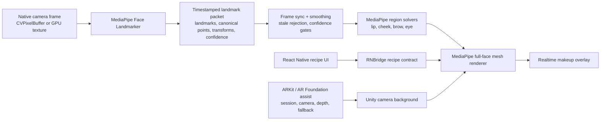

# MediaPipe-First AR Makeup Implementation Plan

> **For agentic workers:** REQUIRED SUB-SKILL: Use superpowers:subagent-driven-development (recommended) or superpowers:executing-plans to implement this plan task-by-task. Steps use checkbox (`- [ ]`) syntax for tracking.

**Goal:** Move product makeup placement from ARKit UV-driven rendering to a MediaPipe canonical face coordinate system, with ARKit kept only as an iOS assist layer for camera/session/depth/fallback.

**Architecture:** MediaPipe Face Landmarker becomes the semantic source of full-face landmarks, canonical mesh coordinates, and region anchors for lip, cheek, brow, and later eye makeup. Unity remains the realtime renderer, React Native remains the product/control surface, and ARKit/AR Foundation assists with iOS camera/session/device capabilities without owning makeup coordinates. The production frame path must use native camera frames or GPU textures, not Unity `ReadPixels` plus PNG encoding.

**Tech Stack:** React Native 0.86, TypeScript, Jest, Unity 6000.x, AR Foundation 6.3.5, ARKit 6.3.5, iOS Swift/Objective-C++, MediaPipeTasksVision 0.10.14, Unity C#, Python 3 static verifiers, real iPhone QA.

---

## Goal Mode Prompt

Use this as the objective when starting a goal-mode execution:

```text
Implement the MediaPipe-first AR makeup architecture described in docs/roadmaps/active/mediapipe-first-ar-makeup-goal-plan-ko.md, starting at Task 0 and stopping at each milestone for verification. Preserve the privacy contract, keep ARKit as assist/fallback only, make MediaPipe canonical landmarks/assets the product coordinate source, and remove ReadPixels/PNG from the product runtime path.
```

## Decision

The product coordinate system is **MediaPipe canonical face space**.

ARKit remains useful, but not as the product makeup coordinate source:

- ARKit may provide iOS camera/session lifecycle, device capability, AR camera background, optional face pose/depth/occlusion, and fallback diagnostics.
- ARKit `ARFace` UV must not be the source of lip, cheek, brow, or eye makeup placement in the long-term product renderer.
- MediaPipe Face Landmarker output owns semantic landmarks, canonical region anchors, and the full-face mesh used by makeup rendering.
- Assets are authored and validated against MediaPipe/ARCore canonical face texture space.
- Runtime placement is detector-driven; a canonical PSD asset alone does not mean the makeup is recognized on the user's face.

This is a strategic rewrite of the coordinate/rendering pipeline, not another slider tuning pass.

## Current State

Relevant existing files:

- `rn/MakeupARValidation/App.tsx` owns region recipe UI, payload construction, debug display, and RN-to-Unity messages.
- `rn/MakeupARValidation/__tests__/App.test.tsx` guards RN recipe and HUD behavior.
- `rn/MakeupARValidation/ios/MakeupARValidation/MakeupARMediaPipeFaceLandmarker.swift` proves the app target can import `MediaPipeTasksVision` and run the current MediaPipe brow diagnostic path.
- `rn/MakeupARValidation/ios/Podfile` and `rn/MakeupARValidation/ios/Podfile.lock` include the MediaPipe Tasks Vision dependency.
- `unity/MakeupARUnityValidation/Assets/Scripts/RNBridge.cs` receives RN recipe payloads and controls Unity runtime routes.
- `unity/MakeupARUnityValidation/Assets/Scripts/E3RegionMaskOverlay.cs` is the current smooth region mask renderer.
- `unity/MakeupARUnityValidation/Assets/Scripts/E7MediaPipeBrowLandmarkRuntime.cs` is the current Unity-side MediaPipe brow diagnostic runtime.
- `unity/MakeupARUnityValidation/Assets/Plugins/iOS/E7MediaPipeBrowLandmarkBridge.mm` bridges UnityFramework to app-owned Swift MediaPipe symbols.
- `unity/MakeupARUnityValidation/Assets/Scripts/E7VisionLipBoundaryRuntime.cs` is an interim Apple Vision lip boundary path.
- `unity/MakeupARUnityValidation/Assets/Resources/SmoothRegionMasks/` contains lip, cheek, brow, and eye masks/assets, including PSD/ARCore/MediaPipe canonical candidates.
- `scripts/e7_reference_atlas/verify_brow_landmark_privacy_contract.py` guards the current MediaPipe brow privacy contract.
- `scripts/e7_reference_atlas/verify_psd_arcore_makeup_textures.py` guards MediaPipe/ARCore canonical asset assumptions.
- `scripts/build_m3_unityframework.sh` is the required UnityFramework regeneration/sync path before approved real-device RN/Xcode builds.

Observed product gap:

- Current assets are increasingly MediaPipe/ARCore canonical, but runtime makeup placement is still mostly ARKit UV or interim screen/texture paths.
- Brow improved because it now has better canonical asset alignment and less diagnostic runtime interference, but the coordinate foundation is still mixed.
- Lip remains unstable because the current path blends ARKit mesh, Vision boundary, and renderer-specific assumptions.
- Cheek can disappear when renderer routing or mask source assumptions conflict.
- The old `ReadPixels -> PNG encode -> detector -> bridge -> render` path is too slow and can produce frame jitter, latency, and overlay suppression bugs.

## Non-Negotiables

- Product runtime must not use `ReadPixels`, `Texture2D.EncodeToPNG`, PNG bridge inference, or synchronous GPU readback as the main MediaPipe input path.
- Raw camera frames must not be persisted by default.
- Raw camera frames must not leave the device.
- Expanding AI/model inference, recommendation, backend upload, or raw-frame storage requires explicit user approval and privacy review.
- The renderer must tolerate dropped or stale MediaPipe frames without hiding all makeup.
- Manual sliders can fine-tune style, but cannot be the primary mechanism for correcting face coordinate errors.
- Product UI must not expose five competing coordinate/rendering sources as equal product choices. Debug UI may expose them clearly as diagnostics.

## Target Architecture



### Landmark Packet Contract

Every MediaPipe result sent toward Unity rendering should carry this semantic shape:

```json
{
  "source": "mediapipe_face_landmarker_full_face_v1",
  "frameId": 12345,
  "timestampMs": 1719730000000,
  "imageWidth": 1080,
  "imageHeight": 1920,
  "landmarkCount": 478,
  "hasBlendshapes": true,
  "hasFacialTransformMatrix": true,
  "faceConfidence": 0.98,
  "rawFrameStored": false,
  "offDeviceUpload": false,
  "landmarks": [
    {"i": 0, "x": 0.5021, "y": 0.4310, "z": -0.0312}
  ],
  "facialTransformMatrix": [
    1.0, 0.0, 0.0, 0.0,
    0.0, 1.0, 0.0, 0.0,
    0.0, 0.0, 1.0, 0.0,
    0.0, 0.0, 0.0, 1.0
  ]
}
```

The packet can be JSON during integration and can move to a compact binary/native struct when performance evidence shows JSON serialization is a bottleneck.

### Region Ownership

| Region | Coordinate source | Renderer target | Notes |
| --- | --- | --- | --- |
| Lip | MediaPipe lip landmarks and canonical mesh | MediaPipe region mesh first, full-face mesh after Task 8 | Replace Vision lip boundary as product default after parity is proven |
| Brow | MediaPipe eyebrow landmarks and canonical asset anchors | MediaPipe region mesh / warped textured strip | Current brow diagnostic runtime becomes full-face packet source |
| Cheek | MediaPipe face oval, eye, nose, mouth landmarks | Region solver projected onto face mesh | Cheek visibility must not depend on brow/lip renderer selection |
| Eye | MediaPipe eye/eyelid landmarks | Deferred until lip/brow/cheek are stable | Keep current eye controls as diagnostic/product placeholder |

## File Structure

Create:

- `docs/roadmaps/active/mediapipe-first-ar-makeup-goal-plan-ko.md` - this executable goal-mode plan.
- `docs/architecture/mediapipe-first-ar-makeup-architecture-ko.md` - durable architecture decision after Task 0.
- `docs/runbooks/mediapipe-first-real-device-qa-ko.md` - real iPhone QA checklist after the first working MediaPipe-first renderer.
- `unity/MakeupARUnityValidation/Assets/Scripts/MediaPipe/MediaPipeFaceLandmarkPacket.cs` - Unity DTO/parser for full-face landmark packets.
- `unity/MakeupARUnityValidation/Assets/Scripts/MediaPipe/MediaPipeFaceFrameSmoother.cs` - timestamp, confidence, and motion smoothing layer.
- `unity/MakeupARUnityValidation/Assets/Scripts/MediaPipe/MediaPipeRegionSolver.cs` - shared MediaPipe landmark-to-region geometry helpers.
- `unity/MakeupARUnityValidation/Assets/Scripts/MediaPipe/MediaPipeLipRegionRenderer.cs` - first MediaPipe-first lip renderer.
- `unity/MakeupARUnityValidation/Assets/Scripts/MediaPipe/MediaPipeBrowRegionRenderer.cs` - MediaPipe-first brow renderer.
- `unity/MakeupARUnityValidation/Assets/Scripts/MediaPipe/MediaPipeCheekRegionRenderer.cs` - MediaPipe-first cheek renderer.
- `unity/MakeupARUnityValidation/Assets/Scripts/MediaPipe/MediaPipeFullFaceMeshRenderer.cs` - full-face mesh renderer using MediaPipe topology/canonical UVs.
- `rn/MakeupARValidation/ios/MakeupARValidation/MakeupARMediaPipeFrameSource.swift` - native iOS frame source abstraction for `CVPixelBuffer` or GPU texture input.
- `unity/MakeupARUnityValidation/Assets/Plugins/iOS/E7MediaPipeFullFaceBridge.mm` - UnityFramework-facing bridge for full-face MediaPipe packets.
- `scripts/e7_reference_atlas/verify_mediapipe_first_runtime_contract.py` - static guard forbidding product `ReadPixels`/PNG inference and validating packet/privacy strings.
- `scripts/e7_reference_atlas/verify_mediapipe_canonical_assets.py` - static asset manifest guard for MediaPipe canonical region assets.

Modify:

- `rn/MakeupARValidation/App.tsx` - simplify product renderer choices and add MediaPipe-first diagnostics.
- `rn/MakeupARValidation/__tests__/App.test.tsx` - add RN payload/HUD tests for MediaPipe-first mode.
- `rn/MakeupARValidation/ios/MakeupARValidation/MakeupARMediaPipeFaceLandmarker.swift` - expand from brow diagnostic output to full-face packet output.
- `rn/MakeupARValidation/ios/MakeupARValidation.xcodeproj/project.pbxproj` - include new Swift frame source files and bridge references as needed.
- `rn/MakeupARValidation/ios/Podfile` - keep `MediaPipeTasksVision` dependency explicit.
- `unity/MakeupARUnityValidation/Assets/Scripts/RNBridge.cs` - route recipes to MediaPipe-first renderers and report full-face packet status.
- `unity/MakeupARUnityValidation/Assets/Scripts/E3RegionMaskOverlay.cs` - keep as compatibility/debug renderer while product default moves to MediaPipe-first.
- `unity/MakeupARUnityValidation/Assets/Scripts/E7MediaPipeBrowLandmarkRuntime.cs` - replace brow-only PNG diagnostic ownership with full-face packet integration or mark as diagnostic-only.
- `unity/MakeupARUnityValidation/Assets/Scripts/MakeupRegionRendererRoutes.cs` - collapse product route naming around MediaPipe-first default plus debug alternatives.
- `docs/architecture/ar-makeup-rendering-concepts-glossary-ko.md` - update coordinate system definitions after architecture doc lands.
- `docs/product/eyebrow-makeup-feature.md` - record that brow assets now target MediaPipe-first runtime placement.

Do not modify without a separate user approval:

- Backend upload, AI recommendation, payment, community/admin code, Android product implementation, commercial SDK integration, or raw-frame storage paths.
- Real-device signing/team/device defaults.
- Historical validation docs unless the task is explicitly validation history.

## Task 0: Lock the Product Coordinate Decision

**Files:**
- Create: `docs/architecture/mediapipe-first-ar-makeup-architecture-ko.md`
- Modify: `docs/architecture/ar-makeup-rendering-concepts-glossary-ko.md`
- Modify: `docs/product/eyebrow-makeup-feature.md`

- [ ] **Step 0.1: Create the architecture decision document**

Add a durable architecture document with these sections:

```markdown
# MediaPipe-First AR Makeup Architecture

Status: Accepted for product-coordinate implementation
Decision date: 2026-06-30

## Decision

The product coordinate system for AR makeup is MediaPipe canonical face space.
ARKit remains an iOS assist layer for camera/session/depth/fallback, but ARKit
UV is no longer the product source of lip, cheek, brow, or eye makeup placement.

## Consequences

- Makeup assets are authored and validated against MediaPipe/ARCore canonical
  face texture space.
- Runtime makeup placement is driven by MediaPipe Face Landmarker packets.
- Product renderers must not depend on Unity `ReadPixels` plus PNG detector input.
- ARKit face mesh/UV renderers remain available only as compatibility/debug
  routes while the MediaPipe-first renderer reaches parity.
```

- [ ] **Step 0.2: Update glossary wording**

In `docs/architecture/ar-makeup-rendering-concepts-glossary-ko.md`, add a short section that states:

```markdown
### Product Coordinate Source

2026-06-30 decision: product makeup placement moves to MediaPipe canonical face
space. ARKit/AR Foundation may still provide iOS camera/session/depth/fallback
assistance, but ARKit `ARFace` UV is not the long-term semantic coordinate
source for lip, cheek, brow, or eye makeup.
```

- [ ] **Step 0.3: Record the brow impact**

In `docs/product/eyebrow-makeup-feature.md`, add an implementation note that brow assets should be interpreted as MediaPipe canonical assets and runtime placement belongs to the MediaPipe full-face landmark packet.

- [ ] **Step 0.4: Verify docs**

Run:

```bash
git diff --check -- docs/architecture/mediapipe-first-ar-makeup-architecture-ko.md docs/architecture/ar-makeup-rendering-concepts-glossary-ko.md docs/product/eyebrow-makeup-feature.md
```

Expected: no whitespace errors.

## Task 1: Add Product Runtime Guardrails

**Files:**
- Create: `scripts/e7_reference_atlas/verify_mediapipe_first_runtime_contract.py`
- Modify: `scripts/e7_reference_atlas/verify_brow_landmark_privacy_contract.py`

- [ ] **Step 1.1: Create a static verifier for the MediaPipe-first contract**

Create `scripts/e7_reference_atlas/verify_mediapipe_first_runtime_contract.py` with checks for:

- `rn/MakeupARValidation/ios/MakeupARValidation/MakeupARMediaPipeFaceLandmarker.swift` imports `MediaPipeTasksVision`.
- The full-face runtime reports `rawFrameStored` as `false`.
- The full-face runtime reports `offDeviceUpload` as `false`.
- Product MediaPipe runtime files under `unity/MakeupARUnityValidation/Assets/Scripts/MediaPipe/` do not contain `ReadPixels`, `EncodeToPNG`, or `Texture2D`.
- Existing diagnostic files may contain those strings only when the file also contains `diagnostic-only`.

Use this failure style:

```python
raise AssertionError("Product MediaPipe runtime must not use ReadPixels or PNG encoding.")
```

- [ ] **Step 1.2: Keep the existing privacy verifier focused**

Modify `scripts/e7_reference_atlas/verify_brow_landmark_privacy_contract.py` so the brow diagnostic checks stay valid, and delegate product-wide full-face constraints to `verify_mediapipe_first_runtime_contract.py`.

- [ ] **Step 1.3: Run verifiers**

Run:

```bash
.venv/bin/python scripts/e7_reference_atlas/verify_brow_landmark_privacy_contract.py --repo-root /Users/hi/dev/Jungle/makeupAR
.venv/bin/python scripts/e7_reference_atlas/verify_mediapipe_first_runtime_contract.py --repo-root /Users/hi/dev/Jungle/makeupAR
```

Expected: brow verifier passes; MediaPipe-first verifier fails until Task 2 creates the product runtime files, then passes after Task 2.

## Task 2: Build Direct Native Frame Input

**Files:**
- Create: `rn/MakeupARValidation/ios/MakeupARValidation/MakeupARMediaPipeFrameSource.swift`
- Modify: `rn/MakeupARValidation/ios/MakeupARValidation/MakeupARMediaPipeFaceLandmarker.swift`
- Create: `unity/MakeupARUnityValidation/Assets/Plugins/iOS/E7MediaPipeFullFaceBridge.mm`
- Modify: `rn/MakeupARValidation/ios/MakeupARValidation.xcodeproj/project.pbxproj`

- [ ] **Step 2.1: Add the Swift frame source abstraction**

Create `MakeupARMediaPipeFrameSource.swift` with a small API that accepts native frames in memory:

```swift
import AVFoundation
import Foundation

final class MakeupARMediaPipeFrameSource {
  struct Frame {
    let pixelBuffer: CVPixelBuffer
    let timestampMs: Int64
    let orientation: CGImagePropertyOrientation
  }

  func makeFrame(pixelBuffer: CVPixelBuffer, timestampMs: Int64, orientation: CGImagePropertyOrientation) -> Frame {
    Frame(pixelBuffer: pixelBuffer, timestampMs: timestampMs, orientation: orientation)
  }
}
```

- [ ] **Step 2.2: Expand the MediaPipe Swift runtime to accept native frames**

In `MakeupARMediaPipeFaceLandmarker.swift`, add a full-face entry point that takes a `CVPixelBuffer`-backed frame and returns the packet contract from this document. Keep the existing PNG brow symbol available only for diagnostic compatibility and mark it with the exact string `diagnostic-only`.

- [ ] **Step 2.3: Add the UnityFramework bridge symbols**

Create `E7MediaPipeFullFaceBridge.mm` with Unity-facing C symbols:

```objc
extern "C" const char *E7MediaPipeDetectFullFaceFromNativeFrame(long frameHandle, long timestampMs);
extern "C" void E7MediaPipeReleaseFullFaceCString(const char *value);
```

The first implementation may return a structured `"status":"not_connected"` packet while Task 3 wires the actual camera frame handle. It must include `"rawFrameStored":false` and `"offDeviceUpload":false`.

- [ ] **Step 2.4: Verify native build references**

Run:

```bash
.venv/bin/python scripts/e7_reference_atlas/verify_mediapipe_first_runtime_contract.py --repo-root /Users/hi/dev/Jungle/makeupAR
```

Expected: verifier passes for privacy strings and fails only if the product runtime still references `ReadPixels` or PNG encoding.

## Task 3: Define Unity Landmark Packet and Frame Sync

**Files:**
- Create: `unity/MakeupARUnityValidation/Assets/Scripts/MediaPipe/MediaPipeFaceLandmarkPacket.cs`
- Create: `unity/MakeupARUnityValidation/Assets/Scripts/MediaPipe/MediaPipeFaceFrameSmoother.cs`
- Modify: `unity/MakeupARUnityValidation/Assets/Scripts/RNBridge.cs`

- [ ] **Step 3.1: Add Unity packet DTO**

Create `MediaPipeFaceLandmarkPacket.cs` with fields matching the packet contract: `source`, `frameId`, `timestampMs`, `imageWidth`, `imageHeight`, `landmarkCount`, `faceConfidence`, `rawFrameStored`, `offDeviceUpload`, `landmarks`, and `facialTransformMatrix`.

- [ ] **Step 3.2: Add parser failure behavior**

The parser must reject packets when:

- `source` is not `mediapipe_face_landmarker_full_face_v1`.
- `rawFrameStored` is not `false`.
- `offDeviceUpload` is not `false`.
- `landmarkCount` is below `468`.
- `timestampMs` is older than the latest accepted packet.

- [ ] **Step 3.3: Add smoothing**

Create `MediaPipeFaceFrameSmoother.cs` with:

- Timestamp monotonicity check.
- Configurable max stale age, initially `180ms`.
- Confidence gate, initially `0.5`.
- Per-landmark exponential smoothing, initially `alpha = 0.65`.
- A bypass flag for debug comparison.

- [ ] **Step 3.4: Route status through RNBridge**

Modify `RNBridge.cs` so debug status can report:

```text
mediapipe=full-face source=direct-frame landmarks=478 stale=false smoothed=true rawFrameStored=false offDeviceUpload=false
```

- [ ] **Step 3.5: Compile-check Unity scripts**

Run a Unity batchmode import/compile check before any real-device build:

```bash
"/Applications/Unity/Hub/Editor/6000.3.18f1/Unity.app/Contents/MacOS/Unity" -batchmode -quit -projectPath "/Users/hi/dev/Jungle/makeupAR/unity/MakeupARUnityValidation" -logFile /Users/hi/dev/Jungle/makeupAR/evidence/logs/mediapipe-first-unity-compile.log
```

Expected: Unity exits successfully and the log has no C# compile errors.

## Task 4: Make Lip MediaPipe-First

**Files:**
- Create: `unity/MakeupARUnityValidation/Assets/Scripts/MediaPipe/MediaPipeRegionSolver.cs`
- Create: `unity/MakeupARUnityValidation/Assets/Scripts/MediaPipe/MediaPipeLipRegionRenderer.cs`
- Modify: `unity/MakeupARUnityValidation/Assets/Scripts/MakeupRegionRendererRoutes.cs`
- Modify: `rn/MakeupARValidation/App.tsx`
- Modify: `rn/MakeupARValidation/__tests__/App.test.tsx`

- [ ] **Step 4.1: Add RN test for lip default**

Add a Jest assertion that the product/default lip route is `mediapipe-first` and that Vision/ARKit routes are labeled as diagnostics.

- [ ] **Step 4.2: Implement lip landmark contours**

In `MediaPipeRegionSolver.cs`, define lip contour groups by MediaPipe landmark index and expose:

```csharp
public bool TrySolveLipRegion(MediaPipeFaceLandmarkPacket packet, out MediaPipeLipRegion region)
```

The region must include outer lip points, inner mouth cutout points, centroid, bounds, and confidence.

- [ ] **Step 4.3: Render lip from MediaPipe region geometry**

Create `MediaPipeLipRegionRenderer.cs` so the lip material uses MediaPipe contour geometry instead of ARKit UV mask placement. Preserve existing color, opacity, gloss, feather, and texture recipe values from RN.

- [ ] **Step 4.4: Keep Vision lip as a diagnostic fallback**

Modify renderer routes so `E7VisionLipBoundaryRuntime.cs` is not the product default. Its HUD label should read `VISION_DIAGNOSTIC`.

- [ ] **Step 4.5: Verify lip behavior locally**

Run:

```bash
cd rn/MakeupARValidation
npm test -- --runTestsByPath __tests__/App.test.tsx --runInBand
npm run lint -- --quiet
npx tsc --noEmit
```

Expected: tests, lint, and TypeScript checks pass.

## Task 5: Make Brow MediaPipe-First

**Files:**
- Create: `unity/MakeupARUnityValidation/Assets/Scripts/MediaPipe/MediaPipeBrowRegionRenderer.cs`
- Modify: `unity/MakeupARUnityValidation/Assets/Scripts/E7MediaPipeBrowLandmarkRuntime.cs`
- Modify: `unity/MakeupARUnityValidation/Assets/Scripts/RNBridge.cs`
- Modify: `scripts/e7_reference_atlas/verify_brow_landmark_privacy_contract.py`

- [ ] **Step 5.1: Convert brow diagnostic output into shared packet usage**

Keep the current brow diagnostic event for HUD comparison, but make product brow placement consume the full-face MediaPipe packet from Task 3.

- [ ] **Step 5.2: Implement brow region fitting**

Create `MediaPipeBrowRegionRenderer.cs` with left/right brow region solving, using MediaPipe eyebrow landmarks as anchors and PSD/PNG canonical assets as the style texture source.

- [ ] **Step 5.3: Preserve independent region rendering**

Verify that turning brow on does not hide lip or cheek. Add a Jest/HUD expectation in `App.test.tsx` that lip, cheek, and brow can all be enabled in the same payload when the route is `mediapipe-first`.

- [ ] **Step 5.4: Run brow privacy and route checks**

Run:

```bash
.venv/bin/python scripts/e7_reference_atlas/verify_brow_landmark_privacy_contract.py --repo-root /Users/hi/dev/Jungle/makeupAR
.venv/bin/python scripts/e7_reference_atlas/verify_mediapipe_first_runtime_contract.py --repo-root /Users/hi/dev/Jungle/makeupAR
```

Expected: both verifiers pass.

## Task 6: Make Cheek MediaPipe-First

**Files:**
- Create: `unity/MakeupARUnityValidation/Assets/Scripts/MediaPipe/MediaPipeCheekRegionRenderer.cs`
- Modify: `unity/MakeupARUnityValidation/Assets/Scripts/MediaPipe/MediaPipeRegionSolver.cs`
- Modify: `unity/MakeupARUnityValidation/Assets/Scripts/E3RegionMaskOverlay.cs`
- Modify: `rn/MakeupARValidation/App.tsx`

- [ ] **Step 6.1: Define cheek anchors from landmarks**

Use face oval, eye, nose, and mouth landmarks to derive cheek regions. The cheek solver must output independent left/right cheek polygons and must not depend on brow or lip active state.

- [ ] **Step 6.2: Render cheek as its own layer**

Create `MediaPipeCheekRegionRenderer.cs` and preserve existing cheek recipe inputs: color, opacity, intensity, feather, coverage, material style, and texture id.

- [ ] **Step 6.3: Add route guard**

Ensure `MakeupRegionRendererRoutes.cs` reports cheek as `mediapipe-first` when enabled and never reports cheek as hidden because brow is active.

- [ ] **Step 6.4: Verify RN controls**

Run:

```bash
cd rn/MakeupARValidation
npm test -- --runTestsByPath __tests__/App.test.tsx --runInBand
```

Expected: tests pass and include a case where lip, cheek, and brow are simultaneously active.

## Task 7: Formalize MediaPipe Canonical Assets

**Files:**
- Create: `scripts/e7_reference_atlas/verify_mediapipe_canonical_assets.py`
- Modify: `scripts/e7_reference_atlas/verify_psd_arcore_makeup_textures.py`
- Modify: `docs/architecture/mediapipe-first-ar-makeup-architecture-ko.md`

- [ ] **Step 7.1: Add asset manifest rules**

The verifier must require canonical region assets in `unity/MakeupARUnityValidation/Assets/Resources/SmoothRegionMasks/` to declare or match:

- `psd-arcore-lip-*` for MediaPipe/ARCore lip candidates.
- `psd-arcore-cheek-*` for MediaPipe/ARCore cheek candidates.
- `psd-arcore-brow-*` or approved brow PNG canonical assets for brow.
- Texture import settings compatible with Unity runtime sampling.

- [ ] **Step 7.2: Separate product and debug asset names**

Update RN labels so product users see style names, while debug HUD can still show raw asset ids such as `psd-arcore-brow-semi-arch-v1`.

- [ ] **Step 7.3: Run asset verifiers**

Run:

```bash
.venv/bin/python scripts/e7_reference_atlas/verify_psd_arcore_makeup_textures.py --repo-root /Users/hi/dev/Jungle/makeupAR
.venv/bin/python scripts/e7_reference_atlas/verify_mediapipe_canonical_assets.py --repo-root /Users/hi/dev/Jungle/makeupAR
```

Expected: both verifiers pass.

## Task 8: Build the MediaPipe Full-Face Mesh Renderer

**Files:**
- Create: `unity/MakeupARUnityValidation/Assets/Scripts/MediaPipe/MediaPipeFullFaceMeshRenderer.cs`
- Modify: `unity/MakeupARUnityValidation/Assets/Scripts/MediaPipe/MediaPipeLipRegionRenderer.cs`
- Modify: `unity/MakeupARUnityValidation/Assets/Scripts/MediaPipe/MediaPipeBrowRegionRenderer.cs`
- Modify: `unity/MakeupARUnityValidation/Assets/Scripts/MediaPipe/MediaPipeCheekRegionRenderer.cs`
- Modify: `unity/MakeupARUnityValidation/Assets/Shaders/SmoothRegionMask.shader` or add a MediaPipe-specific shader if the existing shader cannot preserve quality.

- [x] **Step 8.1: Add full-face topology**

Implement MediaPipe face mesh topology in `MediaPipeFullFaceMeshRenderer.cs`, using MediaPipe landmark indices and canonical UV mapping. Keep topology data in a compact static table in the renderer or a focused helper file.

2026-06-30 update: `MediaPipeCanonicalFaceMesh.cs` now carries the generated
MediaPipe canonical 468-vertex / 898-triangle topology and UV table from
`canonical_face_model.obj`, and `MediaPipeFullFaceMeshRenderer.cs` builds a
real triangle mesh from smoothed MediaPipe packets.

- [ ] **Step 8.2: Layer lip/brow/cheek on the full mesh**

Move lip, brow, and cheek renderers to feed the full-face mesh renderer as region masks/material layers.

2026-06-30 update: first product pass is implemented as
`MediaPipeCanonicalRegionMeshBuilder.cs`, which gates the same canonical
full-face topology by MediaPipe lip, brow, and cheek regions. Remaining quality
work is to turn these region meshes into authored full-face material layers and
verify live face placement on device.

- [x] **Step 8.3: Add stale-frame behavior**

When MediaPipe packets go stale, keep the last stable makeup placement for a short grace window and fade or hold according to the debug setting. Do not clear all makeup immediately.

2026-06-30 update: `MediaPipeRegionOverlayRenderer` keeps short-stale packets
visible with reduced alpha and expires old packets with
`mediapipe_stale_expired_waiting_for_face`. `E7MediaPipeFullFaceRuntime` now
ages packets with the same runtime clock as MediaPipe frame timestamps by
combining the last XR frame timestamp with Unity realtime delta.

- [x] **Step 8.4: Capture performance evidence**

Record these metrics in debug HUD and logs:

- MediaPipe inference latency.
- Packet age.
- Unity render frame time.
- Dropped packet count.
- Smoothing enabled/disabled.
- Active region count.

2026-06-30 update: Unity/RN metric samples now carry
`mediapipePacketAgeMs`, `mediapipeInferenceLatencyMs`,
`mediapipeDroppedPacketCount`, `mediapipeStalePacketCount`,
MediaPipe capture skip counters, Unity frame time, and `activeRegionCount` so
real-device QA can separate slow inference, Unity render frame drops, stale
packets, and active-layer load.

2026-06-30 update: The MediaPipe-first verifier now also guards the native
frame-input contract: the full-face product Swift section must use
`MPImage(pixelBuffer:)`, must not decode PNG bytes, and Unity must use throttled
`ARCameraManager` CPU-image to BGRA conversion (`15 fps`, max width `720`) before
calling `E7MediaPipeDetectFullFaceBgra`. The Unity conversion path now reuses a
persistent pinned BGRA buffer and passes its `IntPtr` through `XRCpuImage.Convert`
and the native bridge, instead of allocating a pin handle per capture. The legacy
brow PNG path remains diagnostic-only. The Unity orientation fallback path also
reuses fixed transformation buffers instead of allocating candidate arrays per
capture, and the lip/cheek/brow product region solvers now expose non-alloc
preallocated-buffer APIs used by both overlay rendering and heartbeat/status
diagnostics. Zero-copy native-frame/GPU texture input is reserved through the
native-frame ABI but still awaits real-device profiling after coordinate
correctness is proven.

## Task 9: Keep ARKit as Assist

**Files:**
- Modify: `unity/MakeupARUnityValidation/Assets/Scripts/FaceTrackingStatusReporter.cs`
- Modify: `unity/MakeupARUnityValidation/Assets/Scripts/RNBridge.cs`
- Modify: `docs/architecture/mediapipe-first-ar-makeup-architecture-ko.md`

- [x] **Step 9.1: Rename ARKit role in debug status**

Debug status should distinguish:

```text
coordinates=mediapipe assist=arkit-session,arkit-camera,optional-depth
```

2026-06-30 update: `RNBridge` and `FaceTrackingStatusReporter` now report
`productCoordinateSystem=mediapipe_canonical_face_space`,
`placementOwner=mediapipe_full_face_landmarks`, and
`arkitAssistRole=arkit_session_camera_optional_depth`; MediaPipe status exposes
`coordinates=mediapipe assist=arkit-session,arkit-camera,optional-depth`.

- [x] **Step 9.2: Define fallback**

Fallback behavior:

- If MediaPipe has no face and ARKit has face tracking, show debug status and keep product makeup hidden.
- If ARKit session is unavailable but MediaPipe has camera frames, MediaPipe diagnostics may still run only if camera permissions and privacy constraints are satisfied.
- If both are unavailable, show `waiting for face` and keep all product makeup hidden.

2026-06-30 update: `MediaPipeRegionOverlayRenderer` hides lip/cheek/brow
product overlays on `mediapipe_waiting_for_face`, expires long-stale packets
with `mediapipe_stale_expired_waiting_for_face`, and never falls back to ARKit
UV placement when the MediaPipe packet is missing. The architecture doc now
records this ARKit-assist fallback policy.

- [x] **Step 9.3: Avoid mixed coordinate rendering**

Do not combine MediaPipe region anchors with ARKit UV masks in the same product renderer path. Debug comparison can display both routes only when the HUD clearly labels them.

2026-06-30 update: `RNBridge` dispatches `mediapipe-region-overlay` layers to
`MediaPipeRegionOverlayRenderer` before the legacy `E3RegionMaskOverlay`
fallback branch. `MediaPipeRegionOverlayRenderer` now rejects non-MediaPipe
renderer modes, and the MediaPipe-first verifier guards against ARKit/ARFace
coordinate-owner tokens in product renderer files.

## Task 10: Product UI Cleanup

**Files:**
- Modify: `rn/MakeupARValidation/App.tsx`
- Modify: `rn/MakeupARValidation/__tests__/App.test.tsx`
- Create: `docs/runbooks/mediapipe-first-real-device-qa-ko.md`

- [x] **Step 10.1: Simplify route labels**

Product UI should default to `MediaPipe`. Debug UI may list:

- `MediaPipe`
- `ARKit diagnostic`
- `Vision diagnostic`
- `Legacy mask`

Avoid exposing route names like `ATLAS`, `PSD ARCORE`, `VISION`, `FLAT`, and `PSD FLAT` as equal product choices without explanation.

2026-06-30 update: Compact HUD now displays product renderer ownership as
`Renderer MediaPipe` instead of internal renderer ids such as
`lip-mediapipe-region-overlay-renderer`. Lip source buttons now separate
MediaPipe product sources from `Vision diagnostic`, `Legacy atlas diagnostic`,
and `Legacy mask` labels. Lip mask summaries now use the same product wording
(`MediaPipe lip`, `MediaPipe flat`) instead of `Canonical` or PSD route names.

- [x] **Step 10.2: Add QA runbook**

Create a real-device QA checklist with:

- Face detected from neutral pose.
- Lip follows smile/open-mouth movement.
- Brow follows eyebrow movement and does not hide other regions.
- Cheek remains visible with lip and brow active.
- Fast head turn does not produce large jitter.
- Temporary face loss recovers without clearing all state permanently.
- Debug HUD reports `rawFrameStored=false` and `offDeviceUpload=false`.

2026-06-30 update: `docs/runbooks/mediapipe-first-real-device-qa-ko.md` now
records the first approved device-loop checklist, product UI label acceptance
criteria, MediaPipe full-face topology checks, performance diagnostics, and
privacy evidence requirements.

- [x] **Step 10.3: Run RN checks**

Run:

```bash
cd rn/MakeupARValidation
npm test -- --runTestsByPath __tests__/App.test.tsx --runInBand
npm run lint -- --quiet
npx tsc --noEmit
```

Expected: all pass.

2026-06-30 update: RN checks passed with 46/46 Jest tests, TypeScript
`npx tsc --noEmit`, and `npm run lint -- --quiet`. MediaPipe-first,
canonical-asset, PSD texture, and brow privacy verifiers also passed.

## Task 11: Real-Device Build Gate

**Files:**
- Modify only the implementation files completed in previous tasks.
- Write logs under `evidence/logs/` only when the user approves a real-device build.

- [ ] **Step 11.1: Stop and ask for build approval**

Before building, report:

- Build question: whether to build/install/run on the real iPhone now.
- Primary path: UnityFramework regeneration with `bash scripts/build_m3_unityframework.sh`, then RN/Xcode build/install/run.
- Target assumptions: current connected iPhone and current signing team from local Xcode settings.
- Expected risk: MediaPipe native frame bridge, UnityFramework sync, device signing, and runtime performance.
- Out of scope: backend upload, raw-frame storage, Android, commercial SDK, and App Store readiness.

2026-06-30 update: Pre-build static guard now includes
`verify_unityframework_build_contract.py`. The RN iOS project no longer carries
a repo-default `DEVELOPMENT_TEAM`; the verifier checks that no signing team,
provisioning profile, or device id is hard-coded before an approved device
build.

- [ ] **Step 11.2: Close Unity processes before UnityFramework build**

Run process checks and close Unity/Hub/Licensing when needed:

```bash
pgrep -fl "Unity|Unity Hub|Unity.Licensing.Client"
```

- [ ] **Step 11.3: Regenerate and sync UnityFramework**

After approval, run from repo root:

```bash
bash scripts/build_m3_unityframework.sh
```

Expected: Unity iOS export succeeds, ARKit links are verified, `UnityFramework.framework` is built with signing disabled, Unity `Data` is copied, and RN/package framework paths are synced.

- [ ] **Step 11.4: Build/install/run RN iOS app**

Use the user-approved connected device and signing team. Do not hard-code a new UDID or `DEVELOPMENT_TEAM` as repo defaults.

- [ ] **Step 11.5: Record evidence**

Record concise build results in the appropriate product/architecture doc or QA runbook. Save full runtime/build logs under `evidence/logs/` only when they are decision evidence.

## Verification Matrix

Run these before claiming a milestone is complete:

```bash
cd rn/MakeupARValidation
npm test -- --runTestsByPath __tests__/App.test.tsx --runInBand
npm run lint -- --quiet
npx tsc --noEmit
```

```bash
cd /Users/hi/dev/Jungle/makeupAR
.venv/bin/python scripts/e7_reference_atlas/verify_brow_landmark_privacy_contract.py --repo-root /Users/hi/dev/Jungle/makeupAR
.venv/bin/python scripts/e7_reference_atlas/verify_psd_arcore_makeup_textures.py --repo-root /Users/hi/dev/Jungle/makeupAR
.venv/bin/python scripts/e7_reference_atlas/verify_mediapipe_first_runtime_contract.py --repo-root /Users/hi/dev/Jungle/makeupAR
.venv/bin/python scripts/e7_reference_atlas/verify_mediapipe_canonical_assets.py --repo-root /Users/hi/dev/Jungle/makeupAR
.venv/bin/python scripts/e7_reference_atlas/verify_unityframework_build_contract.py --repo-root /Users/hi/dev/Jungle/makeupAR
.venv/bin/python scripts/e7_reference_atlas/verify_ios_local_media_capture_contract.py
```

Expected before all tasks are complete:

- Existing RN/TypeScript/lint checks should pass after each local implementation step.
- New MediaPipe-first verifiers may fail until their corresponding task creates the guarded files.
- Real-device build is only run after explicit user approval.

## Acceptance Criteria

- Lip, brow, and cheek placement are driven by MediaPipe canonical full-face landmarks, not ARKit UV.
- Lip remains aligned through neutral, smile, and open-mouth states.
- Brow placement remains aligned and does not suppress lip or cheek rendering.
- Cheek remains visible independently when lip and brow are active.
- Product runtime MediaPipe input uses native frames or GPU texture input, not `ReadPixels` plus PNG encoding.
- Debug HUD reports MediaPipe packet state, smoothing state, packet age, inference latency, and privacy flags.
- Makeup does not shake severely under normal head motion; smoothing reduces jitter without introducing obvious lag.
- Temporary frame drops or stale MediaPipe packets do not clear all makeup instantly.
- Raw frame storage remains disabled and off-device upload remains disabled.
- Real-device QA passes on the user-approved iPhone build.

## Stop And Ask

Stop for user approval before:

- Adding backend upload, cloud inference, recommendation, face analysis storage, or raw-frame persistence.
- Adding a commercial SDK.
- Expanding scope to Android product implementation.
- Changing signing/team/device defaults.
- Running a real-device build/install.
- Replacing Unity as the renderer or removing ARKit/AR Foundation entirely.

## Execution Notes

- Prefer small commits per task when the user asks to commit.
- Keep ARKit, Vision, and legacy mask renderers as debug comparison routes until MediaPipe-first output is visibly better on device.
- Do not present diagnostic route names as product choices.
- Keep generated Unity/Xcode/build artifacts out of git.
- Use `docs/product/` for user-facing product state, `docs/architecture/` for durable architecture decisions, `docs/runbooks/` for QA/build checklists, and `docs/roadmaps/active/` for active execution plans.
